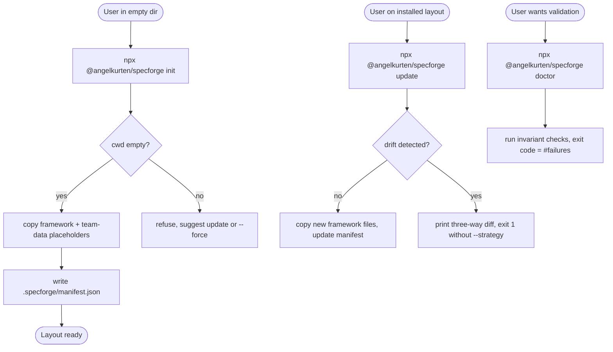
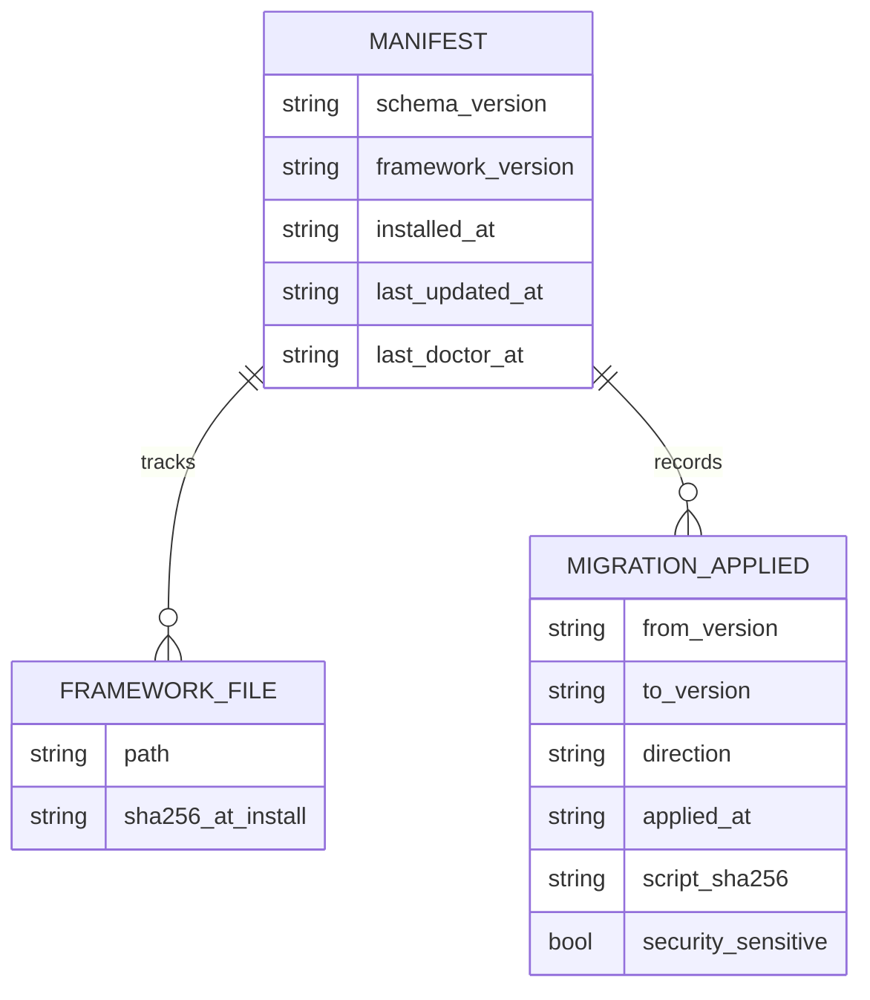

# PRD-003: CLI for installation and lifecycle management

**Status**: Implemented
**Implemented at**: 2026-05-27
**Date**: 2026-05-26
**Author**: AI-assisted
**Priority**: P2
**Depends on**: None
**Supersedes**: None

> **Note**: This is a **framework-internal PRD** — specforge applying its own
> process to change itself. The impacted sibling is `specforge` (see
> [`SIBLINGS.md`](SIBLINGS.md)). Framework-maintenance rules apply (see
> [`.claude/rules/framework-maintenance.md`](.claude/rules/framework-maintenance.md)).

## Impacted Projects

| Project | Impact |
|---------|--------|
| **specforge** | New `tools/cli/` subdirectory containing a TypeScript Node.js package published to npm as `@angelkurten/specforge`. New `.specforge/manifest.json` schema written into adopting projects. Existing `scripts/upgrade.sh` enters a deprecation window (not removed in this PRD). Repo gains `.github/workflows/cli-release.yml` for the publish pipeline. New tests under `tools/cli/tests/`. Updates to `README.md` / `README.es.md` documenting the `npx` adoption path. |

---

## 1. Problem Statement

Adopting specforge today requires `git clone` of the upstream repo (or a fork)
followed by manual file copying into the target workspace, with the user
expected to know which files are framework (overwriteable on upgrade) and
which are team data (never to be touched). The existing
[`scripts/upgrade.sh`](scripts/upgrade.sh) automates the *upgrade* half of this
workflow — once specforge is already installed — but does not address the
*bootstrap* half. A new adopter has no command they can run from an empty
directory to obtain a working specforge layout.

This friction has three concrete costs. First, every new adopter retraces the
same setup steps, with the same opportunity for mistakes (forgetting
`SIBLINGS.md`, copying `.specforge-source` from a stale path, copying example
PRDs that should not exist in a fresh install). Second, the bash upgrade
script assumes a git-managed working tree and bails on uncommitted changes — a
reasonable safety net for upgrades, but a hostile experience for bootstrap.
Third, no programmatic surface exists for validating that an installed
specforge layout actually conforms to the framework's own hard rules (PRD
numbering monotonicity, `SIBLINGS.md` path resolution, gate-block YAML shape).
Drift is detectable only at PRD-review time, which is far downstream from when
the drift was introduced.

The 2026 ecosystem norm for framework adoption is the npx-launched scaffolder
(`create-next-app`, `create-vite`, `create-t3-app`). Teams already have
`node`/`npm` available in any development environment that uses TypeScript,
JavaScript, or modern tooling — which covers every active sibling stack
specforge has been written for. A CLI distributed via npm gives specforge the
same one-command bootstrap that those frameworks offer, and gives the
framework a place to host validation, migration, and lifecycle logic that
today lives nowhere.

## 2. Goals

- Provide `npx @angelkurten/specforge init` that scaffolds a complete specforge layout
  (framework files, team-data placeholders, `.specforge/manifest.json`) into
  the current working directory.
- Provide `npx @angelkurten/specforge update` that refreshes framework files in place,
  preserving every file the manifest marks as team data and surfacing any
  framework file the user has locally modified for explicit resolution.
- Provide `npx @angelkurten/specforge doctor` that validates the installed layout against
  a set of structural invariants derived from `.claude/rules/hard-rules.md`,
  exiting non-zero on any failure.
- Provide `npx @angelkurten/specforge migrate` that applies versioned, idempotent
  transformations to the team's local files when framework releases require
  schema changes (e.g. a new frontmatter field on rule files, a column added
  to `SIBLINGS.md`).
- Maintain a `.specforge/manifest.json` artifact that records the installed
  framework version, the sha256 of every framework file at install time, and
  the timestamps of the last `init`, `update`, and `doctor` runs.
- If the cwd already contains a non-empty specforge layout, the system shall
  refuse `init` without `--force` and direct the user to `update`.
- If `update` detects a framework file the user has locally modified (sha256
  drift against the manifest), the system shall halt with a three-way diff
  unless `--strategy=ours|theirs|merge` is passed.
- Ship the CLI as a single npm package `@angelkurten/specforge` whose
  published version string matches the framework version in `VERSION` at
  publish time. The package bundles a snapshot of the framework tree taken
  from the repo root at publish time.

## 3. Non-Goals

- Generating PRDs, ADRs, or roadmap items. PRD authoring is the AI agent's
  responsibility, not the CLI's; the CLI scaffolds the framework that the
  agent then uses.
- Interactive wizard / TUI prompts on `init` or `update`. The CLI is
  flag-driven and headless-friendly. Tooling that needs prompts wraps it.
- Telemetry of any kind. The CLI makes no network calls except the implicit
  npm tarball download performed by `npx` itself.
- A plugin or extension system. Until a second concrete need exists, the
  command set is closed (init, update, doctor, migrate, version).
- Replacing the agent-driven workflow (`workflow.md`). The CLI is install
  and lifecycle plumbing; it never runs reviewers, never dispatches
  sub-agents, never edits a PRD body.
- Auto-detecting framework drift on every command. Drift detection runs only
  when `update` or `doctor` is invoked. The CLI is not a daemon.
- Replacing `scripts/upgrade.sh` in this PRD. The bash script enters a
  deprecation window and is removed in a follow-up PRD once adoption of the
  CLI is confirmed.

## 4. User Flows / Design



### 4.1 Happy path: `init`

1. User runs `npx @angelkurten/specforge init` in an empty directory.
2. CLI verifies the cwd contains zero specforge artifacts (no `.specforge/`,
   no `CLAUDE.md`, no `.claude/rules/`, no `SIBLINGS.md`, no
   `NNN-*.md` files at the root).
3. CLI copies the bundled framework tree (`CLAUDE.md`, `CONVENTIONS.md`,
   `README.md`, `LICENSE`, `.claude/rules/`, `templates/`, `agents/`,
   `examples/`, `scripts/`) into the cwd.
4. CLI writes team-data placeholders: a `SIBLINGS.md` containing the
   header and example rows from the upstream `SIBLINGS.md`, and an empty
   `ROADMAP.md` with the canonical header.
5. CLI writes `.specforge/manifest.json` recording installed version,
   timestamp, and sha256 of every framework file installed.
6. CLI prints a brief next-steps message pointing at `SIBLINGS.md` and
   `README.md`. Exit 0.

### 4.2 Happy path: `update`

1. User runs `npx @angelkurten/specforge update` in an existing specforge layout.
2. CLI reads `.specforge/manifest.json` to learn the currently installed
   version and the recorded sha256 of every framework file.
3. CLI compares the bundled framework tree (the newer one) against the
   installed framework tree, computing three sets per file:
   `unchanged-by-user / changed-by-user / missing-locally`.
4. If no file is in `changed-by-user`, CLI overwrites every file in
   `unchanged-by-user` whose bundled sha256 differs from the installed
   sha256, creates files in `missing-locally`, updates the manifest, and
   exits 0.
5. If any file is in `changed-by-user`, CLI lists those files with their
   three-way state and exits 1 unless `--strategy=ours|theirs|merge` was
   passed. `ours` keeps the user's version; `theirs` overwrites with the
   bundled version; `merge` invokes `diff3` (or a Node equivalent) and
   leaves conflict markers in any unresolvable hunk.

### 4.3 Happy path: `doctor`

1. User runs `npx @angelkurten/specforge doctor`.
2. CLI runs the validators enumerated in § 7 against the cwd's installed
   layout.
3. Each validator emits zero or more findings tagged with the rule it
   enforces and the file or line that failed.
4. CLI exits with code equal to the count of failing validators, capped
   at 255. Zero means all checks passed.

### 4.4 Happy path: `migrate`

1. User runs `npx @angelkurten/specforge migrate` on a layout whose manifest reports
   a version older than the bundled CLI.
2. CLI computes the ordered list of migration scripts between the
   installed version and the bundled version (from the package's
   `migrations/` directory), and prints the list as a dry-run unless
   `--apply` was passed.
3. With `--apply`, each migration script runs in order, mutating team
   data idempotently (e.g. adding a missing frontmatter field, renaming
   a column header in `SIBLINGS.md`). Each script's effect is recorded
   in the manifest's `migrations_applied` array.
4. After all migrations apply, `update` is the next expected step;
   `migrate` does not itself refresh framework files.

### 4.5 Error branches

Every branch below specifies the exact `error:` + `remediation:`
lines printed to stderr (per § 5.0). The CLI's error contract is
load-bearing for new adopters; vague messages here defeat the
maturity goal of the tool.

- **`init` on a non-empty layout without `--force`** — exit 2.
  - `error: cwd is not empty; refuse to install without --force`
  - `remediation: run \`specforge update\` to refresh an existing install, or \`specforge init --force\` to overwrite`
- **`init --force --erase` in a dirty git tree without the double opt-in** — exit 3.
  - `error: --erase refused in a dirty git tree`
  - `remediation: commit or stash changes, or pass --no-git-safety with SPECFORGE_ALLOW_DESTRUCTIVE=1 to override`
- **`update` on a layout without `.specforge/manifest.json`** — exit 2.
  - `error: no .specforge/manifest.json found at <cwd>`
  - `remediation: run \`specforge init --force\` (existing framework files are preserved if their sha256 matches the bundled version), or restore the manifest from version control`
- **`update` with `--strategy=merge` producing unresolvable conflicts** — exit 3.
  - `error: <N> file(s) contain unresolved <<<<<<< merge markers`
  - `remediation: resolve conflicts manually, then re-run \`specforge update\` (drift will be reconciled)`
  - The conflicting paths are listed one per line above the error/remediation pair.
- **`doctor` on a layout without `.specforge/manifest.json`** — runs manifest-independent validators and reports manifest absence as a failure of the `manifest-present` validator. Exit code = number of failing validators.
- **`migrate` without a manifest** — exit 2.
  - `error: no .specforge/manifest.json found`
  - `remediation: run \`specforge init --force\` first; \`migrate\` operates on an installed layout`
- **`migrate --to=<X>` with no migration path** — exit 2.
  - `error: no migration path from <installed> to <X>`
  - `remediation: bundled migrations cover versions <list>; pick a target from that list, or upgrade the CLI with \`npx @angelkurten/specforge@latest version\``
- **Installed-version newer than bundled CLI** — exit 2 on any mutating command.
  - `error: installed framework_version <X> is newer than bundled <Y>`
  - `remediation: run \`npx @angelkurten/specforge@latest <command>\` to use a CLI that matches your install`
- **Another `specforge` process holds the lock** — exit 5.
  - `error: another specforge process holds .specforge/lock (pid <N>, acquired <ISO timestamp>)`
  - `remediation: wait for the other process to finish, or remove the lock manually if you confirm no process is running`
  - Lock semantics in § 7.6.

## 5. API

The CLI surface is the public contract. Flags absent from this section do
not exist.

### 5.0 Global flag and output semantics

The following contracts apply across every command that names the flag:

- `--quiet`: suppresses **progress and informational output**. Error
  messages, validator findings, and the final exit-code-relevant
  summary line (e.g. "3 files updated", "2 validators failed") are
  always printed regardless of `--quiet`. The `migrate` dry-run
  listing is informational and is suppressed by `--quiet` — scripts
  that need the list under `--quiet` should pass `--json` instead
  (added per § 5.4).
- `--dry-run`: prints the file operations that would be performed
  and exits 0 without writing to disk. The printed plan goes to
  stdout (machine-readable when `--json` is also passed) and is the
  contract callers can rely on for previewing.
- `--json`: emits structured output instead of human prose. When
  `--json` is set, ANSI color codes are never emitted regardless of
  TTY state. The JSON shape is enumerated per command.
- **TTY / color**: ANSI color codes are emitted only when stdout is a
  TTY **and** the `NO_COLOR` environment variable is unset. CI
  pipelines that consume the output as text always see uncoloured
  bytes by default.

Every error message printed to stderr has the shape
`error: <one-line summary>\nremediation: <exact command or
documentation pointer>`. Error branches in § 4.5 specify the
`remediation:` text per branch.

### 5.1 `specforge init`

**Synopsis**: `specforge init [--force] [--erase] [--no-git-safety] [--dry-run] [--quiet]`

**Behaviour**:

- `--force`: proceed even if the cwd already contains specforge
  artifacts. Existing framework files are overwritten; team data files
  are preserved unless `--erase` is also set.
- `--erase`: only meaningful with `--force`. Deletes every existing
  file in the cwd that matches a framework or team-data pattern
  (enumerated in § 6.2), printing the deletion list to stdout before
  removal (suppressed by `--quiet` except for the summary count).
  Refuses if the cwd is a git working tree with uncommitted changes
  unless **both** `--no-git-safety` is set **and** the environment
  variable `SPECFORGE_ALLOW_DESTRUCTIVE=1` is exported. The two-part
  opt-in is deliberate: an aliased command that pre-sets the flag
  cannot trigger destructive behaviour without an additional env
  export at invocation time.
- `--no-git-safety`: see `--erase` above. Has no effect without
  `--erase`. Has no effect without `SPECFORGE_ALLOW_DESTRUCTIVE=1`.
- `--dry-run`: see § 5.0 (global semantics). Prints the planned
  copy/delete operations and exits 0 without writing.
- `--quiet`: see § 5.0.

**Next-steps message** (printed on exit 0 unless `--quiet`): lists
the three commands the user is most likely to need next —
`specforge doctor`, `specforge update`, `specforge --help` — and
the two files the user must populate before authoring a PRD —
`SIBLINGS.md` and `ROADMAP.md`.

**Exit codes**:

| Code | Meaning |
|------|---------|
| 0 | Install completed |
| 2 | Refused: cwd not empty and `--force` not set |
| 3 | Refused: `--erase` in a dirty git tree without the double opt-in |
| 5 | Refused: another `specforge` process holds the lock (§ 7.6) |
| 10 | I/O error during copy |

### 5.2 `specforge update`

**Synopsis**: `specforge update [--strategy=ours|theirs|merge] [--dry-run] [--quiet]`

**Behaviour**:

- `--strategy`: resolution policy when one or more framework files
  carry user modifications (sha256 drift). Omit to halt on drift.
- `--dry-run`: print the file operations and conflict set, exit
  without writing.
- `--quiet`: suppress non-error output.

**Exit codes**:

| Code | Meaning |
|------|---------|
| 0 | Update completed (with or without strategy applied) |
| 1 | Drift detected and no `--strategy` provided |
| 2 | Refused: no `.specforge/manifest.json` |
| 3 | `--strategy=merge` left conflict markers |
| 5 | Refused: another `specforge` process holds the lock (§ 7.6) |
| 10 | I/O error |

### 5.3 `specforge doctor`

**Synopsis**: `specforge doctor [--json] [--rule=<id>] [--ignore-sibling=<name>] [--quiet]`

**Behaviour**:

- `--json`: emit results as a single JSON object on stdout. Shape:

  ```json
  {
    "schema_version": "1",
    "bundled_framework_version": "0.7.0",
    "installed_framework_version": "0.7.0",
    "validators_run": ["prd-numbering", "siblings-paths-resolve", "..."],
    "exclusions": { "siblings": ["web-client"] },
    "findings": [
      { "rule": "gate-block-yaml", "severity": "error",
        "file": "003-cli-for-installation-and-lifecycle.md", "line": 800,
        "message": "tests: bare scalar; expected YAML list" }
    ]
  }
  ```

  ANSI color is never emitted under `--json` (see § 5.0).

- `--rule`: run only the named validator (one of the IDs in § 7.4).
  May be passed multiple times. An unknown rule ID exits 2 with a
  usage line that lists the available IDs.
- `--ignore-sibling`: exclude one sibling (by name from `SIBLINGS.md`)
  from the `siblings-paths-resolve` validator. May be passed multiple
  times. Intended for CI runs where not every sibling repo is checked
  out alongside specforge. Each excluded name appears in the
  human-readable per-check output AND in the `--json` output's
  `exclusions.siblings` array, so a CI audit can confirm which
  exclusions were granted. Passing a name that does not match any
  active row in `SIBLINGS.md` is itself a failure of
  `siblings-paths-resolve`.
- `--quiet`: see § 5.0. Suppresses per-check progress lines; the
  final summary and the findings list are always printed.

**Exit codes**:

| Code | Meaning |
|------|---------|
| 0 | All validators passed |
| 2 | Refused: unknown `--rule` value |
| N | N validators reported at least one failure (capped at 255) |

### 5.4 `specforge migrate`

**Synopsis**: `specforge migrate [--apply] [--to=<version>] [--allow-downgrade] [--acknowledge-security-rollback] [--json] [--dry-run] [--quiet]`

**Behaviour**:

- Default mode is dry-run; `--apply` is required to mutate anything.
- `--to`: migrate up to a specific framework version, not the latest
  bundled. Refuses with exit 2 if no migration path exists between
  installed and target. The error's `remediation:` names which
  intermediate version is missing.
- `--allow-downgrade`: required when `--to` names a version older
  than the installed `framework_version`. Without this flag a
  downgrade attempt exits 2 with a one-line refusal. With it, the
  CLI computes the reverse path by running each migration script's
  `down()` function in reverse order. A migration whose module does
  not export `down` halts the downgrade with exit 4 before any file
  is mutated, naming the offending migration. `--allow-downgrade`
  has no effect when the target is newer than installed.
- `--acknowledge-security-rollback`: required in addition to
  `--allow-downgrade` when **any** migration in the reverse path
  exports `security_sensitive: true` (see § 7.5). Without this flag
  such a downgrade exits 4 before mutation, listing each
  security-sensitive migration with its `description`. The
  acknowledgement is per-invocation; aliases cannot pre-set it
  silently because the flag name itself documents intent.
- `--json`: emit the migration plan (dry-run) or applied report
  (`--apply`) as a JSON object on stdout. Shape includes `path`
  (ordered array of migration IDs), `direction` (`"up"` or
  `"down"`), `security_sensitive_in_path` (boolean), and per-step
  `applied_at` / `script_sha256` (with `--apply`).
- `--dry-run`: synonym for absence of `--apply` — explicit form for
  scripts. See § 5.0.
- `--quiet`: see § 5.0. The migration list is informational and is
  suppressed by `--quiet`; pair with `--json` if a script needs the
  list while suppressing prose.

**Exit codes**:

| Code | Meaning |
|------|---------|
| 0 | Migrations applied (or no migrations needed) |
| 2 | Refused: no manifest; downgrade without `--allow-downgrade`; or `--to` has no migration path |
| 4 | Migration step failed: missing `down()` on a downgrade; missing `--acknowledge-security-rollback` on a sensitive downgrade; or a step threw. Subsequent steps not attempted. |
| 5 | Refused: another `specforge` process holds the lock (§ 7.6) |

### 5.5 `specforge version`

**Synopsis**: `specforge version [--json]`

**Behaviour**: prints the bundled framework version and, if a manifest
is present, the installed framework version. JSON form emits
`{ schema_version, bundled, installed, drift: boolean }`. A
malformed or unreadable `.specforge/manifest.json` (truncated, not
JSON, schema mismatch) exits 10 with `error: manifest at
.specforge/manifest.json is malformed (<reason>)` followed by
`remediation: run \`specforge init --force\` to regenerate, or
restore from version control`. Absence of the manifest is not an
error — `installed` is then reported as `null`.

**Exit codes**: 0 (manifest present or absent and well-formed), or
10 (manifest malformed).

## 6. Data Model

### 6.1 `.specforge/manifest.json`



**Schema** (JSON Schema draft 2020-12, abridged):

```json
{
  "schema_version": "1",
  "framework_version": "0.7.0",
  "installed_at": "2026-05-27T14:22:01Z",
  "last_updated_at": "2026-05-27T14:22:01Z",
  "last_doctor_at": null,
  "framework_files": [
    {
      "path": "CLAUDE.md",
      "sha256_at_install": "abc123..."
    },
    {
      "path": ".claude/rules/hard-rules.md",
      "sha256_at_install": "def456..."
    }
  ],
  "migrations_applied": [
    {
      "from_version": "0.6.0",
      "to_version": "0.7.0",
      "direction": "up",
      "applied_at": "2026-05-27T14:22:05Z",
      "script_sha256": "fed987...",
      "security_sensitive": false
    }
  ]
}
```

- `schema_version` is a free integer string for the manifest schema
  itself (independent of `framework_version`). Bumped only when the
  manifest shape changes.
- `framework_version` mirrors the `VERSION` file at the time `init` or
  `update` last wrote the manifest.
- Timestamps are ISO 8601 UTC.
- `framework_files` enumerates every file the CLI considers framework
  (the partition rules below). User-data files are absent. The
  manifest records only `sha256_at_install` — drift against current
  on-disk content is **computed on demand** by `update`, `doctor`,
  and `version`. The current hash is never persisted in the
  manifest, because a stored "current" hash would itself be drift
  the moment the user edits the file. This deliberately diverges
  from the original draft ERD's `sha256_current` field.
- `migrations_applied` records each migration step that ran, in
  order. `direction` is `"up"` or `"down"`. `script_sha256` is the
  sha256 of the bundled migration script at execution time
  (forensics: if the npm package is later republished with a
  tampered migration script at the same version, the recorded hash
  exposes the tampering). `security_sensitive` mirrors the
  migration module's export of the same name (default `false`).

### 6.2 File partition

The partition between framework and team data is the single most
load-bearing decision in the CLI. It is encoded as TypeScript
constants in `tools/cli/src/partition.ts` (hardcoded, type-checked
at compile time). The file is short, flat, and exported — diffable
in framework releases by inspecting the module's git history.

The tables below enumerate every path the CLI recognises. Anything
that does not match either table is **unknown** and reported by
`doctor` as such; `init`/`update` never write to or delete unknown
paths.

**Framework files** (overwriteable on `update`, deleted by
`--force --erase`):

| Path | Notes |
|------|-------|
| `CLAUDE.md` | Pointer file; small by design (see [`framework-maintenance.md`](.claude/rules/framework-maintenance.md)) |
| `CONVENTIONS.md` | Format reference |
| `README.md`, `README.es.md` | Adoption guide |
| `LICENSE` | MIT |
| `CHANGELOG.md` | Framework release notes |
| `VERSION` | Single-line semver |
| `.claude/rules/**` | All rule files |
| `templates/**` | PRD, ADR, AgDR, SYSTEM_ARTIFACT templates |
| `agents/**` | Reviewer / generator / critic briefings |
| `examples/**` | Worked examples (read-only reference) |
| `scripts/upgrade.sh` | Legacy shell installer; deprecated in this PRD, removed in a follow-up |
| `mkdocs.yml`, `requirements-docs.txt` | Documentation build config |
| `docs/**` | Framework-bundled documentation (e.g. `docs/faq.md`). Teams who want to author project-specific docs alongside the framework use a sibling project's `docs/`, not specforge's root. |
| `.github/workflows/cli-release.yml`, `.github/workflows/specforge-ci.yml` | CI workflows that ship with the framework |

**Team data** (never overwritten by `update`; deleted by `--force
--erase` with the deletion list printed):

| Pattern | Notes |
|---------|-------|
| `SIBLINGS.md` | Team registry |
| `ROADMAP.md` | Living roadmap |
| `[0-9][0-9][0-9]-*.md` (root only) | PRDs (e.g. `001-product-roadmap.md`) |
| `ADR-[0-9][0-9][0-9]-*.md` (root only) | ADRs |
| `AgDR-[0-9][0-9][0-9]-*.md` (root only) | AgDRs |
| `.specforge/**` | The manifest, the lock file, and any future CLI state |
| `.specforge-source` | Legacy pointer used by `scripts/upgrade.sh --local`. Preserved through deprecation; removed in the follow-up PRD that deletes `upgrade.sh`. |
| `.github/workflows/*` not listed above | Team-authored CI; the CLI's workflow names are reserved (above), all other workflow files are team data. |

**Ignored** (CLI never reads, writes, or reports):

| Pattern | Notes |
|---------|-------|
| `.git/**`, `.gitignore`, `.gitattributes` | Version control |
| `node_modules/**`, `dist/**`, `build/**` | Build tool artifacts |
| `.DS_Store`, `Thumbs.db` | OS metadata |

**Unknown** (anything else at the cwd or below): `doctor` reports
each unknown path with severity 🟢 in its standard output and as a
`{ severity: "info", rule: "unknown-path", file: ... }` entry in
`--json`. `update` and `init` never touch unknown paths.

The "if user-authored" clause from earlier drafts of this PRD is
removed: it was not implementable. The CLI cannot distinguish a
user-authored `docs/foo.md` from a framework-bundled one without
the partition pre-declaring which it expects.

## 7. Architecture

```mermaid
flowchart LR
    subgraph repo[specforge repo]
        root[/Framework tree at root/]
        cli[tools/cli/ - TypeScript source]
        bundle[/At publish: copy framework tree into cli dist/]
    end
    subgraph npm[npm registry]
        pkg[specforge@x.y.z]
    end
    subgraph user[User project]
        cwd[(cwd)]
        manifest[(.specforge/manifest.json)]
    end
    repo -- publish workflow --> pkg
    pkg -- npx --> cli2[CLI runs against cwd]
    cli2 -- writes/updates --> cwd
    cli2 -- reads/writes --> manifest
```

### 7.1 Repository layout (post-PRD)

```
specforge/
├── CLAUDE.md                    # framework (root copy = source of truth)
├── CONVENTIONS.md
├── .claude/rules/
├── templates/
├── agents/
├── examples/
├── scripts/upgrade.sh           # deprecated, retained this PRD
├── VERSION
├── SIBLINGS.md                  # team data (this repo's own registry)
├── ROADMAP.md                   # team data
├── 00N-*.md                     # PRDs
├── ADR-*.md                     # ADRs
└── tools/
    └── cli/
        ├── package.json         # name: "specforge"
        ├── tsconfig.json
        ├── src/
        │   ├── cli.ts           # entry, command parsing, Node version guard
        │   ├── commands/
        │   │   ├── init.ts
        │   │   ├── update.ts
        │   │   ├── doctor.ts
        │   │   ├── migrate.ts
        │   │   └── version.ts
        │   ├── manifest.ts      # read/write/validate manifest (JSON, no eval)
        │   ├── partition.ts     # framework vs team-data classification (hardcoded constants)
        │   ├── lock.ts          # .specforge/lock acquisition + release (§ 7.6)
        │   ├── merge.ts         # diff3 for --strategy=merge
        │   ├── sha.ts           # sha256 with canonicalisation (BOM strip, LF, single trailing newline)
        │   ├── yaml.ts          # safe-load wrapper enforcing FAILSAFE_SCHEMA / no custom tags
        │   ├── safe-fs.ts       # write/delete with realpath + O_NOFOLLOW + cwd-prefix enforcement
        │   ├── git.ts           # spawn-based git status with timeout, fail-closed on error
        │   └── validators/
        │       ├── manifest-present.ts
        │       ├── framework-file-integrity.ts   # NEW per § 7.4
        │       ├── prd-numbering.ts
        │       ├── prd-required-sections.ts      # NEW: hard-rule 10
        │       ├── prd-back-refs.ts              # NEW: hard-rule 4
        │       ├── prd-marketing-language.ts     # NEW: hard-rule 9
        │       ├── prd-system-artifact-diff.ts   # NEW: hard-rule 8
        │       ├── siblings-paths-resolve.ts
        │       ├── gate-block-yaml.ts
        │       ├── claude-md-size.ts
        │       ├── rule-frontmatter.ts
        │       └── roadmap-evidence-categories.ts # NEW: hard-rule 12
        ├── framework/           # populated by prepublish script from repo root
        ├── migrations/
        │   └── 0.6.0-to-0.7.0.ts
        ├── tests/
        │   ├── fixtures/
        │   ├── unit/
        │   └── integration/
        └── README.md
```

### 7.2 Publish pipeline

The npm package's source of truth for framework content is the repo
root, not a copy maintained inside `tools/cli/`. A prepublish step
(`tools/cli/scripts/prepublish.ts`) runs at release time:

1. Read `VERSION` from the repo root.
2. Write the same value into `tools/cli/package.json` `version`.
3. Read the partition's framework list from `tools/cli/src/partition.ts`
   (imported as a TypeScript module, not parsed as data — type-safe
   at compile time).
4. Copy each enumerated framework file from the repo root into
   `tools/cli/framework/`, preserving relative paths.
5. Verify the copy is complete and exit non-zero on any missing
   required file.

The previous draft proposed a `tools/cli/framework/partition.json`
file as the partition source-of-truth; that design carried a
circular dependency (the file that decided what to copy lived
inside what was being copied). The hardcoded TypeScript approach
resolves the circularity: `partition.ts` is **CLI code**, lives
in `src/` like the rest of the CLI, ships in the compiled `dist/`,
and never appears in `framework/`.

CI then runs `npm publish --provenance` from `tools/cli/`, attaching
the GitHub Actions provenance attestation that npm verifies on install.

### 7.3 Drift detection

`sha256(file)` is computed against canonicalised content. The
canonicalisation pipeline, applied identically to the bundled file
and the installed file before comparing, is:

1. **Read as bytes**, UTF-8 expected.
2. **Strip a leading UTF-8 BOM** (`EF BB BF`) if present.
3. **Normalize line endings** to LF (collapse `CRLF` and bare `CR`
   to `LF`).
4. **Ensure exactly one trailing LF**. Files with zero trailing
   newlines have one added; files with multiple trailing newlines
   are collapsed to one. This deliberately diverges from the
   draft's "trailing newline preserved" — preservation produced
   spurious drift when editors auto-trim or auto-add the final
   newline.
5. **Hash** the resulting byte stream with SHA-256.

The pipeline is implemented in `tools/cli/src/sha.ts` and is the
single source of canonicalisation across `update`, `doctor`,
`version`, and the prepublish step. Binary files are not currently
in the framework partition; if a framework binary is added in a
future release, the partition entry will tag it with
`canonicalise: false` and the SHA is computed over raw bytes.

### 7.4 Validators (doctor)

The validator set at v0.7.0 is closed and additive — future framework
releases may add validators, never remove. Each validator has an
identifier passed via `--rule`. Two reviewer panel findings shaped
this section: (a) the validator set must cover the grep-tractable
hard rules, not just naming conventions; (b) framework-file
integrity must be checkable against the bundled-and-attested
reference, not just the user-mutable manifest.

| ID | Check | Hard rule it enforces |
|----|-------|------------------------|
| `manifest-present` | `.specforge/manifest.json` exists, parses, conforms to schema | CLI invariant |
| `framework-file-integrity` | When `installed_framework_version == bundled_framework_version`, every framework file's on-disk sha256 matches the bundled file's sha256 (drift = tamper or local edit). When versions differ, the validator no-ops (a follow-up `update` is the right remedy). Grounds integrity on the npm provenance chain rather than on the user-mutable manifest. | CLI invariant; supports [`hard-rules.md`](.claude/rules/hard-rules.md) override-immunity |
| `prd-numbering` | PRD filenames are monotonic 3-digit; no duplicates | [`prd-authoring.md`](.claude/rules/prd-authoring.md) Naming |
| `prd-required-sections` | Every PRD has the Impacted Projects table plus the 11 numbered sections (§ 1 Problem Statement through § 11 Open Questions) and the gate block | [`hard-rules.md`](.claude/rules/hard-rules.md) #10, [`prd-authoring.md`](.claude/rules/prd-authoring.md) § Required sections |
| `prd-back-refs` | No PRD contains a `> **Updated by PRD-X**` line | [`hard-rules.md`](.claude/rules/hard-rules.md) #4 |
| `prd-marketing-language` | No PRD or ADR contains the forbidden list ("blazingly fast", "enterprise-grade", "best-in-class", "robust", "seamless"), case-insensitive | [`hard-rules.md`](.claude/rules/hard-rules.md) #9 + [`framework-maintenance.md`](.claude/rules/framework-maintenance.md) |
| `prd-system-artifact-diff` | Every PRD with `Status: Implemented` lists `system_artifact_diff` entries whose count equals the number of impacted siblings that maintain a `SYSTEM_ARTIFACT.md` (per `SIBLINGS.md` `Read first` column) | [`hard-rules.md`](.claude/rules/hard-rules.md) #8 + [`gate-block.md`](.claude/rules/gate-block.md) |
| `siblings-paths-resolve` | Every active row in `SIBLINGS.md` has a resolving `Path` (subject to `--ignore-sibling`) | [`hard-rules.md`](.claude/rules/hard-rules.md) #11 + [`workflow.md`](.claude/rules/workflow.md) step 2 |
| `gate-block-yaml` | Every PRD's gate block parses as YAML (via `yaml` with `customTags: []` — see § 8.2) with `commit_hash`, `tests`, `system_artifact_diff` as the three required fields; `tests` and `system_artifact_diff` are YAML lists (never bare scalars); `Implemented` PRDs have no `[TBD]` values | [`gate-block.md`](.claude/rules/gate-block.md) |
| `claude-md-size` | `CLAUDE.md` ≤ 80 lines (soft target documented at 50) | [`framework-maintenance.md`](.claude/rules/framework-maintenance.md) "Keep CLAUDE.md small" |
| `rule-frontmatter` | Every `.claude/rules/*.md` has YAML frontmatter with `name` and `description`; path-scoped rules also declare `paths:` as a list | [`framework-maintenance.md`](.claude/rules/framework-maintenance.md) rule-file conventions |
| `roadmap-evidence-categories` | Every item in `ROADMAP.md` cites at least one entry from the six evidence categories (or the category-7 retroactive escape). Items with only a category-6 hypothesis must have a falsifiable validation plan. | [`hard-rules.md`](.claude/rules/hard-rules.md) #12 + [`roadmap.md`](.claude/rules/roadmap.md) |

12 validators total. The original draft listed 6; the panel found
that omitting hard rules 4, 8, 9, 10, and 12 contradicted the
PRD's own framing of `doctor` as a hard-rules enforcer. Adding
`framework-file-integrity` closes the manifest-tamper gap.

### 7.5 Migrations

A migration is a TypeScript module exporting:

```ts
export const from: string;                     // e.g. "0.6.0"
export const to: string;                       // e.g. "0.7.0"
export const description: string;              // human-readable one-liner
export const security_sensitive?: boolean;     // default: false
export async function up(cwd: string): Promise<MigrationReport>;
export async function down?(cwd: string): Promise<MigrationReport>;
```

**`up` / `down`**: `up` is required; `down` is optional. A migration
without `down` cannot participate in a downgrade — `migrate
--to=<older> --allow-downgrade` halts with exit 4 if any step in
the reverse path lacks `down`, before any file is mutated. Authors
should write `down` whenever the inverse transformation is
well-defined (e.g. removing an added column) and omit it for
inherently one-way changes (e.g. data normalisation that loses
information).

**`security_sensitive`**: when `true`, the migration closes a
security-relevant gap (added a validator, hardened a field shape,
removed a leakable default). Downgrading past a sensitive
migration requires the user to pass
`--acknowledge-security-rollback` in addition to
`--allow-downgrade` (§ 5.4). Without the acknowledgement flag, the
CLI exits 4 before mutation and lists each sensitive migration in
the reverse path with its `description`. The acknowledgement is
per-invocation and the flag's name documents intent — an alias
that pre-sets `--allow-downgrade` cannot accidentally bypass it.
The manifest's `migrations_applied[].direction` records `up` vs
`down` and `security_sensitive` is mirrored at execution time, so
a post-hoc audit of `manifest.json` reveals when a sensitive
rollback was applied.

**Scope**: migrations operate on **team data** — they fix things
in the user's files that became invalid because of a framework
schema change. Framework files themselves are replaced by
`update`, not migrated.

**Idempotency**: each migration must be idempotent at the script
level (running `up` twice produces the same result as running it
once). The CLI also tracks applied migrations in
`migrations_applied`: a migration whose `(from, to, direction)`
tuple already appears in the manifest is **skipped** on the next
`migrate --apply`, with a per-step log line stating the skip and
the original `applied_at`. So the tested behaviour is "applied
once, tracked, idempotent at the script level as defence-in-depth".
This resolves the panel finding that the two readings of
"idempotent" produced different observable behaviours.

### 7.6 Locking

Concurrent invocations of mutating commands (`init`, `update`,
`migrate`) against the same cwd are unsafe — a manifest write
and a framework-file copy can interleave to produce a torn state.
The CLI prevents this with an OS-level advisory lock.

**Lock file**: `.specforge/lock`. Acquired by every mutating
command before any read or write to other paths. Contents are a
single JSON line `{ "pid": <int>, "command": "init|update|migrate",
"acquired_at": "<ISO 8601 UTC>" }`.

**Acquisition**: the CLI calls `fsPromises.open(lockPath, 'wx')`
to create the file exclusively. `EEXIST` from this call means
another process holds the lock: the CLI reads the existing file,
prints the `pid` / `command` / `acquired_at` triple in the error
message (§ 4.5), and exits 5. There is no retry loop — concurrent
CI pipelines must serialise themselves; the CLI is not the place
to add timeouts.

**Release**: on normal exit, abnormal exit (caught exception), or
signal (`SIGINT`, `SIGTERM`), the CLI removes the lock file in a
`finally` / signal handler. A lock file left behind by a crashed
process is detectable: its `acquired_at` is in the past with no
running pid. The error message instructs the user to remove the
lock manually after confirming no live process holds it; the CLI
does not auto-recover because automatic recovery is itself a
race condition.

**Scope**: `doctor` and `version` are read-only and do **not**
acquire the lock. They may run concurrently with each other and
with a held lock. This minimises the lock's footprint to where it
matters (mutation).

**Cross-platform**: `fsPromises.open(..., 'wx')` provides the
same exclusivity guarantee on macOS, Linux, and Windows. No
`flock(2)` is used — it is not portable. The file's presence is
the lock.

## 8. Security

### 8.1 npm supply chain

The package is published with `--provenance` from a GitHub Actions
workflow attached to a tag matching `v*.*.*`. Consumers can verify
provenance with `npm audit signatures @angelkurten/specforge` on
install. The `README.md` "Adoption via npx" section documents this
command as a recommended pre-install step for security-conscious
adopters.

The package's `engines.node` is set to `>=20.0.0` (current LTS in
2026; Node 18 reached EOL April 2025). `npx` honours `engines` since
npm 10, but `EBADENGINE` is a warning by default — `engine-strict`
must be set to make it fatal, and most users don't. The CLI
therefore performs an **independent runtime version check** as the
very first action in `cli.ts`: if `process.versions.node` is below
the declared minimum, exit 2 with `error: Node.js <X> is below the
required minimum <Y>` and `remediation: install Node.js
>=<Y>.0.0`. This guarantees the security baseline regardless of
npm settings.

### 8.2 No code execution from user files

The CLI never `require()`s or `import()`s any file from the user's
cwd. Migration scripts are bundled in the package, not loaded from
disk at runtime. The `update` and `doctor` commands read user
files as data (text, YAML, JSON) — never as code.

**YAML parsing safety**: PRD gate blocks and rule-file frontmatter
are parsed via `tools/cli/src/yaml.ts`, a thin wrapper around the
`yaml` package configured with `customTags: []` and `strict: true`.
Custom YAML tags (`!!js/function`, `!<tag:yaml.org,2002:js/...>`,
or any unknown tag) cause the parse to throw — they never
instantiate anything. A poisoned PRD planted by a compromised
upstream commit cannot exploit a permissive parser when `doctor`
runs in CI. The wrapper is the single YAML entry point in the
codebase; direct use of `yaml.parse` or `js-yaml.load` outside it
is a lint-blocked pattern.

**JSON parsing safety**: native `JSON.parse` is safe by
specification; the CLI uses it directly. Manifests that fail to
parse exit 10 with a precise error path (§ 5.5).

### 8.3 File overwrite safety

Four safeguards:

1. `init` refuses to write into a non-empty cwd without `--force`.
2. `update` refuses to overwrite framework files the manifest
   reports as user-modified (drift detected via § 7.3), unless an
   explicit `--strategy` is passed.
3. `--erase` requires the **double opt-in** described in § 5.1:
   `--no-git-safety` **and** `SPECFORGE_ALLOW_DESTRUCTIVE=1` in the
   environment. Either alone is insufficient. The environment
   variable cannot be set by a CLI alias and must be exported at
   invocation time — this is the deliberate friction.
4. **Lock acquisition** (§ 7.6) prevents two concurrent mutating
   commands from interleaving.

**`git status` invocation**: implemented via `child_process.spawn`
(not `exec`) with `shell: false` and a 5-second timeout:

```ts
spawn('git', ['status', '--porcelain'], { shell: false, timeout: 5000 })
```

Failure modes treated identically as **fail-closed (refuse erase)**:
- `git` binary absent (`ENOENT`)
- timeout (5s)
- non-zero exit
- any spawn error

This eliminates `PATH` hijacks and shell-injection paths. The CLI
never passes user input as an argument to `git`.

### 8.4 Path traversal and symlink safety

The partition (§ 6.2) contains relative paths only. Before writing
or deleting any file, the CLI runs all of the following checks via
`tools/cli/src/safe-fs.ts`:

1. **Lexical resolution**: resolve the target against the cwd via
   `path.resolve`. Reject if the resolved path is not a prefix of
   the resolved cwd. Catches `..` traversal and absolute-path
   injection.
2. **Real-path resolution**: call `fs.realpath` on the cwd and on
   the target's parent directory. Re-check the prefix invariant
   against the realpaths. Catches the case where the cwd itself
   sits behind a symlink, or where an attacker pre-plants a
   symlink at an intermediate directory.
3. **`O_NOFOLLOW` on the leaf**: use `fs.open` with the `'wx'`
   flag for new files (fails if any path component is a symlink
   that points elsewhere) and `fs.lstat` before any overwrite
   (refuse if the existing target is a symlink). This prevents
   the classic "plant a symlink at `~/.ssh/authorized_keys` then
   trigger a write" attack against `init --force` / `update`.

A compromised npm package distributing a tampered `partition.ts`
that names absolute paths or `../../etc/foo` is rejected at step
1. A directory tree pre-seeded with a symlink at a target path is
rejected at step 2 or 3. Test rows #23 (lexical) and a new symlink
test (added in § 9) cover both attack vectors.

### 8.5 PII / data classification

The CLI handles no PII. The manifest contains file paths, sha256
hashes, timestamps, and a framework version string. It does not
contain user content.

### 8.7 Migration rollback (security-relevant)

`--allow-downgrade` combined with `migrate` could otherwise be
used to silently revert a security-relevant migration before
exploiting the gap it closed. The `security_sensitive: boolean`
export on migration modules (§ 7.5) and the required
`--acknowledge-security-rollback` companion flag (§ 5.4) close
this gap. The acknowledgement is logged in `migrations_applied`
(direction `down`, `security_sensitive: true`) so an audit of the
manifest exposes the rollback even if it succeeded.

### 8.6 Manifest integrity

The manifest is plain JSON without a signature. The previous draft
acknowledged this as a gap detectable only "indirectly" — but the
indirect detectors named (`siblings-paths-resolve`,
`gate-block-yaml`) check team data, not framework files, so manifest
tampering against framework files was unobservable.

**Resolution**: the `framework-file-integrity` validator (§ 7.4)
re-hashes installed framework files and compares against the
bundled CLI's snapshot when the installed and bundled versions
match. The bundled snapshot ships in the npm tarball whose
provenance is npm-attested (§ 8.1) and is therefore the trusted
reference, not the user-mutable manifest. An attacker who edits
both a framework file and its manifest entry to match is still
caught: the bundled-file SHA differs from both.

When installed and bundled versions differ, the validator no-ops —
the user should run `update`, which performs the integrity check
as part of its drift detection.

Cryptographic signing of the manifest itself is explicitly out
of scope; the npm provenance chain is the trust anchor.

## 9. Test Plan

| # | Test | Type | Description | Path |
|---|------|------|-------------|------|
| 1 | partition classification | unit | Given a list of file paths, classify each as `framework`, `team`, `ignored`, or `unknown` per the constants exported from `partition.ts`. Includes regex edge cases (`010-foo.md` vs `1-foo.md`, `ADR-001-x.md` vs `adr-001-x.md`, root-only vs nested `[0-9][0-9][0-9]-*.md`). | `tools/cli/tests/unit/partition.test.ts` |
| 2 | sha256 canonicalisation | unit | The same file content with LF vs CRLF endings produces the same sha256. | `tools/cli/tests/unit/sha.test.ts` |
| 3 | manifest schema validation | unit | A well-formed manifest parses; missing required fields fail with a precise error path. | `tools/cli/tests/unit/manifest.test.ts` |
| 4 | three-way diff happy path | unit | Given base, ours, theirs without overlapping hunks, `diff3` produces a clean merge. | `tools/cli/tests/unit/merge.test.ts` |
| 5 | three-way diff conflict | unit | Overlapping hunks produce `<<<<<<<` markers and the file is reported as conflicting. | `tools/cli/tests/unit/merge.test.ts` |
| 6 | doctor validator: prd-numbering | unit | Detects duplicates, non-monotonic gaps reported as warning, non-three-digit names rejected. | `tools/cli/tests/unit/validators/prd-numbering.test.ts` |
| 7 | doctor validator: siblings-paths-resolve | unit | An active row whose `Path` does not resolve on disk fails; retired rows are ignored. | `tools/cli/tests/unit/validators/siblings-paths.test.ts` |
| 8 | doctor validator: gate-block-yaml | unit | A bare scalar in `tests:` or `system_artifact_diff:` fails; `[TBD]` in a `Draft` PRD passes; `[TBD]` in an `Implemented` PRD fails. | `tools/cli/tests/unit/validators/gate-block.test.ts` |
| 9 | doctor validator: rule-frontmatter | unit | Missing `name` or `description` fails; paths-scoped frontmatter is accepted. | `tools/cli/tests/unit/validators/rule-frontmatter.test.ts` |
| 10 | init: empty cwd | integration | Run `init` in an empty tmpdir; verify the manifest, framework files, and team-data placeholders exist with correct sha256s. | `tools/cli/tests/integration/init.test.ts` |
| 11 | init: refuses non-empty cwd | integration | `init` in a tmpdir with a stray file exits 2 without writing anything. | `tools/cli/tests/integration/init.test.ts` |
| 12 | init: `--force --erase` clean | integration | In a clean tmpdir with prior content, `--force --erase` removes prior files then installs. | `tools/cli/tests/integration/init.test.ts` |
| 13 | init: `--erase` refuses dirty git | integration | In a dirty git tree, `--erase` refuses unless `--no-git-safety` is set. | `tools/cli/tests/integration/init.test.ts` |
| 14 | update: no drift | integration | After `init` followed by bumping the bundled framework version, `update` replaces changed files and updates the manifest. | `tools/cli/tests/integration/update.test.ts` |
| 15 | update: user modified a framework file | integration | If the user edited `.claude/rules/hard-rules.md` post-install, `update` halts without `--strategy`. | `tools/cli/tests/integration/update.test.ts` |
| 16 | update: `--strategy=theirs` | integration | The user's edits to a framework file are overwritten; the manifest is refreshed. | `tools/cli/tests/integration/update.test.ts` |
| 17 | update: `--strategy=ours` | integration | The user's edits survive; the manifest records the file as locally modified. | `tools/cli/tests/integration/update.test.ts` |
| 18 | update: `--strategy=merge` conflict | integration | Overlapping hunks leave conflict markers and exit code 3. | `tools/cli/tests/integration/update.test.ts` |
| 19 | doctor: clean install passes | integration | Immediately after `init`, `doctor` exits 0. | `tools/cli/tests/integration/doctor.test.ts` |
| 20 | doctor: synthetic gate-block violation | integration | A planted PRD with `tests: [TBD]` (Implemented) produces a `gate-block-yaml` failure. | `tools/cli/tests/integration/doctor.test.ts` |
| 21 | migrate: dry-run lists steps | integration | `migrate` without `--apply` prints the migration list and does not mutate files. | `tools/cli/tests/integration/migrate.test.ts` |
| 22 | migrate: `--apply` mutates idempotently | integration | Running `--apply` twice produces the same result as running it once. | `tools/cli/tests/integration/migrate.test.ts` |
| 23 | path traversal rejected | integration | A partition entry containing `../../etc/foo` (injected into a test build via a fixture-only override of the `partition.ts` constants) is rejected by `safe-fs` before any write. Exercises the lexical-resolution guard in § 8.4 step 1, independent of where the bad path originated. | `tools/cli/tests/integration/security.test.ts` |
| 24 | newer installed version refuses | integration | Manifest declaring framework_version newer than bundled causes every mutating command to refuse with exit 2. | `tools/cli/tests/integration/version-guard.test.ts` |
| 25 | end-to-end: npm pack + npx | e2e | `npm pack` produces a tarball; `npx ./specforge-*.tgz init` in a tmpdir creates a working layout. | `tools/cli/tests/e2e/pack-and-run.test.ts` |
| 26 | end-to-end: provenance metadata present | e2e | After `npm pack`, the package manifest carries the fields expected by `npm audit signatures` (offline check of metadata shape only). | `tools/cli/tests/e2e/provenance-metadata.test.ts` |
| 27 | CLI parses unknown flags as error | unit | `specforge init --does-not-exist` exits non-zero with a usage line. | `tools/cli/tests/unit/cli.test.ts` |
| 28 | version command output | unit | `specforge version --json` emits the expected shape; bundled and installed versions match after `init`. | `tools/cli/tests/unit/version.test.ts` |
| 29 | migrate: downgrade without flag refuses | integration | A `migrate --to=<older>` without `--allow-downgrade` exits 2 and does not mutate files. | `tools/cli/tests/integration/migrate.test.ts` |
| 30 | migrate: downgrade with flag, all `down()` present | integration | `migrate --to=<older> --allow-downgrade --apply` runs each migration's `down()` in reverse, manifest reflects the older version. | `tools/cli/tests/integration/migrate.test.ts` |
| 31 | migrate: downgrade refuses when any `down()` missing | integration | If any migration in the reverse path lacks `down()`, exit 4 before any file mutation, with the offending migration named. | `tools/cli/tests/integration/migrate.test.ts` |
| 32 | doctor: `--ignore-sibling` skips named sibling | integration | A sibling whose `Path:` does not resolve passes `doctor --ignore-sibling=<name>`; the exclusion appears in output for audit. | `tools/cli/tests/integration/doctor.test.ts` |
| 33 | doctor: `--ignore-sibling` with unknown name fails | integration | `--ignore-sibling=does-not-exist` is itself a `siblings-paths-resolve` failure. | `tools/cli/tests/integration/doctor.test.ts` |
| 34 | init: `--dry-run` writes zero files | integration | After `--dry-run` in empty tmpdir, the printed plan matches what `init` would do; the cwd remains empty (zero files, no `.specforge/`). Exit 0. | `tools/cli/tests/integration/init.test.ts` |
| 35 | update: `--dry-run` writes zero files | integration | After bumping bundled framework version, `--dry-run` reports the conflict set; filesystem mtimes unchanged; exit 0. | `tools/cli/tests/integration/update.test.ts` |
| 36 | doctor: `--json` output schema | unit | `--json` on a layout with one synthetic failure emits a JSON object with `schema_version`, `bundled_framework_version`, `installed_framework_version`, `validators_run`, `exclusions`, and `findings[]` with the required fields. Validated against an inline JSON Schema. | `tools/cli/tests/unit/cli.test.ts` |
| 37 | init: `--erase --no-git-safety` with env var proceeds | integration | In a dirty git tree with `SPECFORGE_ALLOW_DESTRUCTIVE=1`, `init --force --erase --no-git-safety` proceeds and removes prior files. Without the env var, exit 3 even with the flag. | `tools/cli/tests/integration/init.test.ts` |
| 38 | doctor: `--rule` filters validators | integration | `doctor --rule=prd-numbering` runs exactly that validator and skips the others (verified by stub instrumentation). `--rule=does-not-exist` exits 2 with a usage line listing valid IDs. | `tools/cli/tests/integration/doctor.test.ts` |
| 39 | version: malformed manifest exits 10 | unit | `version` on a tmpdir whose `.specforge/manifest.json` is truncated exits 10; stderr matches the error+remediation format from § 5.5. | `tools/cli/tests/unit/version.test.ts` |
| 40 | migrate: `--to=<X>` with no migration path | integration | `migrate --to=99.0.0` (no path) exits 2 with the no-path error from § 4.5; filesystem unchanged. | `tools/cli/tests/integration/migrate.test.ts` |
| 41 | concurrent invocation: second exits 5 | integration | Spawn `update` against a tmpdir, then immediately spawn a second `update` against the same tmpdir. The second exits 5 with the lock-held error (§ 4.5) naming the first process's pid. Lock removed after the first finishes; a third invocation succeeds. | `tools/cli/tests/integration/locking.test.ts` |
| 42 | path traversal: symlink at target rejected | integration | Plant a symlink at `.claude/rules/hard-rules.md` pointing to `/tmp/sentinel` before `init --force`. The CLI refuses to write through the symlink; `/tmp/sentinel` is untouched; exit code reflects refusal. Repeat for an intermediate-directory symlink. | `tools/cli/tests/integration/security.test.ts` |
| 43 | YAML: custom tag rejected | unit | A PRD planted with `tests: !!js/function "function(){...}"` in its gate block causes `gate-block-yaml` to fail without instantiating the function (verified by absence of side effects). | `tools/cli/tests/unit/validators/gate-block.test.ts` |
| 44 | Node version: runtime refuses below minimum | unit | Stub `process.versions.node` to `18.20.0`; CLI entry exits 2 with the version-error message from § 8.1 regardless of npm flags. | `tools/cli/tests/unit/cli.test.ts` |
| 45 | git status timeout: fails closed | integration | `--erase --no-git-safety` with `SPECFORGE_ALLOW_DESTRUCTIVE=1` and a stubbed `git` binary that sleeps past the 5-second timeout exits 3 (refuse erase), not 0. | `tools/cli/tests/integration/init.test.ts` |
| 46 | framework-file-integrity validator | integration | Modify an installed framework file post-init; with installed_framework_version == bundled, `doctor` flags `framework-file-integrity` failure for that file. Bump bundled version; the validator no-ops. | `tools/cli/tests/integration/doctor.test.ts` |
| 47 | migrate: security-sensitive rollback requires acknowledgement | integration | Plant a migration with `security_sensitive: true` and a `down()`. `migrate --to=<older> --allow-downgrade --apply` exits 4 listing the sensitive migration. Adding `--acknowledge-security-rollback` proceeds; `migrations_applied` records `direction: "down"`, `security_sensitive: true`. | `tools/cli/tests/integration/migrate.test.ts` |
| 48 | doctor: `--json` exclusions echoed | integration | `doctor --json --ignore-sibling=web-client` emits `exclusions.siblings: ["web-client"]` in the JSON output for CI auditability. | `tools/cli/tests/integration/doctor.test.ts` |
| 49 | sha256: BOM and trailing-newline canonicalisation | unit | Files differing only by leading UTF-8 BOM, by `CRLF` vs `LF`, by zero/one/two trailing newlines, all hash to the same value. Files differing in any other byte hash differently. | `tools/cli/tests/unit/sha.test.ts` |
| 50 | doctor: `prd-required-sections` | unit | A PRD missing § 8 Security fails; a PRD missing the Impacted Projects table fails; a PRD missing the gate block fails. | `tools/cli/tests/unit/validators/prd-required-sections.test.ts` |
| 51 | doctor: `prd-back-refs` | unit | A PRD containing a `> **Updated by PRD-005**` line fails; a PRD with the canonical newer-PRD `Depends on` header passes. | `tools/cli/tests/unit/validators/prd-back-refs.test.ts` |
| 52 | doctor: `prd-marketing-language` | unit | A PRD or ADR containing "blazingly fast" (case-insensitive) fails. The other four forbidden phrases each trigger the failure individually. | `tools/cli/tests/unit/validators/prd-marketing-language.test.ts` |
| 53 | doctor: `prd-system-artifact-diff` | unit | An `Implemented` PRD impacting two siblings (one with SYSTEM_ARTIFACT.md, one without) requires exactly one entry in `system_artifact_diff`; zero or two entries fail. | `tools/cli/tests/unit/validators/prd-system-artifact-diff.test.ts` |
| 54 | doctor: `roadmap-evidence-categories` | unit | A `ROADMAP.md` item citing zero evidence entries fails. An item with only a category-6 hypothesis without a falsifiable validation plan fails. An item with a category-7 retroactive PRD reference passes. | `tools/cli/tests/unit/validators/roadmap-evidence-categories.test.ts` |
| 55 | migrate: idempotency at script level | unit | The bundled `0.6.0-to-0.7.0` migration's `up()` called twice against a controlled fixture produces the same result as one call; same for `down()`. | `tools/cli/tests/unit/migrations/0.6.0-to-0.7.0.test.ts` |
| 56 | migrate: applied-once tracked | integration | Running `migrate --apply` against a manifest already listing the migration in `migrations_applied` skips with a log line citing the original `applied_at`; the manifest is not duplicated. | `tools/cli/tests/integration/migrate.test.ts` |
| 57 | e2e: pack + npx produces doctor-clean layout | e2e | `npm pack`; `npx ./@angelkurten-specforge-*.tgz init` in tmpdir; verify `.specforge/manifest.json` exists, framework files present, AND `npx ./@angelkurten-specforge-*.tgz doctor` exits 0 on the resulting layout. Tightens row #25's pass criterion. | `tools/cli/tests/e2e/pack-and-run.test.ts` |

## 10. Migration Plan

This PRD ships in three phases, each independently revertible.

**Phase 1 — Land the CLI (this PRD).** The CLI is published as
`specforge@0.7.0-rc.1` (or the next available pre-release of the
current `VERSION`). Existing users continue to use
`scripts/upgrade.sh`; new users may use either. `README.md` adds a
new "Adoption via npx" section but does not remove the existing
manual / git-clone path. The deprecation banner in `upgrade.sh` is
not added yet — adoption is observed for one minor framework release.

**Phase 2 — Soft-deprecate the bash script (follow-up PRD).** After
Phase 1 has shipped one minor release without regressions reported,
a follow-up PRD adds a one-line deprecation notice at the top of
`upgrade.sh` pointing at `npx @angelkurten/specforge update`. `README.md` reorders
to lead with npx; the manual path moves to an "alternative install"
appendix. `upgrade.sh` still works.

**Phase 3 — Remove the bash script (follow-up PRD).** After Phase 2
has shipped one major release, `upgrade.sh` is deleted and the
adoption documentation is npx-only.

**Rollback strategy**: each phase is a separate PRD with its own
gate. If the CLI proves to have a defect after Phase 1, the npm
package can be deprecated via `npm deprecate @angelkurten/specforge@<version> "<reason>"`
and users fall back to `upgrade.sh` immediately — no team-data is
at risk because the manifest is additive (its absence does not break
the existing bash workflow).

**Data backfill**: existing specforge installations have no
`.specforge/manifest.json`. Running `update` on them refuses with a
clear remediation path: either re-run `init --force` (no-op against
existing framework files because sha256s match) to write the
manifest, or run a one-shot `specforge adopt` command (deferred to
a follow-up PRD if demand justifies it).

**Feature flag plan**: none. The CLI is an additive surface; there
is no runtime path inside the existing framework that branches on
the CLI's presence.

**Deploy sequence**:

1. Land the `tools/cli/` directory, the workflow, and the tests.
2. Tag `v0.7.0-rc.1` on a release branch.
3. Verify CI publishes the package with provenance.
4. Run `npx @angelkurten/specforge@0.7.0-rc.1 init` in a scratch dir as smoke test (verifies the scoped package is resolvable and the tarball is published).
5. Cut the GA tag `v0.7.0` once the rc is stable.
6. Update `CHANGELOG.md` and the gate block.

## 11. Open Questions

All four pre-draft open questions were resolved before merging this
PRD. Resolutions are reflected in the relevant sections:

- [x] **npm package name** → `@angelkurten/specforge` (scoped).
      Guarantees registry availability without speculation about
      whether the bare `specforge` slot is free. The package's `bin`
      field exposes the command as `specforge`, so once installed
      locally users type `specforge <command>`; first-time invocation
      via npx requires the full scoped name `npx @angelkurten/specforge
      <command>`. See § 5 API and the Impacted Projects table.
- [x] **Node.js minimum** → `>=20.0.0`. Current LTS in 2026; Node 18
      reached EOL April 2025. See § 8.1.
- [x] **Downgrade behaviour for `migrate`** → opt-in via
      `--allow-downgrade`. Migrations gain an optional `down()` export;
      a downgrade path that hits a migration without `down` halts
      before any file mutation. See § 5.4 and § 7.5.
- [x] **Doctor in CI where some siblings are absent** →
      `--ignore-sibling=<name>` (repeatable). Granular, explicit,
      fail-closed by default; an unknown name passed to the flag is
      itself a failure. See § 5.3.

No further open questions remain at the time of this Draft merge.

### Review-driven additions (closed in this revision)

The multi-reviewer panel (backend + security + frontend + quality,
running in parallel per `workflow.md` step 5) surfaced five
additional tradeoffs that were resolved before merging this Draft.
The resolutions are reflected throughout the document; this list
indexes them:

- [x] **Concurrent invocation policy** → `.specforge/lock` advisory
      lockfile (§ 7.6). `init`/`update`/`migrate` acquire; `doctor`/`version`
      do not. Second invocation exits 5.
- [x] **`doctor` hard-rule coverage** → expanded from 6 to 12
      validators, covering hard rules 4, 8, 9, 10, 12 and adding
      `framework-file-integrity` (§ 7.4).
- [x] **`--no-git-safety` hardening** → double opt-in: flag plus
      `SPECFORGE_ALLOW_DESTRUCTIVE=1` env var, neither sufficient
      alone (§ 5.1, § 8.3).
- [x] **Security-sensitive migrations** → migration modules export
      `security_sensitive?: boolean`; downgrading past a sensitive
      migration requires `--acknowledge-security-rollback` in
      addition to `--allow-downgrade`; direction recorded in
      manifest (§ 5.4, § 7.5, § 8.5b).
- [x] **`partition.json` location** → eliminated. Partition is now
      hardcoded TypeScript constants in `tools/cli/src/partition.ts`,
      removing the circular dependency from the publish pipeline
      (§ 6.2, § 7.1, § 7.2).

New questions surfaced during the **scoped re-review** (step 7,
re-running backend and quality since both had 🔴 findings) will be
added here or routed to follow-up PRDs per the workflow.

---

## Gate: Promotion to `Implemented`

<!--
  yellow-tracking: post-implementation re-review (step 9) raised 8 🟡
  across backend, frontend, and quality reviewers. Closure routing:

    Backend 🟡-1 (row #26 wrong path)            → fix-in-code (commit 6fe3d7e)
    Backend 🟡-2 (merge base degradation)        → follow-up PRD-004 § A
    Backend 🟡-3 (dead branch in update merge)   → fix-in-code (commit 6fe3d7e)
    Backend 🟡-4 (migrate JSON dry-run no steps) → fix-in-code (commit 6fe3d7e)
    Backend 🟡-5 (exit 3 git-unavailable doc gap)→ follow-up PRD-004 § B
    Frontend 🟡-1 (next-steps msg ignores --quiet)→ fix-in-code (commit 6fe3d7e)
    Frontend 🟡-2 (doctor redundant guard)        → fix-in-code (commit 6fe3d7e)
    Quality 🟡-1 (row #18 merge conflict assert)  → follow-up PRD-004 § A
                                                    (architectural: base bytes
                                                     not stored per § 6.1; a
                                                     genuine 3-way conflict is
                                                     unconstructible without
                                                     changing the data model)

  No 🔴 open at promotion (Quality's 2 🔴 on rows #31/#47 closed
  fix-in-code via test-only migration injection — same commit 6fe3d7e).
  Security PASS (no findings). Backend + quality re-review (round 1):
  both APPROVE.

  AgDR-001 (vitest as the CLI test runner) was emitted by the
  implementation lead. It is a record, not a gate precondition.
-->

```yaml
commit_hash: 6fe3d7e
tests:
  - tools/cli/tests/unit/partition.test.ts
  - tools/cli/tests/unit/sha.test.ts
  - tools/cli/tests/unit/manifest.test.ts
  - tools/cli/tests/unit/merge.test.ts
  - tools/cli/tests/unit/cli.test.ts
  - tools/cli/tests/unit/version.test.ts
  - tools/cli/tests/unit/validators/prd-numbering.test.ts
  - tools/cli/tests/unit/validators/siblings-paths.test.ts
  - tools/cli/tests/unit/validators/gate-block.test.ts
  - tools/cli/tests/unit/validators/rule-frontmatter.test.ts
  - tools/cli/tests/unit/validators/prd-required-sections.test.ts
  - tools/cli/tests/unit/validators/prd-back-refs.test.ts
  - tools/cli/tests/unit/validators/prd-marketing-language.test.ts
  - tools/cli/tests/unit/validators/prd-system-artifact-diff.test.ts
  - tools/cli/tests/unit/validators/roadmap-evidence-categories.test.ts
  - tools/cli/tests/unit/migrations/0.6.0-to-0.7.0.test.ts
  - tools/cli/tests/integration/init.test.ts
  - tools/cli/tests/integration/update.test.ts
  - tools/cli/tests/integration/doctor.test.ts
  - tools/cli/tests/integration/migrate.test.ts
  - tools/cli/tests/integration/security.test.ts
  - tools/cli/tests/integration/version-guard.test.ts
  - tools/cli/tests/integration/locking.test.ts
  - tools/cli/tests/e2e/pack-and-run.test.ts
  - tools/cli/tests/e2e/provenance-metadata.test.ts
system_artifact_diff: []   # the only impacted sibling (specforge) maintains no
                           # SYSTEM_ARTIFACT.md, so the list length = 0 per the
                           # gate-block rule. Matches PRD-001 / PRD-002 precedent.
```
