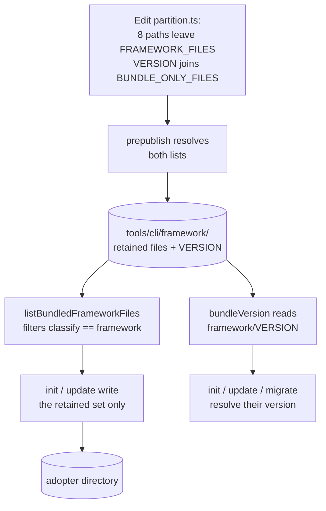
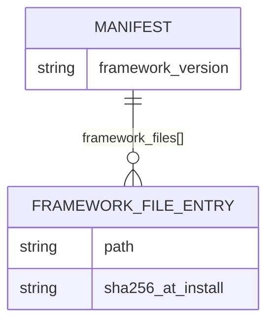
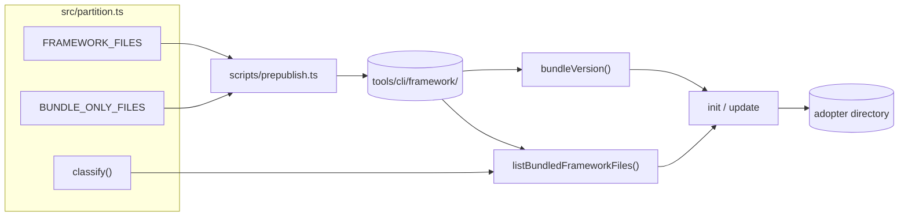

# PRD-005: Stop installing specforge's own project metadata into adopters

**Status**: Draft
**Date**: 2026-08-05
**Author**: AI-assisted
**Priority**: P1
**Depends on**: PRD-003
**Supersedes**: None

> **Note**: This is a **framework-internal PRD** — specforge applying its own
> process to change itself. The impacted sibling is `specforge` (see
> [`SIBLINGS.md`](SIBLINGS.md)). Framework-maintenance rules apply (see
> [`.claude/rules/framework-maintenance.md`](.claude/rules/framework-maintenance.md)).

## Impacted Projects

| Project | Impact |
|---------|--------|
| **specforge** | `FRAMEWORK_FILES` in `tools/cli/src/partition.ts` loses eight entries, seven of which are files adopters actually received. New `BUNDLE_ONLY_FILES` constant in the same file holding `VERSION`, which must stay in the npm tarball but must not be written into adopters. `tools/cli/scripts/prepublish.ts` resolves and copies that second list and prunes its now-unreachable `OPTIONAL` entries. `README.md` / `README.es.md` lose their file-layout tree entries, `VERSION`/`CHANGELOG.md` links, and `scripts/upgrade.sh` instructions for paths that will no longer be installed. New and extended tests under `tools/cli/tests/`. No changes to `.claude/rules/`, `templates/`, `agents/`, `examples/`, the manifest schema, or any command implementation. |

---

## 1. Problem Statement

`specforge init` and `specforge update` write specforge's own project metadata
into the adopting team's directory. The partition that decides this lives in
`tools/cli/src/partition.ts:13`, and it classifies as framework content seven
paths that no adopting team consumes: `CHANGELOG.md`, `VERSION`, `docs/**`,
`mkdocs.yml`, `requirements-docs.txt`, `.github/workflows/cli-release.yml`, and
`scripts/upgrade.sh`.

The reported failure is a coding agent working in an adopter's repository
reading the installed `CHANGELOG.md` as that team's own release history and
acting on it. This is the predictable outcome of the file's name and location:
the framework's entry point instructs the agent to read files in this
directory, and nothing inside `CHANGELOG.md` announces that it describes a
different project. `VERSION` has the same shape of failure. The CLI never reads
the installed copy — it resolves the version from the **bundle**
(`tools/cli/src/framework-bundle.ts:32`) and records the installed version in
`.specforge/manifest.json` — but the legacy shell upgrader does
(`scripts/upgrade.sh:15`, `:54-60`), so the installed copy is not entirely
inert, merely useless to everything an adopter should still be running.

Two entries are worse than noise. `docs/**` plants a `docs/` directory — a name
that collides with the directory most teams already use — containing
specforge's mkdocs site, alongside the `mkdocs.yml` and `requirements-docs.txt`
that build it. And `.github/workflows/cli-release.yml` is the workflow that
publishes `@angelkurten/specforge` to npm on any `v*.*.*` tag push. Where a
team installs specforge as its own repository — one of the two topologies
`README.md` documents — that workflow sits at a repository root and is live: a
team tagging their own `v1.2.0` triggers a workflow they did not write, holding
`id-token: write` (`.github/workflows/cli-release.yml:14`) and running
`npm publish --provenance` against `secrets.NPM_TOKEN` (`:51-54`).

An eighth path, `.github/workflows/specforge-ci.yml` (`partition.ts:30`), is
listed but does not exist in the repository, so `prepublish` skips it via its
`OPTIONAL` set (`scripts/prepublish.ts:111`). It is a live rule with no file
behind it: the day someone adds that filename, it ships to every adopter and
reproduces the `cli-release.yml` hazard. It is removed here rather than left
armed. It has never reached an adopter, which is why the counts differ — eight
entries leave `FRAMEWORK_FILES`, seven files stop being installed.

## 2. Goals

- When `init` or `update` writes a framework tree, the result shall contain
  only files an adopting team consumes: `CLAUDE.md`, `CONVENTIONS.md`,
  `LICENSE`, `README.md`, `README.es.md`, `.claude/rules/**`, `templates/**`,
  `agents/**`, and `examples/**`.
- Keep `VERSION` in the published tarball, because `bundleVersion()` reads it
  unguarded from `init`, `update` and `migrate`, while removing it from what
  those commands write into the adopter's directory.
- If a team creates a file at one of the vacated paths, then `update` shall
  leave it untouched.
- Ensure existing installations produce no new `doctor` findings and no
  behaviour change until the team chooses to act.
- Ensure no shipped framework file references a path that is no longer
  installed.
- Document, in the release notes, which files an existing adopter should delete
  and which they merely may delete.

## 3. Non-Goals

- **Automatic deletion of already-installed metadata.** A first version of this
  PRD specified a migration that deleted orphans, gated on a sha256 match
  against the manifest. The review panel returned blockers in two independent
  classes, and together they are the reason the machinery is not built.

  *Ordering and idempotency*: `update` run before `migrate` erases the manifest
  evidence the migration depends on (`update.ts:206-215` rebuilds
  `framework_files` from the bundle); `runMigrate` writes back a manifest it
  read before `up()` ran (`migrate.ts:244-246`), so entry-drops cannot land;
  installs at 0.7.0, 0.7.1 and 0.8.0 cannot reach any migration because
  `planMigrations` aborts at the first gap in the chain
  (`migrations-registry.ts:137-143`); and a failed deletion is recorded as a
  completed migration (`migrate.ts:222`) that can never be retried, leaving the
  adopter holding the live publish workflow permanently and silently.

  *Security*: the sha256 gate is not byte-identity — `sha256OfFile`
  canonicalises BOM, line endings and trailing newline (`sha.ts:13-30`) — so
  "any edit fails the gate" was false; TOCTOU sits between the hash check and
  the unlink; the hash gate follows a symlink because `readFile` resolves it
  (`sha.ts:44`) while only `safeUnlink`'s `lstat` (`safe-fs.ts:151-166`) would
  refuse, and that helper has no callers today; `safe-fs.ts` exposes no
  directory-removal primitive at all, so § 4.2's empty-directory cleanup had no
  guarded implementation; the manifest is unauthenticated JSON inside the tree
  being operated on (`manifest.ts:58-151` validates shape only), so an attacker
  who can write it controls both sides of the comparison; and
  `security_sensitive: false` would have suppressed the only pre-apply operator
  warning (`migrate.ts:153`) on the tool's first destructive operation.

  Building all of that to solve a cosmetic problem is the wrong trade. Orphans
  are inert — no validator reads `framework_files` (verified across
  `src/validators/`) — so they cost an adopter nothing until deleted.
- **Removing these files from specforge's own repository.** `CHANGELOG.md`,
  `docs/`, `mkdocs.yml` and `cli-release.yml` remain, and `docs.yml` keeps
  building and deploying the documentation site. This PRD changes only what is
  bundled into the npm tarball and written into adopters.
- **Reclassifying the vacated paths as team data.** They fall to `unknown`,
  which is inert. Claiming `docs/**` as team data would place the adopter's
  entire documentation tree in `init --force --erase`'s deletion list
  (`init.ts:77-79`, `:175-181`) — the same objection this PRD raises against
  claiming `scripts/**`.
- **A `doctor` validator reporting orphaned metadata.** Deferred; the release
  notes carry the cleanup list instead.
- **Fixing the silent fail-open in `framework-file-integrity`.** That validator
  returns no findings whenever the manifest version differs from the bundled
  version (`framework-file-integrity.ts:25`), and `doctor` then prints
  `0 error(s)`, indistinguishable from a verified-clean result. It is
  pre-existing, this PRD neither creates nor worsens it, and a warning-severity
  no-op signal belongs in its own PRD.
- **Retiring `scripts/upgrade.sh`.** It stays in the repository and its
  deprecation window is unchanged. See § 8 for what its de-classification
  costs.
- **Changing the rule, template, agent, or example sets.**

## 4. User Flows / Design



### 4.1 Happy path — new install

1. A team runs `npx @angelkurten/specforge@latest init`.
2. `prepublish` has already bundled the retained framework set plus `VERSION`.
3. `listBundledFrameworkFiles` (`framework-bundle.ts:73-78`) filters the bundle
   walk by `classify(p) === "framework"`. `VERSION` now classifies `unknown`,
   so it is excluded from what `init` writes and from `hashBundle` — no code
   change is needed at the call sites for this to hold.
4. The resulting directory contains no `CHANGELOG.md`, no `VERSION`, no
   `docs/`, no `mkdocs.yml`, no `requirements-docs.txt`, no
   `scripts/upgrade.sh`, and no `.github/workflows/` entry from specforge.
5. `bundleVersion()` still resolves, because `framework/VERSION` is present in
   the tarball.

### 4.2 Happy path — existing install

1. A team on 0.9.0 runs `update`. The reduced framework set is refreshed.
2. The seven previously-installed paths are neither refreshed nor deleted —
   `update` has no deletion path (`src/commands/update.ts` contains no unlink
   call) and this PRD does not add one.
3. `update` rebuilds `framework_files` from the bundle (`update.ts:206-221`),
   so the stale entries drop out of the manifest as a side effect. Nothing
   depends on them: no validator reads `framework_files`.
4. `doctor` reports 0 findings. `framework-file-integrity` iterates
   `opts.bundleHashes` (`validators/framework-file-integrity.ts:30`), not the
   manifest, and the vacated paths are no longer in the bundle to be compared.
5. The files remain on disk until the team deletes them, following § 10.

### 4.3 Error branches

| Condition | Behaviour | Covered by |
|---|---|---|
| Team has already created their own `CHANGELOG.md` at that path | `update` never touches it: it writes only paths present in `bundleHashes` (`update.ts:101`, `:158-163`). Classification is `unknown`, so `--force --erase` does not collect it either. | § 9 row 11 |
| Team runs `update` on a pre-0.7.0 layout with no manifest | Unchanged from PRD-003; this PRD adds no new manifest requirement. | pre-existing coverage |
| `framework/VERSION` missing from a hand-built or tampered bundle | `bundleVersion()` throws, and the three unguarded call sites propagate it rather than starting on an unknown version. | § 9 row 8 |
| A `BUNDLE_ONLY_FILES` entry is absent at publish time | `prepublish` exits non-zero from the bundle-only resolve loop; the entries are not in `OPTIONAL`. | § 9 row 7 |

## 5. API

No new command, no new flag, no changed exit code. The CLI surface of `init`,
`update`, `doctor`, `migrate` and `version` is unchanged.

### 5.1 `specforge init`

**Before**: writes 45 bundled framework files.
**After**: writes the retained set — 33 files, verified by applying the § 6
change and running `prepublish`. The vacated paths are absent from the tarball
or excluded by classification, so they cannot be written.

Secondary effect: `init --force --erase` no longer lists the vacated paths as
deletion targets, because `listEraseTargets` collects only `framework`- and
`team`-classified files (`init.ts:77-79`) and these are now `unknown`.
`.github/workflows/cli-release.yml` is the exception — it falls to the existing
`.github/workflows/*` team catch-all (`partition.ts:47`) and stays collectable,
which is correct for a workflow file in the team's own repository.

### 5.2 `specforge update`

**Before**: refreshes all framework files, including the seven.
**After**: refreshes the retained set. Files already on disk at a vacated path
are neither refreshed nor deleted.

### 5.3 `specforge migrate`

Unchanged. No migration module is added by this PRD.

## 6. Data Model

No persisted schema changes. `.specforge/manifest.json` keeps its shape
(`src/manifest.ts:30`); entries for the vacated paths drop out of
`framework_files` the next time `update` rebuilds the array, and nothing reads
them in the meantime.



### 6.1 Partition change — `tools/cli/src/partition.ts`

| Path | 0.9.0 | 0.10.0 | Rationale |
|---|---|---|---|
| `CHANGELOG.md` | framework | unknown | specforge's release history; the reported failure |
| `VERSION` | framework | **bundle-only** | bundle copy is the CLI's version source; install copy is read only by the deprecated shell upgrader |
| `docs/**` | framework | unknown | specforge's mkdocs site; `docs/` collides with the team's own |
| `mkdocs.yml` | framework | unknown | builds that site |
| `requirements-docs.txt` | framework | unknown | builds that site |
| `.github/workflows/cli-release.yml` | framework | team *(existing catch-all)* | publishes specforge's npm package |
| `.github/workflows/specforge-ci.yml` | framework | team *(existing catch-all)* | listed but no such file exists; a live rule with nothing behind it |
| `scripts/upgrade.sh` | framework | unknown | legacy upgrader, deprecated since PRD-003 |
| `CLAUDE.md`, `CONVENTIONS.md`, `LICENSE`, `README.md`, `README.es.md`, `.claude/rules/**`, `templates/**`, `agents/**`, `examples/**` | framework | framework | unchanged |

### 6.2 New constant — `BUNDLE_ONLY_FILES`

```ts
/**
 * Files copied into the npm tarball but never written into an adopter's
 * directory. `prepublish` resolves these alongside FRAMEWORK_FILES;
 * `listBundledFrameworkFiles` excludes them because they do not classify
 * as "framework". Entries must be relative, `..`-free, and must NOT
 * classify as "framework" — see § 9 row 3.
 */
export const BUNDLE_ONLY_FILES: ReadonlyArray<string> = ["VERSION"];
```

Removing both workflow entries from `FRAMEWORK_FILES` leaves the
framework-over-team precedence at `partition.ts:141-144` with no live case —
confirmed by matching every tracked file against the reduced lists and finding
zero double-matches. The comment explaining that precedence must be updated or
removed in the same edit rather than left describing a rule that no longer
fires.

## 7. Architecture

`partition.ts` is the source of truth for the partition: `prepublish.ts:15`
imports `FRAMEWORK_FILES` to populate `tools/cli/framework/`, and `init` /
`update` write the bundle filtered through `classify()`. This PRD adds a second
list to that same file, so the "one file decides" property holds for the CLI,
but the publish step now resolves two lists instead of one — `prepublish.ts:103`
gains a companion loop, and `BUNDLE_ONLY_FILES` entries are fatal-on-missing
rather than optional.

The property holds for the CLI only. `scripts/upgrade.sh` carries its own
divergent partition (`upgrade.sh:18-33`) that still copies `CHANGELOG.md`,
`VERSION` and the whole `scripts/` directory, so a legacy install whose
maintainer runs the shell upgrader re-acquires exactly what this PRD stops
installing. Retiring that script is out of scope (§ 3); § 10 tells adopters to
delete it.



## 8. Security

**Threat withdrawn for new installs: unwanted publish workflow.** Removing
`.github/workflows/cli-release.yml` from the bundle withdraws a workflow
requesting `id-token: write` and running `npm publish --provenance` against
`secrets.NPM_TOKEN` (`.github/workflows/cli-release.yml:14`, `:51-54`) from
repositories that never needed it. Removing the phantom `specforge-ci.yml`
entry closes the same hazard before a file appears behind it.

**Residual for existing installs.** This PRD deletes nothing, so every adopter
who installed at 0.9.0 or earlier as their own repository keeps that workflow
on disk and armed on `v*.*.*` tag push. The realistic blast radius is bounded —
the job's `defaults.run.working-directory: tools/cli` (`:21`) fails early in a
repository without that path — but an unaudited job holding `id-token: write`
alongside a publish token is the one cleanup item that is not cosmetic. § 10
lists it as **should delete**, separately from the rest.

**Second hazard withdrawn: `--force --erase` blast radius.** Because
`docs/**`, `mkdocs.yml`, `requirements-docs.txt`, `CHANGELOG.md` and
`scripts/upgrade.sh` classify `framework` today, `listEraseTargets` collects
them (`init.ts:78-79`) and `init --force --erase` unlinks them
(`init.ts:175-181`) — meaning it currently deletes an adopter's own `docs/`
tree if one exists at that path. Moving them to `unknown` removes that.

**Cost: `scripts/upgrade.sh` leaves integrity coverage.** At `framework` it is
in `bundleHashes`, so `doctor` reports tampering and `--force --erase` replaces
it. At `unknown` it is neither hashed nor compared nor collected. It is a
12 KB executable that persists on legacy installs and performs bulk copy into
the adopter tree, so anyone with write access to the adopter's repository can
modify it for execution the next time a maintainer runs it, and `doctor` will
no longer say so. This is why § 10 lists it as **should delete** rather than
leaving it in the cosmetic group.

**No destructive operation is introduced.** The `partition.ts` edit is
data-only; `classify()` and its absolute-path and `..` rejection
(`partition.ts:135-137`) are untouched. `prepublish` never reaches an adopter —
`scripts/` is in `tools/cli/.npmignore`. No code path gains write or delete
authority. The risks of the abandoned deletion design are enumerated in § 3.

**Bundle integrity.** `VERSION` moving to `BUNDLE_ONLY_FILES` keeps it inside
the npm-provenance-attested tarball. It leaves `hashBundle`'s scope because it
no longer classifies as `framework`, which removes no tamper detection that
existed: `hashBundle` *computes* hashes from the bundle
(`framework-bundle.ts:97`) and never attested the bundle's own `VERSION`.
Copies already on pre-0.10.0 installs are never refreshed and never compared
after this change, so they freeze at their install-time value — harmless,
because nothing in the CLI reads them, and covered by the § 10 cleanup list.

**PII**: none. No file this PRD touches carries personal data.

## 9. Test Plan

| # | Test | Type | Description | Path |
|---|------|------|-------------|------|
| 1 | vacated paths no longer classify as framework | unit | `classify()` returns `unknown` for `CHANGELOG.md`, `VERSION`, `mkdocs.yml`, `requirements-docs.txt`, `docs/x.md`, `docs/a/b.md`, `scripts/upgrade.sh`; and `team` for `.github/workflows/cli-release.yml` and `.github/workflows/specforge-ci.yml` via the existing catch-all. | `tools/cli/tests/unit/partition.test.ts` |
| 2 | retained paths still classify as framework | unit | `CLAUDE.md`, `CONVENTIONS.md`, `LICENSE`, `README.md`, `README.es.md`, `.claude/rules/x.md`, `templates/x.md`, `agents/x.md`, `examples/x.md` remain `framework`. Regression guard against over-removal. | `tools/cli/tests/unit/partition.test.ts` |
| 3 | `BUNDLE_ONLY_FILES` entries are well-formed and non-framework | unit | Every entry is relative, contains no `..`, is absent from `FRAMEWORK_FILES`, and satisfies `classify(e) === "unknown"` — asserting `unknown` specifically, since `ignored` would also be "not framework" but would mean the entry escaped the bundle root. | `tools/cli/tests/unit/partition.test.ts` |
| 4 | `--force --erase` no longer targets vacated paths | unit | `listEraseTargets` on a fixture containing `CHANGELOG.md`, `docs/x.md` and `scripts/upgrade.sh` collects none of them, still collects `CLAUDE.md`, and still collects `.github/workflows/cli-release.yml` via the team catch-all. | `tools/cli/tests/unit/partition.test.ts` |
| 5 | prepublish bundles the reduced set plus `VERSION` | integration | The bundle contains `VERSION` and every retained path, and none of the other seven vacated paths. Asserts the file count is 33. | `tools/cli/tests/integration/prepublish.test.ts` |
| 6 | prepublish prunes unreachable `OPTIONAL` entries | integration | No entry remains in `OPTIONAL` that is absent from both `FRAMEWORK_FILES` and `BUNDLE_ONLY_FILES`, so the set cannot silently excuse a future missing file. | `tools/cli/tests/integration/prepublish.test.ts` |
| 7 | prepublish fails closed on a missing bundle-only file | integration | With a second, non-`VERSION` entry added to `BUNDLE_ONLY_FILES` and no file behind it, `prepublish` exits non-zero and names it. Uses a non-`VERSION` entry deliberately: a missing repo-root `VERSION` already hard-fails at `prepublish.ts:82-86` before either list is resolved, so testing with `VERSION` would pass whether or not the new loop is fatal-on-missing. | `tools/cli/tests/integration/prepublish.test.ts` |
| 8 | `bundleVersion()` resolves, and throws when the bundle lacks `VERSION` | unit | Against a bundle built by the real `prepublish`, `bundleVersion()` returns the expected version. Against a bundle with `framework/VERSION` removed, it throws rather than returning a default. Direct regression guard for the defect this design exists to avoid. | `tools/cli/tests/unit/version.test.ts` |
| 9 | `init` / `update` / `migrate` start on the new bundle | integration | Each command resolves its version and completes on a fixture built from the reduced bundle. Covers the three unguarded `bundleVersion()` call sites (`init.ts:137`, `update.ts:88`, `migrate.ts:61`). | `tools/cli/tests/integration/init.test.ts` |
| 10 | a fresh install has no project metadata | e2e | `npm pack` + `npx ./tarball init` in a tmpdir: none of the seven vacated paths present; `doctor` exits 0. | `tools/cli/tests/e2e/pack-and-run.test.ts` |
| 11 | `update` neither resurrects nor deletes vacated paths | e2e | On a fixture that already contains `CHANGELOG.md` and `docs/x.md` from a 0.9.0 install, `update` leaves both byte-identical and does not recreate a deleted one. | `tools/cli/tests/e2e/pack-and-run.test.ts` |
| 12 | a team file at a vacated path survives `update` | e2e | Team-authored `CHANGELOG.md` with distinct content is unchanged after `update`. | `tools/cli/tests/e2e/pack-and-run.test.ts` |
| 13 | existing installs gain no doctor findings | integration | A 0.9.0-shaped fixture carrying all seven paths, updated to 0.10.0, reports 0 findings across all 13 validators, exit 0. | `tools/cli/tests/integration/doctor.test.ts` |
| 14 | no shipped framework file references a vacated path | conformance | `README.md` and `README.es.md` contain no link or instruction pointing at `VERSION`, `CHANGELOG.md`, `docs/`, `mkdocs.yml`, `requirements-docs.txt`, or `scripts/upgrade.sh`. Guards goal 5 against future reintroduction. | `tools/cli/tests/conformance/framework.test.ts` |

## 10. Migration Plan

**Order.** One release, 0.10.0. MINOR per the CHANGELOG's stated policy: no
rule or template changes, and no capability an adopter used is removed.

1. Edit `partition.ts` — remove the eight `FRAMEWORK_FILES` entries, add
   `BUNDLE_ONLY_FILES`, update the stale precedence comment (§ 6.2).
2. Edit `scripts/prepublish.ts` — resolve and copy `BUNDLE_ONLY_FILES`,
   fatal-on-missing; prune the `OPTIONAL` set (`prepublish.ts:111-118`), whose
   seven entries all become unreachable once the paths leave both lists.
3. Edit `README.md` and `README.es.md` — remove **every** reference to a
   vacated path, not only the file-layout tree. Concretely: the tree entries at
   `README.md:51-113`; the prose at `:113` recommending `scripts/upgrade.sh`;
   the `VERSION` and `CHANGELOG.md` links at `:208`; and the legacy-upgrader
   subsection at `:216-224`. Equivalent lines at `README.es.md:113`, `:210`,
   `:218-223`. No README link points into `docs/`, so the tree is the only
   `docs/` reference.
4. Add the CHANGELOG entry for 0.10.0 including the cleanup lists below.

**Backfill.** None required. Existing installs keep the seven paths; they are
inert, and the next `update` drops their manifest entries as a side effect of
rebuilding `framework_files` from the bundle.

**Cleanup for existing adopters (release notes).**

*Should delete — not cosmetic:*

- `.github/workflows/cli-release.yml` — live on `v*.*.*` tag push, holds
  `id-token: write` and a publish step. See § 8.
- `scripts/upgrade.sh` — executable, no longer covered by `doctor`'s integrity
  check, and applies a partition that reinstalls the files this release
  removes. See § 7.

*May delete — cosmetic:*

- `CHANGELOG.md`, `VERSION`, `docs/`, `mkdocs.yml`, `requirements-docs.txt`.

Deleting any of them is safe: nothing in the CLI reads them from an install.

**Rollback.** Revert the commit and publish a patch. No migration module, no
manifest surgery, and no deleted user data means rollback is a plain code
revert — an adopter on 0.10.0 who reverts to 0.9.0 gets the files written back
by the next `update`.

**Deploy sequence.** Single package; no service ordering. CI publishes on the
`v0.10.0` tag as usual.

## 11. Open Questions

None. The one open trade-off — whether to delete already-installed metadata
automatically — was resolved against building it, and the reasoning is recorded
in § 3.

---

## Gate: Promotion to `Implemented`

```yaml
commit_hash: [TBD]
tests:
  - [TBD]
system_artifact_diff: []
```
