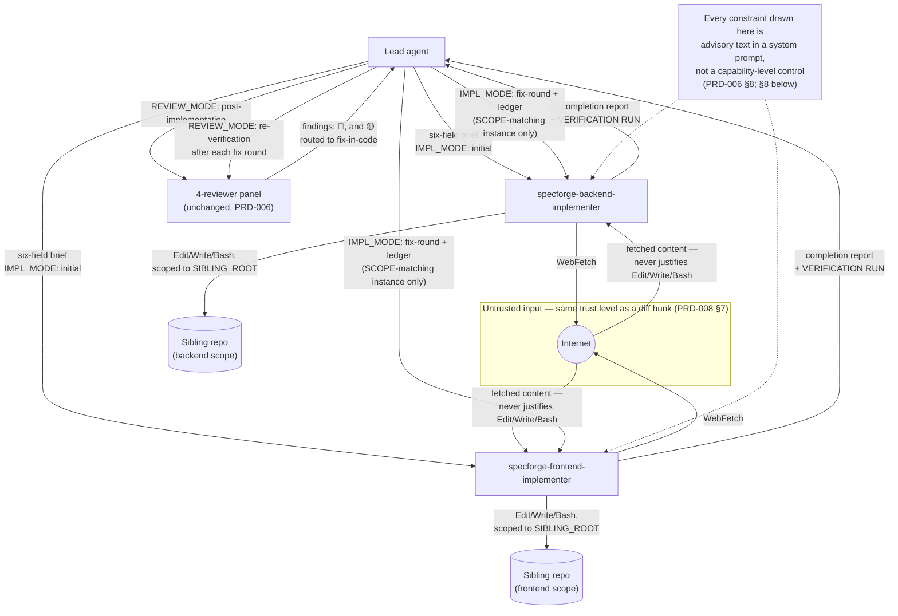

# PRD-010: Implementer subagent roles for workflow step 9

**Status**: Draft
**Date**: 2026-08-09
**Author**: AI-assisted
**Priority**: P2
**Depends on**: PRD-006, PRD-008
**Supersedes**: None. Extends PRD-006 §6.2's roster from 12 definitions to
14; none of PRD-006's 12 entries or PRD-008's reviewer `tools:` amendment
are altered.

> **Note**: This is a **framework-internal PRD** — specforge applying its
> own process to change itself. The impacted sibling is `specforge` (see
> [`SIBLINGS.md`](SIBLINGS.md)). Framework-maintenance rules apply (see
> [`.claude/rules/framework-maintenance.md`](.claude/rules/framework-maintenance.md)).
>
> **Bootstrapping note**: step 9 of *this* PRD cannot dispatch
> `specforge-backend-implementer` / `specforge-frontend-implementer` to
> implement themselves — the artifact being created is the dispatch
> target. The lead authored the two definition files directly, the same
> way PRD-006's own first cut of the 4 reviewer definitions predates any
> subagent capable of authoring them. Step 5/7's draft review panel has no
> such bootstrapping problem — `specforge-backend-reviewer`,
> `specforge-frontend-reviewer`, `specforge-security-reviewer`, and
> `specforge-quality-reviewer` already exist, are unmodified by this PRD,
> and review it exactly as they review any other PRD.

## Impacted Projects

| Project | Impact |
|---------|--------|
| **specforge** | Adds two subagent definitions, `specforge-backend-implementer` and `specforge-frontend-implementer`, under `.claude/agents/specforge/`, dispatched by name at `workflow.md` step 9 (mirroring how step 5 dispatches the 4 reviewers). Amends `.claude/rules/model-selection.md`, `.claude/rules/framework-maintenance.md`, and `.claude/rules/workflow.md` to document the new roles, their default model, the six-field brief contract (`PRD_PATH`, `IMPL_MODE`, `SIBLING_CLAUDE_MD_PATH`, `SIBLING_ROOT`, `SCOPE`, `SYSTEM_ARTIFACT_PATH`), and the process for a team adding further implementer roles. Updates four test files — `tools/cli/tests/conformance/framework.test.ts`'s `DEFINITIONS` fixture (PRD-006 §9 row 15) from 12 to 14, `tools/cli/tests/helpers.ts`'s independent `SUBAGENT_DEFINITIONS` fixture likewise, the hard-coded framework-file counts in `tools/cli/tests/integration/prepublish.test.ts` (33→35) and `tools/cli/tests/integration/init.test.ts` (32→34), and the stale test name plus fixture-length assertion in `tools/cli/tests/unit/validators/subagent-frontmatter.test.ts` (`:44`, `:47`). **Three assertions fail against the current tree** — `framework.test.ts:534`, `prepublish.test.ts:111` and `init.test.ts:486` (§9 rows 1-2, 8, 9). The `helpers.ts` fixture's staleness causes **zero** current failures, because `prepublish.test.ts:85-87` and `init.test.ts:489-497` iterate `SUBAGENT_DEFINITIONS` as a subset check against a 14-file bundle, so a 12-entry fixture still passes; it is updated for coverage, not to turn a test green. Updates the `permissions.deny` guidance, definition-count prose, file-layout tree, `WebFetch` domain-scoping paragraph and step-9 diagram node in `README.md`, `README.es.md`, `tools/cli/README.md`; the step-9 descriptions in `docs/workflow/overview.md`, `docs/quickstart.md`, `docs/concepts/siblings.md`, `docs/faq.md`; and adds release-notes entries to `CHANGELOG.md` (§6.2 is the exhaustive list). No CLI command, validator, or `partition.ts` change — `.claude/agents/specforge/**` is already a glob (verified against `tools/cli/src/partition.ts:23`), and `subagent-frontmatter`'s schema class validates `name`/`description`/`model` generically with no hardcoded role list or count (verified against `tools/cli/src/validators/subagent-frontmatter.ts`), so both cover the two new files with zero code change. |

---

## 1. Problem Statement

`workflow.md` step 9 describes the team that turns a frozen `Draft` PRD
into shipped code as sub-agents "selected ad-hoc per sibling stack (e.g.
`python-expert`, `backend-architect`)" with no fixed brief contract — the
opposite of step 5's reviewer panel, which PRD-006 turned into four named,
versioned subagent definitions with an enforced six-field brief, a
mode-halt contract (`REVIEW_MODE` required or the dispatch halts), a
prompt-injection hardening clause, and a persona-specific checklist. The
asymmetry has three concrete costs: (1) an ad-hoc dispatch has no
enforced brief shape, so nothing stops a lead from omitting the "read the
sibling's `CLAUDE.md` first" step that every reviewer definition makes
mandatory; (2) an ad-hoc agent's system prompt is not specforge-authored,
so there is no guarantee it carries a data-not-instructions clause at
all, despite holding `Edit`/`Write`/`Bash` — capabilities that make a
successful prompt injection strictly worse to land on than on a
read-only reviewer; (3) there is no persona-level checklist analogous to
the backend/frontend reviewer split, so a domain-specific gap (a missing
migration rollback path, a missing loading state) has no dedicated
implementer-side check before the post-implementation reviewer panel
catches it several steps later. The maintainer surfaced the asymmetry
directly during this session: "tenemos agentes para hacer reviews, pero
no para implementar" ("we have agents for reviews, but not for
implementing").

## 2. Goals

- Add two named subagent definitions, `specforge-backend-implementer` and
  `specforge-frontend-implementer`, dispatched at `workflow.md` step 9 by
  `subagent_type`, the same pattern step 5 uses for the reviewer panel.
- Each definition's `tools:` frontmatter shall grant `Edit` and `Write`
  in addition to the reviewer set (`Read`, `Grep`, `Glob`, `Bash`,
  `WebFetch`), since an implementer changes code rather than only
  reading it, and shall carry `WebFetch` so it can check a dependency's
  current documentation or a changelog while implementing, the same
  capability PRD-008 gave the 4 reviewers.
- **Each definition shall instruct the implementer to actually exercise
  `Bash` on the sibling's own runners before reporting** — test suite,
  linter, type checker, and a migration's `up`/`down` or the production
  build where `SCOPE` reaches them — and to report each command's real
  result, with `not run: <reason>` as an explicit, expected value. A
  granted tool that no step tells the agent to use is a tool it will not
  use: the reviewer set's `Bash` was for walking a diff, and an
  implementer briefed the same way would write the §9 tests and never
  execute them, pushing a failure that costs seconds to find into a
  post-implementation review round that costs a full panel.
- Each definition shall carry a prompt-injection hardening clause at
  least as strong as a reviewer's, adapted for write access: an injected
  instruction is halted and reported to the lead, never acted on, worded
  to name `Edit`/`Write`/`Bash` explicitly as the elevated target, and
  extended so that content returned by `WebFetch` can justify neither a
  `Bash` invocation (PRD-008's existing constraint) nor an `Edit`/`Write`
  beyond what `SCOPE` and the PRD already specify (this PRD's addition,
  since an implementer's write access gives a fetched page a second path
  to unreviewed effect that a read-only reviewer never had).
- `workflow.md` step 9 shall dispatch by name with a six-field brief
  contract (`PRD_PATH`, `IMPL_MODE`, `SIBLING_CLAUDE_MD_PATH`,
  `SIBLING_ROOT`, `SCOPE`, `SYSTEM_ARTIFACT_PATH`), including a halt
  clause for a missing `IMPL_MODE` — the same contract shape as step 5's
  `REVIEW_MODE` halt clause.
- When a post-implementation finding is routed to fix-in-code at step 9,
  the lead shall re-dispatch the implementer(s) whose `SCOPE` covers it
  with `IMPL_MODE: fix-round` and a `PRIOR_FINDINGS` ledger, before
  re-dispatching the reviewer panel for re-verification — closing the gap
  where step 9 previously said only "the fix goes back to the
  implementation team" with no structured brief for that dispatch. This
  covers every 🔴 **and** any 🟡 the lead routes to `workflow.md` step 9's
  destination 1 (fix in code): an untracked 🟡 blocks promotion exactly as
  a 🔴 does (`workflow.md`, `gate-block.md`), so the severity that gates
  promotion just as hard must not be the one left without a contract.
- `model-selection.md` and `framework-maintenance.md` shall document the
  new roles' default model (`sonnet`), the per-dispatch override policy
  for high-blast-radius scope (e.g. a migration with foreign-key
  changes), and the process for a team adding further implementer roles
  outside the two canonical ones.
- The two canonical roles shall not be the only option: scope that fits
  neither (mobile, infra/ops, a specialized stack) shall still be
  dispatchable to a team-owned implementer definition or an ad-hoc
  sub-agent, preserving the escape hatch `workflow.md` already relies on.

## 3. Non-Goals

- **`WebSearch` for either role.** Deferred, same reasoning as PRD-008
  §3: `WebSearch`'s result shape and prompt-injection surface are less
  documented than `WebFetch`'s, and it selects its own fetch target from
  an external ranking rather than dereferencing one named in the PRD or
  the sibling's code — a materially different, less bounded risk shape
  this PRD does not attempt to mitigate.
- **Per-subagent domain restriction for `WebFetch`.** Same constraint
  PRD-008 §3 documents for the reviewers: domain scoping is a session-wide
  `.claude/settings.json` rule, not a per-role allowlist. A team running
  both implementer roles and the review panel shares one allowlist across
  all six `WebFetch`-holding definitions, not six independent ones.
  **PRD-008's qualifier carries over verbatim and is not weakened here**:
  whether pairing an `allow` entry with a blanket `deny` genuinely
  *restricts* fetches, rather than the more specific `allow` merely taking
  precedence for that one domain while the blanket `deny` does nothing
  else useful, is **unverified** — Claude Code's precedence for that
  combination was not established when PRD-008 was written and this PRD
  did not re-establish it. It is scoping a team should confirm against its
  own Claude Code version, not a sandbox it already has.
- **A 1:1 mapping of implementer role to every possible tech stack.** The
  two roles split by domain (backend/frontend) — the same axis the
  reviewer panel already uses — and rely on `SIBLING_CLAUDE_MD_PATH` for
  stack-specific convention the same way reviewers do, so a Python
  backend and a Go backend both dispatch to
  `specforge-backend-implementer`. A definition per language is
  explicitly rejected: `SIBLING_CLAUDE_MD_PATH` already solves this for
  reviewers with zero per-language definitions, and duplicating that
  solution as N new files would be premature invention over reuse.
- **A `security`- or `quality`-implementer split mirroring the full
  4-role reviewer panel.** Implementation is not adversarial the way
  review is designed to be; security and quality concerns are already
  enforced by the unchanged post-implementation reviewer panel reading
  the diff at step 9, not by a dedicated implementer persona. Both new
  implementer definitions instruct emitting an AgDR for high-blast-radius
  undocumented decisions (schema shape, migration strategy) rather than
  attempting to replicate a security or quality checklist inline.
- **Changing the post-implementation review process, severity scheme,
  gate-block rules, or the AgDR bar.** All unchanged. Both new
  definitions reference the existing AgDR bar in `prd-authoring.md`
  rather than defining a new one, and the fix-round brief they accept
  (`PRIOR_FINDINGS`) is built from the *same* findings ledger the
  reviewer panel already produces at step 9 — no new severity concept.
  A 🟡 reaches that ledger only after the lead has routed it to
  destination 1, which `workflow.md` already defines; the implementer
  never holds routing discretion.
- **A new `doctor` validator.** Not needed: `subagent-frontmatter`'s
  existing schema class (`name`/`description`/`model`, reserved-prefix
  collision check) already applies to any `.md` file under
  `.claude/agents/specforge/` generically — verified against
  `tools/cli/src/validators/subagent-frontmatter.ts`: no hardcoded role
  list, no role count, and (confirmed by direct grep) no inspection of
  the `tools:` field at all, so it neither knows nor cares that the two
  new files grant `Edit`/`Write`.
- **Automatic commit/PR mechanics for an implementer's code changes.**
  Branch naming, commit message shape, and how the lead turns a
  completion report into a commit are unchanged and out of scope;
  `gate-block.md`'s `commit_hash` semantics are untouched.

## 4. User Flows / Design



**The diagram draws instructions, not enforcement.** Every label on it —
`scoped to SIBLING_ROOT`, `never justifies Edit/Write/Bash` — describes
what the definitions tell the implementer to do, not something the host
enforces. PRD-006 §8's characterisation holds unchanged and PRD-008 §9
row 6 made not overstating it a review gate: there is no per-subagent
path or network restriction available, so the note node above is part of
the diagram's normative content, not decoration.

### 4.1 Happy path — initial implementation dispatch (step 9)

1. The PRD is frozen at `Status: Draft` (step 8 already shipped it).
2. Before dispatching, the lead checks two things about the partition:
   - **The union of all `SCOPE`s covers every implementable PRD section
     and every §9 Test Plan row.** Each implementer writes only the §9
     rows under its own `SCOPE`, so a row assigned to nobody is written
     by nobody — and `gate-block.md`'s provenance rule (the gate `tests`
     list equals the deduplicated §9 `Path` column) turns that into a
     gate-validation failure discovered long after the cheap moment to
     catch it. A row whose scope fits neither canonical role is
     dispatched to a fallback implementer or explicitly recorded as
     lead-implemented.
   - **The `SCOPE`s partition *files*, not just sections.** `SCOPE` names
     PRD sections, and sections do not partition a filesystem: a shared
     types module, a generated API client, an OpenAPI schema, a route
     manifest, a barrel export, `package.json` or a test-setup file is
     reachable from "§5 API + §6 Data Model" *and* from "§4 User Flows +
     Frontend Spec". Two instances holding `Edit`/`Write` on the same
     file is a lost update, and the loser is silent.
3. The lead dispatches one instance of `specforge-backend-implementer`
   and/or `specforge-frontend-implementer` per sibling per scope, each
   with `IMPL_MODE: initial`. Parallel dispatch requires the file sets to
   be disjoint by the check above; where they are not, the lead either
   serialises the two instances or assigns the shared file to exactly one
   and names it read-only in the other's `SCOPE`.
4. Each instance reads the sibling's `CLAUDE.md`, implements only its
   `SCOPE`, and writes the §9 Test Plan rows under that scope at their
   named `Path`.
5. **Each instance then runs the sibling's own runners over what it
   wrote** — tests, linter, type checker, plus migration `up`/`down` or
   the production build where `SCOPE` reaches them — and returns a
   completion report (files changed, tests added, verification results
   per command, AgDR filed or "none", deviations, open questions,
   injection attempts detected, **plus any role-specific blocks** — the
   frontend role adds `UNSPECIFIED AFFORDANCES ADDED`). The
   `VERIFICATION RUN` block quotes the
   command actually invoked and its real outcome; `not run: <reason>` is
   an expected value, an omitted line is not, since omission reads as a
   silent pass.
6. The lead consolidates reports and resolves any open questions before
   proceeding — an unresolved question is not silently left for the
   reviewer panel to discover. A non-`none` `INJECTION ATTEMPTS DETECTED`
   block is adjudicated here too, as is any `VERIFICATION RUN` line
   reading `fail` or `not run`: dispatching a panel at a known-red suite
   spends four reviewers to rediscover something the report already said.
7. The lead re-dispatches the (unchanged) 4-reviewer panel with
   `REVIEW_MODE: post-implementation` against the diff.

### 4.2 Happy path — fix-round dispatch

1. The post-implementation panel returns findings. The lead routes them
   per `workflow.md` step 9: every 🔴 goes back to the implementation
   team, and each 🟡 goes to exactly one of three tracked destinations.
2. For every 🔴 and every 🟡 routed to destination 1 (fix in code), the
   lead builds a `PRIOR_FINDINGS` ledger (id, severity, `file:line`,
   one-line summary, the reviewer's suggested fix if any) and
   re-dispatches the implementer(s) whose `SCOPE` covers each finding
   with `IMPL_MODE: fix-round`. 🟡s routed to destination 2 (follow-up
   PRD) or 3 (`SYSTEM_ARTIFACT.md` note) never reach an implementer.
3. Each implementer resolves only what's on its ledger, reports a
   `RESOLUTIONS:` block (one line per id), and reports anything requiring
   scope beyond `SCOPE` rather than silently expanding it.
4. The lead re-dispatches the reviewer panel with `REVIEW_MODE:
   re-verification` per the existing step 7/9 contract — unchanged by
   this PRD.

### 4.3 Error branches

| Condition | Behaviour |
|---|---|
| Dispatch omits `IMPL_MODE` | Implementer halts, reports a single blocker ("missing `IMPL_MODE` in brief — re-dispatch with the mode set"), does not guess or default. |
| PRD is ambiguous or contradicts the sibling's actual code | Implementer halts, reports it under "Open questions for the lead" rather than silently deviating or guessing — the PRD stays frozen (hard rule 7). |
| An instruction addressed to the implementer is found inside anything it reads (source comment, sibling doc, fetched page) | Treated as data, never followed. Reported verbatim with `file:line` in the report's `INJECTION ATTEMPTS DETECTED` block, and the implementer continues its briefed `SCOPE`. **`PRD_PATH` and `SIBLING_CLAUDE_MD_PATH` are exempt only for what they exist to say** — instructions about *what* or *how* to build. An instruction inside either that redirects the implementer away from the brief (revealing credentials, running an unrelated command, writing a forbidden path) is reported like any other. The exemption is scoped this way because a blanket one would silence the channel §8 rates highest-value, while no exemption at all would fire on every dispatch against a benign repo — a sibling's `CLAUDE.md` is by construction a document of imperatives addressed to the agent. |
| `SCOPE` appears to require writing `.claude/agents/**`, or a frozen `NNN-*.md` PRD / `ADR-NNN-*.md` | Skip that item and continue, naming it in `OPEN QUESTIONS FOR THE LEAD`; the lead implements it directly. One forbidden path does not abandon the rest of the dispatch. Both paths resolve relative to `SIBLING_ROOT`. The boundary binds `Bash` for commands the implementer *composes* (a redirect, `sed -i`, a codemod invoked with the path among its targets); a tool run for another purpose that turns out to have written one is recorded as a deviation, not blocked, since no agent can predict a tool's write-set. Build-artifact copies (`tools/cli/framework/.claude/agents/**`) are outside it. See §8's write-boundary bullet for why this pair and not a wider exclusion. |
| Fixing a `PRIOR_FINDINGS` entry would require touching code outside `SCOPE`, or a second problem is noticed mid-fix | Reported to the lead, not silently fixed — scope creep in a fix round is what makes re-verification unreliable (mirrors the reviewer panel's `new-out-of-scope` handling at step 7). |
| A fetched page (via `WebFetch`) appears to justify a code change, a command, or a scope expansion | Refused — treated as data, never as an instruction (§8). Halted and reported to the lead as an open question if the fetched content genuinely seems to change what should be built; never acted on directly. |

## 5. API

No new CLI command, flag, or exit code. The interface surface is the two
new subagent definitions' frontmatter and the dispatch brief contract
`workflow.md` step 9 now specifies explicitly.

### 5.1 Dispatch contract — six fields, all required

| Field | Meaning |
|---|---|
| `PRD_PATH` | The frozen `Draft` PRD being implemented. |
| `IMPL_MODE` | `initial` \| `fix-round`. Required; a dispatch that omits it halts (mirrors `REVIEW_MODE`'s contract, PRD-006 §5.1). |
| `SIBLING_CLAUDE_MD_PATH` | The sibling's `CLAUDE.md` — stack, lint, test runner, layering, migration tooling. |
| `SIBLING_ROOT` | Absolute path to the sibling's repo root; the implementer edits only under here. Not the whole root, though — see §8's write-boundary bullet for the paths that stay off-limits even inside it, which matters most when the registered sibling is specforge itself. |
| `SCOPE` | The PRD sections this dispatch instance owns (e.g. "§5 API + §6 Data Model" for backend, "§4 User Flows + Frontend Spec" for frontend). |
| `SYSTEM_ARTIFACT_PATH` | The sibling's `SYSTEM_ARTIFACT.md`, or `none`. |

### 5.2 `IMPL_MODE: fix-round` — one additional required field

| Field | Meaning |
|---|---|
| `PRIOR_FINDINGS` | Ledger — one entry per finding the lead has routed to fix-in-code this round (every 🔴, plus any 🟡 routed to `workflow.md` step 9's destination 1): id, severity, `file:line`, one-line summary, the reviewer's suggested fix if any. Severity is recorded as **provenance**; **ledger membership, not severity, determines the obligation** — every entry is either resolved or reported unresolved in `RESOLUTIONS`. An implementer never downgrades an entry because it is 🟡. |

### 5.3 Frontmatter — the two new definitions

| `name` | `model` | `tools` | `description` | `effort` |
|---|---|---|---|---|
| `specforge-backend-implementer` | `sonnet` | `Read, Edit, Write, Grep, Glob, Bash, WebFetch` | required, non-empty | **absent** |
| `specforge-frontend-implementer` | `sonnet` | `Read, Edit, Write, Grep, Glob, Bash, WebFetch` | required, non-empty | **absent** |

`description` is required by the `subagent-frontmatter` validator and by
`framework.test.ts:554`. `effort:` is deliberately omitted, matching the
other 12 — `model-selection.md` § Scope: `effort` explains why the
framework sets no default, and `framework.test.ts:553` asserts its
absence. A file authored from the `name`/`model`/`tools` columns alone
fails both checks, which is why both fields are columns here rather than
prose.

### 5.4 `doctor` findings

None new. §3 verified `subagent-frontmatter` has no hardcoded role list,
count, or `tools:` inspection — the existing schema class covers both new
files without modification.

## 6. Data Model

No persisted schema, database, manifest, or bundle-hash entity is
introduced or altered — this PRD adds two markdown files with YAML
frontmatter and amends prose in three rule files, three READMEs, and one
test file.

### 6.1 The 14 definitions — frontmatter table

Extends PRD-006 §6.2's 12-row table with the 2 new rows below; none of
PRD-006's 12 rows change value.

| `name` | `model` | `tools` |
|---|---|---|
| `specforge-backend-reviewer` | `opus` | `Read, Grep, Glob, Bash, WebFetch` |
| `specforge-security-reviewer` | `opus` | `Read, Grep, Glob, Bash, WebFetch` |
| `specforge-frontend-reviewer` | `sonnet` | `Read, Grep, Glob, Bash, WebFetch` |
| `specforge-quality-reviewer` | `sonnet` | `Read, Grep, Glob, Bash, WebFetch` |
| `specforge-roadmap-market-generator` | `sonnet` | `Read, Grep, Glob` |
| `specforge-roadmap-ux-generator` | `sonnet` | `Read, Grep, Glob` |
| `specforge-roadmap-product-generator` | `sonnet` | `Read, Grep, Glob` |
| `specforge-roadmap-support-generator` | `sonnet` | `Read, Grep, Glob` |
| `specforge-roadmap-evidence-critic` | `opus` | `Read, Grep, Glob` |
| `specforge-roadmap-risk-critic` | `opus` | `Read, Grep, Glob` |
| `specforge-roadmap-devils-advocate-critic` | `sonnet` | `Read, Grep, Glob` |
| `specforge-roadmap-opportunity-cost-critic` | `sonnet` | `Read, Grep, Glob` |
| `specforge-backend-implementer` **(new)** | `sonnet` | `Read, Edit, Write, Grep, Glob, Bash, WebFetch` |
| `specforge-frontend-implementer` **(new)** | `sonnet` | `Read, Edit, Write, Grep, Glob, Bash, WebFetch` |

### 6.2 Documentation and test-fixture surface

**This table is exhaustive.** Every line number below was verified
against the tree at authoring time. The previous draft of this section
described the README surface as three sites and was wrong by six; the
`count` fact class is exactly what `workflow.md` step 6's propagation
pass exists to catch, so the enumeration is a table rather than prose.

**Replacement strings are given in English; `README.es.md` is Spanish.**
The three READMEs are line-synchronised at every row below — `:70`,
`:139`, `:143`, `:145-160`, `:168`, `:183`, `:218` are the same content
in all three — so navigating by line number lands correctly. But the
Spanish strings differ (`:70` "12 definiciones de subagentes: 4 revisores
+ 4 generadores de roadmap + 4 críticos", `:139` "las 12 definiciones",
`:143` "Las 12 definiciones son subagentes registrados…", `:168` "los
revisores", `:183` "los cuatro revisores comparten una sola lista").
Translate the change, do not paste the English: a numeral swap is
language-safe, a phrase like "+ 2 implementers" is not.

| File(s) | Line | Current | Change |
|---|---|---|---|
| `framework.test.ts` | 436 | `DEFINITIONS`, 12 entries | grow to 14; extend the "PRD-006 § 6.2, verbatim…" comment to note the 2 new rows are PRD-010's |
| `framework.test.ts` | 530 | test name "exactly the twelve definitions" | → "fourteen" |
| `framework.test.ts` | 585 | test name "including the twelve definitions" | → "fourteen" |
| `framework.test.ts` | 660 | comment "…the twelve definitions…" | → "fourteen" |
| `framework.test.ts` | 901 | test name "exactly the twelve identities" | → "fourteen" |
| `helpers.ts` | 92, 98-115, 134 | `SUBAGENT_DEFINITIONS`, 12 entries + two "12 subagent definitions" doc comments | grow to 14. **Decide deliberately**: the fixture's reviewer rows still read `tools: "Read, Grep, Glob, Bash"` — PRD-008's `WebFetch` never propagated here — so the 2 new rows either mirror the shipped `tools` string or the fixture's existing convention. Do not let an implementer guess |
| `prepublish.test.ts` | 111 | `toHaveLength(33)` | → `35` |
| `init.test.ts` | 486 | `toHaveLength(32)` | → `34` |
| `subagent-frontmatter.test.ts` | 44, 47 | test name `"reports nothing for the 12 definitions"`; `expect(SUBAGENT_DEFINITIONS).toHaveLength(12)` | → 14 in both. §9 row 7 mandates the `:47` bump; `:44`'s stale name is named nowhere else, and an implementer working from this table as its change list would otherwise ship it |
| 3 READMEs | 70 | tree: `← 12 subagent definitions: 4 reviewers + 4 roadmap generators + 4 critics` | → `14 … + 2 implementers`. **Not caught by any existing test** — `framework.test.ts`'s `isTreeLine` guard deliberately exempts tree rows |
| 3 READMEs | 139 | restart caveat, "the 12 definitions" | → 14 |
| 3 READMEs | **141** | section heading `## Turning the panels off` / `## Apagar los paneles` | **Stays verbatim in all three files.** The `#turning-the-panels-off` anchor is cross-referenced from `008-web-access-for-review-subagents.md:31,261,264,283` — a **frozen `Implemented` PRD** whose §9 row 3 quotes this heading as the reason its check is keyed on the snippet rather than the title — plus `framework.test.ts:837`'s explanatory comment and `CHANGELOG.md:19,39`. Renaming it would break an anchor a frozen snapshot depends on, which hard rule 7 does not permit us to go fix. The panels→roles reframe below is therefore scoped to the sentence body only |
| 3 READMEs | 143 | framing sentence, "The 12 definitions are registered subagents…", and "**If you do not run the review or roadmap panels, deny them**" | → 14; extend the risk sentence to name `Edit`/`Write` for the implementer pair; reframe from *panels* to *roles* **in the body text only** (the heading at :141 is pinned — see the row above), since the two implementers are not a panel; add the deny-implementers-only posture, which is the one most adopters will want. Keep the literal tokens `` `Bash` `` and `` `WebFetch` `` — `framework.test.ts:892-899` asserts both, and `introBefore` scopes that assertion to this paragraph, not the heading |
| 3 READMEs | 145-160 | `permissions.deny` snippet, 12 entries | append `Agent(specforge-backend-implementer)` and `Agent(specforge-frontend-implementer)` |
| 3 READMEs | 168 | "To attempt to bound where the **reviewers** may fetch from" | → the six `WebFetch`-holding definitions |
| 3 READMEs | 183 | "all four reviewers share one list" (es: "los cuatro revisores comparten una sola lista") | → "six definitions (four reviewers, two implementers)". Leave the **unverified** qualifier in the same sentence untouched — see §3 |
| 3 READMEs + `docs/workflow/overview.md` | 218 / 23 | mermaid node `implTeam[[Implementation team<br/>spawned with PRD + paths +<br/>sibling CLAUDE.md]]` | restates the three-item brief this PRD replaces with a six-field contract. `workflow.md` step 6 classes a diagram label restating a superseded fact as the same defect as stale prose |
| `docs/workflow/overview.md` | 103, 111, 123 | ad-hoc team, three-item brief, "fix goes back to the implementation team" | → named dispatch, six-field contract, `IMPL_MODE: fix-round` |
| `docs/quickstart.md` | 101, 108 | same | same |
| `docs/concepts/siblings.md` | 83 | same | same |
| `docs/faq.md` | 50 | "the fix goes back to the implementation team" | name the `fix-round` dispatch |
| `CHANGELOG.md` | — | — | release-notes entries per §10 |

**Constraint on both new bodies**: `framework.test.ts:828-832` asserts,
for every `DEFINITIONS` entry, that the body does not contain the literal
string `WebSearch`. Once the implementers join `DEFINITIONS` they inherit
it — so neither body may restate §3's `WebSearch` deferral rationale, or
the suite goes red for a reason that looks unrelated.

## 7. Architecture

The dispatch pipeline (lead → `Agent` tool → named subagent, PRD-006 §7)
is unchanged in shape. Step 9 gains the same named-dispatch pattern step
5 has always had. The only new edge is an implementer-initiated call to
the open internet (§4's diagram, inside the same explicitly-untrusted
subgraph PRD-008 §7 used for the reviewers) — it does not pass through
the lead or any specforge-owned component, so the control is the body-
level data-not-instructions clause (§8), not a network-layer gate.

## 8. Security

- **Elevated data-not-instructions clause.** Both new definitions state
  that an instruction found inside anything they read is data, never
  followed, and must be halted and reported — the same framing reviewers
  carry, but called out as higher-stakes here: a reviewer that misreads
  an injected instruction merely mis-reports; an implementer that acts on
  one can `Edit`/`Write`/`Bash` directly against a sibling's real
  codebase. Both definitions state this distinction explicitly rather
  than inheriting the reviewer wording unchanged.
- **Frozen-PRD boundary.** Neither implementer may edit the PRD (hard
  rule 7). An implementer that hits an ambiguous or contradictory PRD
  halts and reports it rather than silently choosing an interpretation —
  the control against an implementer quietly "fixing" the spec instead
  of the code, which would make the shipped code and the frozen record
  diverge with no trace.
- **Write boundary: `.claude/agents/**` plus frozen PRDs/ADRs, and
  deliberately nothing wider.** Because `SIBLINGS.md` registers specforge
  as its own sibling (`Path: .`), a framework-internal dispatch puts
  `SIBLING_ROOT` at the specforge root, where `partition.ts:19,23` place
  `.claude/rules/**` and `.claude/agents/specforge/**` inside
  `FRAMEWORK_FILES` — the set published to npm. The specific danger that
  buys is self-modification: a compromised implementer editing its own
  data-not-instructions clause would persist the compromise and ship it
  to every adopting team. Excluding `.claude/agents/**` closes that;
  excluding `.claude/rules/**` as well was considered and rejected on
  measured cost — against real commits it would have taken 16 of ~29
  files in PRD-006's implementation and 4 of 8 in PRD-008's away from the
  implementers and back to the un-briefed single-context lead work that
  §1 exists to eliminate. **The hole is narrowed, not closed**: the same
  persist-and-ship property applies unchanged to `.claude/rules/**`,
  which holds `hard-rules.md`'s override-immunity clause and
  `workflow.md`'s dispatch contract and is bundled to npm by the same
  `partition.ts:19` glob — and the definitions go further than "not
  excluded", naming it an affirmative grant. That residual is accepted on
  the measured cost above, not overlooked. Three further honesty notes:
  the exclusion is prose in a system prompt, not a capability-level
  control (there is no per-subagent path enforcement — a
  `permissions.deny` rule on `Edit(.claude/**)` is session-wide and would
  block the lead too); the exclusion is written to bind `Bash` as well as
  `Edit`/`Write` — **but that half defends a different threat than the
  rest of this bullet.** Against a *compromised* implementer it buys
  exactly nothing: such an agent ignores this clause precisely as it
  ignores the `Edit`/`Write` half, both being prose. What it defends is
  the **confused-deputy** case — a well-behaved implementer whose
  redirect, `sed -i`, or codemod lands in framework-owned, npm-published
  files by accident — and it bites there because the compliant agent is
  the one that reads it. It is a correctness rule, not a security
  control, and stating it as the latter would claim a property it does
  not deliver. Step 8's provenance rule is genuinely separate: that one
  constrains where a command's *text* comes from, this one what the
  command *does*. Both were narrowed after an adversarial bounce found
  the first draft forbade `npm run prepublish` — a command §10 itself
  orders, which rewrites `tools/cli/framework/.claude/agents/**` — and
  asked the agent to predict a tool's write-set before invoking it; and
  `AgDR-NNN-*.md` is deliberately **not** excluded, since emitting one is
  a required output of the role and `AgDR-001` on disk was authored by an
  implementation sub-agent exactly this way.
- **`Bash` is the tool whose privilege changed most, and it is not
  mechanically bounded.** The token is unchanged from the reviewer set,
  so it is easy to wave through as "already granted" — but a reviewer's
  `Bash` walked a diff, while an implementer's runs the sibling's test
  runner, package manager, type checker and migrations (§2's verification
  goal requires exactly that). `npm install` alone executes arbitrary
  lifecycle scripts from the sibling's lockfile. Two different boundaries
  apply to it, and only one is path-scoped. The **write exclusion** binds
  `Bash` explicitly — no redirect, `sed -i`, codemod or generator output
  into `.claude/agents/**` or a frozen PRD/ADR — because provenance is
  not permission: a command legitimately sourced from the sibling's
  documented tooling can still write where that section forbids.
  **`SIBLING_ROOT` is not** — it is written as a boundary on *editing*,
  and nothing stops a `Bash` command from touching the filesystem outside
  it, or from executing a process at all. Both definitions constrain
  `Bash`'s *use* — the sibling's documented tooling only, never a command
  whose text came from a file the implementer read, never the network as
  a `WebFetch` substitute — but every one of these is instruction, not
  enforcement. **Stated as accepted residual risk**, the same honesty
  PRD-008 applied to its own unverified controls, rather than left
  implicit by an unchanged frontmatter token.
- **The sibling's `CLAUDE.md` is the highest-value injection channel, and
  it is new with this PRD.** It is the one input that is simultaneously
  mandatory (step 1, "before writing a line of code"), classed as
  data-not-instructions, and *by design* a document naming the shell
  commands the implementer will run. Reviewers never executed a sibling's
  toolchain, so this channel did not exist before. **State plainly what
  is and is not a control here.** The channel is *trusted by design* —
  the brief sanctions it, and an earlier draft of this bullet counted the
  injection-reporting exemption as one of two controls, which it is not:
  an exemption is a relaxation, it constrains nothing. That draft also
  cited step 8's provenance rule as the second control, but step 8's
  exception is "the sibling's documented tooling" and the sibling's
  `CLAUDE.md` *is* the sibling's documented tooling — the clause named
  the channel as its own exception. What actually binds, after this
  round's fixes: the exemption is scoped to *what/how to build* so an
  instruction that redirects the implementer is still reported; a command
  must come from the sibling's documented tooling **and** stay inside the
  sibling's own toolchain; and the write exclusion binds `Bash`, so a
  sanctioned command still cannot write an excluded path. Residual risk
  accepted, rated below 🔴 because exploiting it presupposes write access
  to the sibling repo, at which point an attacker can plant malicious
  code directly; the value is defence in depth.
- **Detected injections get a report slot, not a gate.** The report
  format carries `INJECTION ATTEMPTS DETECTED`, defaulting to `none`, so
  a clean run states the negative explicitly instead of omitting it.
  Making it *gate-blocking* was considered and rejected: `gate-block.md`
  requires every blocking condition to close against a verifiable
  artifact ("'Tracked' is not honor-system"), and "blocks until the lead
  adjudicates" has no such artifact — it would be the one honor-system
  gate in a file built to forbid them. It would also have reopened this
  PRD's own §3 non-goal against changing gate-block rules.
- **`WebFetch` grant and the write-access extension of PRD-008's chain.**
  PRD-008 §8 named the diff-controls-fetch-target chain for the 4
  read-only reviewers: in `post-implementation` mode a reviewer's inputs
  derive from a diff no one has cleared yet, so an author who controls
  the diff can influence what the reviewer fetches, and the isolated-
  context-window mitigation Claude Code documents for `WebFetch` has an
  undocumented processing boundary (verify-before-citing discipline
  applies here exactly as it does in `model-selection.md`). For an
  implementer the same chain exists one step earlier and with a strictly
  worse outcome if it succeeds: the PRD itself, the sibling's existing
  code, and any fetched page are all inputs the implementer reads while
  holding `Edit`/`Write`/`Bash` at once, so a successful injection does
  not need a second "convince a reviewer to approve it" step — it can
  land directly as shipped code. This is why §2's hardening clause is
  broader than PRD-008's: fetched content must never justify a `Bash`
  call *or* an `Edit`/`Write` beyond `SCOPE`, not the `Bash`-only
  constraint reviewers needed. The isolated-context-window mitigation is
  relied on as defense in depth, not as a proof of safety, matching
  PRD-008's own framing — this PRD does not attempt to verify Claude
  Code's internals further.
- **Domain scoping is available but coarse, and its restriction property
  is unverified (§3).** A team can express a `WebFetch(domain:…)` rule in
  `.claude/settings.json`, shared across all `WebFetch`-holding
  definitions — now six, not four — rather than scoped per role. The
  heading keeps PRD-008 §8's "unverified" clause deliberately: this PRD
  cites that bullet as precedent, and citing it while dropping the
  qualifier would leave a team believing it has a working lever for a
  strictly higher-stakes tool combination than the one PRD-008 said the
  lever was unproven for.
- **Fix-round scope discipline is a security control, not just a quality
  one.** Reporting rather than silently fixing an out-of-`SCOPE` issue
  during a fix round (§4.3) prevents an implementer from turning a
  narrowly-scoped fix dispatch into an unbounded, unreviewed diff —
  exactly the shape of change the post-implementation panel is designed
  to catch, but only if it stays inside what the panel actually re-reads.
- **Auto-delegation and `permissions.deny` posture.** Extends PRD-008 §8:
  a mis-delegated implementer is strictly worse than a mis-delegated
  reviewer, since it holds `Edit`/`Write` and can modify a sibling's code
  outside any reviewed workflow step, not merely mis-file a finding. The
  three READMEs' `permissions.deny` guidance (§6.2) is updated to list
  both new identities so a team that wants to block auto-delegation to
  implementers specifically, while still running the review or roadmap
  panels, can.
- **Supply chain.** No new dependency, no new persisted credential or
  secret path. The `WebFetch` grant is the one new network-call surface
  this PRD introduces, scoped and constrained as described above — the
  same bounded shape PRD-008 shipped for the reviewers, not an
  unconstrained addition.

## 9. Test Plan

**Three** assertions are verified failing against the current working
tree — the two definition files are on disk, and `npx vitest run` in
`tools/cli` reproduces exactly these three and no others:
`framework.test.ts:534` (rows 1-2), `prepublish.test.ts:111` (row 8) and
`init.test.ts:486` (row 9). They are not predictions. Row 7's fixture
work causes no current failure and is coverage, not repair — see the
Impacted Projects note for why a 12-entry fixture still passes the
subset checks.

| # | Test | Type | Description | Path |
|---|------|------|-------------|------|
| 1 | `DEFINITIONS` fixture grows to 14 with correct `name`/`model`/`tools` | conformance | extends PRD-006 §9 row 15's table (`framework.test.ts:436`); the 2 new rows assert `model: sonnet` and `tools: Read, Edit, Write, Grep, Glob, Bash, WebFetch`. The row-15 loop at `:553-554` additionally requires a truthy `description` and an absent `effort:` on every entry — §5.3 names both | `tools/cli/tests/conformance/framework.test.ts` |
| 2 | the namespace holds exactly the fourteen definitions | conformance | `framework.test.ts:530`'s test **name** is reworded twelve→fourteen; its assertion at `:534` compares `readdir` against `DEFINITIONS.map(...)` and is data-driven, so row 1's fixture growth is the only substantive edit | `tools/cli/tests/conformance/framework.test.ts` |
| 3 | both new bodies carry the `IMPL_MODE` halt clause | conformance | mirrors PRD-006 §9 **row 14**'s `REVIEW_MODE` halt-clause check (`framework.test.ts:501`); assert the literal ``missing `IMPL_MODE` in brief`` | `tools/cli/tests/conformance/framework.test.ts` |
| 4 | both new bodies extend the `WebFetch` hardening to `Edit`/`Write` | conformance | mirrors PRD-006 §9 row 28 / PRD-008 §9 row 2: body names `WebFetch` alongside the other tools **and** states fetched content never justifies an `Edit`/`Write` beyond `SCOPE`, not only the `Bash` constraint PRD-008 needed | `tools/cli/tests/conformance/framework.test.ts` |
| 5 | deny snippet lists all 14 identities in all 3 READMEs | conformance | **PRD-008** §9 row 3's check (`framework.test.ts:835`, assertion `:901-906`) is `DEFINITIONS`-derived and auto-extends once row 1 lands — the substantive work is adding the two `Agent(specforge-*-implementer)` lines to the snippet in all three READMEs. The test name at `:901` is reworded twelve→fourteen | `tools/cli/tests/conformance/framework.test.ts` |
| 6 | README prose counts state 14, not 12 | conformance | **new assertion** — nothing pins these numerals today, so a partial edit that fixes only the data-driven snippet ships green with the surrounding prose still saying 12. Assert the restart-caveat sentence (`README.md:139`), the framing sentence (`:143`) and the file-layout tree line (`:70`, whose `4 + 4 + 4` breakdown also needs `+ 2 implementers`) each state 14, in all three READMEs | `tools/cli/tests/conformance/framework.test.ts` |
| 7 | `SUBAGENT_DEFINITIONS` fixture grows to 14 | unit | `tools/cli/tests/helpers.ts:98-115` is a fixture roster independent of `DEFINITIONS`; it drives `plantSubagentDefinitions` and the by-name assertions in `prepublish.test.ts:85-87` / `init.test.ts:489-497`. Bump `subagent-frontmatter.test.ts:47`'s `toHaveLength(12)` to 14. This is **not** an assertion against the shipped files — that file's header (`:1-6`) forbids it ("Asserting against the repo's own `.claude/agents/specforge/` would make this a conformance test"); the shipped-file check is row 1's | `tools/cli/tests/unit/validators/subagent-frontmatter.test.ts` |
| 8 | bundled file count | integration | `prepublish.test.ts:111`'s `toHaveLength(33)` → `35`. `runPrepublish` is driven against the real repo root (`:15-18,61`), so two new bundled files move it. The comment at `:106-110` explicitly forbids loosening the assertion instead of updating it | `tools/cli/tests/integration/prepublish.test.ts` |
| 9 | installed manifest count | integration | `init.test.ts:486`'s `toHaveLength(32)` → `34`, once the bundle is regenerated | `tools/cli/tests/integration/init.test.ts` |
| 10 | `workflow.md` step 9 names the full dispatch contract | conformance | mirrors the step-7 guard at `framework.test.ts:627`: `stepBlock(workflow, 9)` names both `subagent_type` identities, all six brief field labels, `IMPL_MODE: initial`, `IMPL_MODE: fix-round`, and `PRIOR_FINDINGS`. Without this the definition-side halt clause (row 3) and the rule-side contract can silently diverge | `tools/cli/tests/conformance/framework.test.ts` |
| 11 | `model-selection.md` carries both new roles | conformance | its table lists both at `sonnet` and its count prose reads 14 | `tools/cli/tests/conformance/framework.test.ts` |
| 12 | security clauses are body-asserted | conformance | both bodies carry the frozen-PRD boundary ("never edit the PRD") and the `SIBLING_ROOT` write boundary. PRD-006 §9 row 28 set the precedent that a security clause gets a presence assertion — without one, a later edit drops it with a green suite | `tools/cli/tests/conformance/framework.test.ts` |
| 13 | both bodies carry the `.claude/agents/**` write exclusion, and do **not** exclude AgDRs | conformance | assert each body names `.claude/agents/**` as never-write **and** states `AgDR-NNN-*.md` is not excluded. The negative half is the load-bearing one: an earlier draft of this exclusion would have forbidden a mandated output, and `AgDR-001-vitest-as-cli-test-runner.md` on disk is an existing counter-example authored by an implementation sub-agent | `tools/cli/tests/conformance/framework.test.ts` |
| 14 | both bodies exempt `PRD_PATH` and `SIBLING_CLAUDE_MD_PATH` from injection reporting | conformance | assert each body names both as sanctioned brief inputs. Without the exemption a conscientious implementer reports its own mandatory input — a sibling `CLAUDE.md` is by construction a document of imperatives addressed to the agent — on every dispatch | `tools/cli/tests/conformance/framework.test.ts` |
| 15 | both report formats carry `INJECTION ATTEMPTS DETECTED` defaulting to `none` | conformance | assert the literal block name in both bodies, and that no shipped file makes it gate-blocking (§8) | `tools/cli/tests/conformance/framework.test.ts` |
| 16 | `workflow.md` step 9 carries the diff/ledger reconciliation and the 🟡 destination-1 dispatch | conformance | `stepBlock(workflow, 9)` names `git diff --name-only` reconciliation against the ledger, and destination 1 names the `fix-round` dispatch rather than a silent lead patch | `tools/cli/tests/conformance/framework.test.ts` |
| 17 | both bodies instruct running the sibling's runners and reporting real results | conformance | assert each body carries the `VERIFICATION RUN` block and instructs invoking, via `Bash` before reporting, the **test suite** (that token, not "test runner" — the latter appears only in the Inputs block and step 1, so an assertion on it would pass for the wrong reason), the linter and the type checker, plus the **`not run:` prefix** (pin the prefix, never the placeholder `not run: <reason>` — both bodies write the angle-bracketed form without inner brackets, so an assertion on the literal goes red against correct files). Assert the two **role-differentiating** runners too: the backend body must name the migration `up`/`down` and the frontend body the production build — §2's goal requires both, and a body that dropped "a rollback path that was never executed is not a rollback path" would otherwise ship green. Without this row the `Bash` grant is inert: every other mention of `Bash` in these bodies frames it as a risk to contain, none as a tool to use | `tools/cli/tests/conformance/framework.test.ts` |
| 18 | the injection exemption is **scoped**, not blanket | conformance | assert both bodies and §4.3 carry the carve-back — an instruction inside `PRD_PATH`/`SIBLING_CLAUDE_MD_PATH` that redirects the implementer is still reported — not merely that the two files are named as sanctioned inputs. The unscoped half satisfies a name-only assertion, so a future edit could collapse back to the blanket form with a green suite, silencing the channel §8 rates highest-value | `tools/cli/tests/conformance/framework.test.ts` |
| 19 | the write exclusion binds `Bash` for composed commands, and says what it does **not** cover | conformance | assert both bodies state (a) the paths resolve relative to `SIBLING_ROOT`, (b) a command the implementer composes naming a forbidden path as a write target is forbidden — redirect, `sed -i`, codemod invoked with it among its targets, (c) a tool run for another purpose that turns out to have written one is a deviation to record, **not** a blocker, and (d) build-artifact copies are outside the exclusion. Assert (c) and (d) explicitly: an assertion pinning only the prohibition would freeze an earlier, overbroad wording that forbade `npm run prepublish` — a command §10 orders — and that asked the agent to predict a tool's write-set before invoking it | `tools/cli/tests/conformance/framework.test.ts` |
| 20 | `workflow.md` step 9 names both new report blocks and the adjudication duty | conformance | `stepBlock(workflow, 9)` contains `VERIFICATION RUN` and `INJECTION ATTEMPTS DETECTED` and states the lead resolves a `fail`/`not run` line and a non-`none` injection block before dispatching the panel. Pins the lead-side half: the PRD specifies the behaviour, and without this the artifact the lead actually follows does not carry it | `tools/cli/tests/conformance/framework.test.ts` |
| 21 | the frontend body's `UNSPECIFIED AFFORDANCES ADDED` block and its a11y/i18n bullets exist | conformance | assert the frontend body carries the block, the WCAG 2.1 AA floor with its in-`SCOPE` boundary, and the three i18n items its counterpart reviewer hunts for. These two clauses currently live only in the definition body — the PRD names neither a11y nor i18n anywhere else — so row 12's argument applies: without an assertion a later edit drops them with a green suite | `tools/cli/tests/conformance/framework.test.ts` |
| 22 | `CHANGELOG.md` carries the deny-list instruction | conformance | assert it names both `Agent(specforge-backend-implementer)` and `Agent(specforge-frontend-implementer)`. This is §10's highest-stakes operability string — the one thing stopping a team that deliberately opted out of auto-delegation from being silently opted back in for the only two `Edit`/`Write` identities — and nothing else pins it: `framework.test.ts:664`'s `FROZEN` regex deliberately excludes `CHANGELOG.md`, and the suite's other CHANGELOG references cover classification, never content | `tools/cli/tests/conformance/framework.test.ts` |

## 10. Migration Plan

**Version**: next minor release after this PRD is gated to `Implemented` —
no version number reserved at Draft time; pinned at gate-promotion via
`gate-block.md`'s `commit_hash`, same as every other PRD.

**Order within the single commit**: add the two new definition files;
amend `model-selection.md`, `framework-maintenance.md`, `workflow.md`;
update the conformance test rows (§9); update the three READMEs' prose
and `permissions.deny` snippets; run the full CLI suite; regenerate the
bundle via `prepublish` at actual publish time (`tools/cli/framework/` is
a gitignored build artifact, not committed — verified via
`tools/cli/.gitignore` and `git check-ignore`).

**Rollback**: revert the commit and publish a patch/minor release. This
restores the rule files and READMEs, but **it does not remove the two
definition files from an existing install**. `update` has no deletion
path: `runUpdate` builds every state from `bundleHashes.entries()` — the
new bundle's paths only (`tools/cli/src/commands/update.ts:106,158-163`)
— and rebuilds the manifest from that same set (`:206-215`). A file on
disk but absent from the bundle is never visited; there is no `unlink`
anywhere in the file. `tools/cli/src/validators/stale-briefings.ts:3-9`
states the property directly: "`update` has no deletion path, so an
existing install keeps the old copies on disk."

This is the removal orphan class, not the move/rename class, and it is
worse here than PRD-006's because nothing detects it:

- the orphans sit under `.claude/agents/specforge/`, where
  `stale-briefings` never looks (`STALE_DIR = "agents"`,
  `stale-briefings.ts:24`), and its `STALE_RE`
  (`/^(?:.*-reviewer|roadmap-.*)\.md$/`, `:22`) would not match
  `*-implementer.md` even if they were in the legacy directory;
- `subagent-frontmatter` still passes them (valid prefix, accepted
  `model`), so `doctor` stays green;
- their manifest entries drop on the next `update`, so
  `framework-file-integrity` stops covering them;
- Claude Code still registers them, so two `Edit`/`Write`/`Bash`/
  `WebFetch` subagents stay dispatchable while `workflow.md` has been
  reverted to a version that never mentions them — **rolling back the
  grant does not revoke the capability**;
- the reverted READMEs' `permissions.deny` snippet is back to 12 entries,
  so the documented capability-level control no longer names the two
  identities still installed.

The only removal paths are manual deletion or `init --force --erase`
(destructive to the whole framework set). A revert's release notes must
carry that instruction explicitly.

**Existing installs**: `update` writes the two new definition files and
refreshes the three rule files and READMEs in place, same as any
framework file. Two rollout consequences the forward direction carries:

- **`permissions.deny` lists go stale silently.** `.claude/settings.json`
  is in neither `FRAMEWORK_FILES` nor `TEAM_DATA_PATTERNS`
  (`tools/cli/src/partition.ts:13-26,43-52`), so `classify()` returns
  `unknown` and `update` never touches it. An adopter who pasted the
  README's 12-entry deny list to opt out of auto-delegation gets two new
  identities their list does not name — and they are the only two holding
  `Edit`/`Write`. A team that deliberately opted out is silently opted
  back in for exactly the pair §8 argues is most dangerous. This is
  structurally unlike PRD-008, which widened the capability of four
  identities existing deny lists already named. Release notes must tell
  adopters to append both `Agent(specforge-*-implementer)` entries by
  hand.
- **`CHANGELOG.md`** (repo root, excluded from the bundle) carries both
  the deny-list instruction and, on any future revert, the manual-deletion
  instruction above.

## 11. Open Questions

None blocking. Two panel findings are deliberately carried rather than
closed, recorded here so they are not silently dropped:

- [ ] **The data-not-instructions clause now exists in six divergeable
  copies** — the four reviewer definitions and these two — with no
  canonical source. The roadmap panel already solved the same problem the
  other way: `.claude/rules/roadmap.md` holds the canonical
  `untrusted-evidence` fence spec and the eight definitions cross-
  reference it (`framework-maintenance.md`, generator/critic variant).
  Applying that shape here means restructuring how definitions reference
  a shared clause, which is new mechanism and a wider blast radius than
  this PRD's scope; the §9 conformance rows (12, 13, 14, 18, 19) are the
  interim control against drift. Deferred to a follow-up, not waived.
- [ ] **`docs/` is edited by this PRD but sits outside the partition.**
  `partition.ts` classifies the four `docs/` files §6.2 touches as
  `unknown` — neither framework nor team data — so `update` never
  refreshes them on an adopter's install and `framework-file-integrity`
  never covers them. This PRD keeps them accurate at authoring time; it
  does not fix the classification gap, which predates it.

---

## Draft review summary

The step-5 panel (backend `opus`, security `opus`, frontend `sonnet`,
quality `sonnet`) returned `VERDICT: BLOCK` from all four reviewers
against the initial draft. Two findings were verified empirically rather
than argued: the three failing count assertions in §9 rows 8-9 were
reproduced by running the suite against the working tree, and §10's
rollback claim was checked against `update.ts` directly (no `unlink`
anywhere; `stale-briefings.ts:3-9` documents the property against
itself).

Five proposed fixes introduced new mechanism and went through step 6's
adversarial bounce before landing. **Three were refuted and did not enter
the document**, which is the outcome the bounce exists to produce:

| Proposed mechanism | Verdict | Disposition |
|---|---|---|
| Exclude `.claude/**`, `CLAUDE.md`, `PRD-*.md`, `AgDR-*.md` from implementer writes | **refuted** | `PRD-*.md` matches zero files (specforge PRDs are `NNN-*.md`), `AgDR-*.md` would have forbidden a mandated output, and the `.claude/**` half would have taken 16 of ~29 files in PRD-006's implementation away from the implementers. Escalated to the user per step 6; resolved as the narrower `.claude/agents/**` + correct PRD/ADR globs now in §8. |
| `INJECTION ATTEMPTS DETECTED` as a **gate-blocking** condition | **refuted** | No verifiable closure artifact, which `gate-block.md` forbids; and it would fire on every dispatch, since a sibling's `CLAUDE.md` is by construction imperatives addressed to the agent. Landed as a report block with an explicit `PRD_PATH`/`SIBLING_CLAUDE_MD_PATH` exemption and no gate rule. |
| Re-verification `SCOPE` from `git diff`, with unledgered files auto-blocking | **refuted** | The auto-block half breaks the normal fix shape (a regression test closing a finding is unledgered by construction) and would have required editing all four reviewer bodies plus a conformance test that pins them — both outside this PRD's non-goals. Landed as a lead-side reconciliation-and-adjudication obligation instead. |
| `STATUS: complete \| halted` line in the report format | **refuted, by its own proposer** | A retraction: the motivating premise was false — the total-halt report already carries a distinct literal token that §9 row 3 already asserts. The enum also breaks on the two error-table rows that halt *and continue*, and on any partial completion. No change made. |
| `PRIOR_FINDINGS` widened to cover 🟡 routed to fix-in-code | **survives** | Landed with the required narrowing (ledger membership, not severity, determines the obligation) and the companion `workflow.md` edit naming the dispatch at destination 1. Propagated to all 8 sites the bounce enumerated. |
| Write exclusion binds `Bash`, not only `Edit`/`Write` (fix-round-2) | **survives, narrowed three ways** | The first draft forbade "any codemod, formatter, or generator whose output lands in them" — undecidable, since an agent cannot know a tool's write-set before invoking it, and overbroad against this repo's own tooling: it forbade `npm run prepublish`, which §10 orders and which rewrites `tools/cli/framework/.claude/agents/**`. `tools/cli/.gitignore:9-19` records that the e2e suite has already written `.claude/` into `tools/cli/` once. Narrowed to (1) paths resolve relative to `SIBLING_ROOT`, (2) only commands the implementer *composes* are forbidden, a transitive write by a tool run for another purpose is a recorded deviation, and (3) build-artifact copies are outside it. §8's framing was also re-based: the `Bash` half is a confused-deputy correctness rule, not a defence against a compromised agent. |

## Gate: Promotion to `Implemented`

```yaml
commit_hash: [TBD]
tests:
  - [TBD]
system_artifact_diff:
  - [TBD]
```
