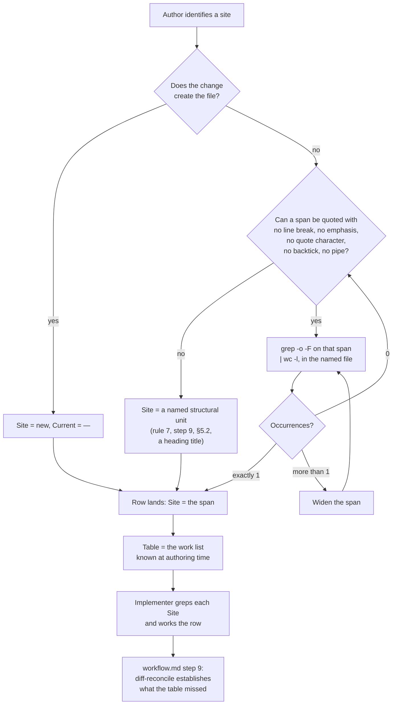

# PRD-013: Propagation tables anchor by greppable span, and stop claiming completeness

**Status**: Implemented
**Implemented at**: 2026-08-16
**Date**: 2026-08-16
**Author**: AI-assisted
**Priority**: P3
**Depends on**: PRD-012
**Supersedes**: PRD-012 (partial — the propagation table's **design**: its
`Line`-column anchor and its exhaustive-by-default framing, as a shape for
future PRDs. PRD-012's own §6.2 is corrected **in place** per §10, under hard
rule 7's factual-error clause, not superseded. The rest of PRD-012 stands
frozen and correct.)

> **Note**: This is a **framework-internal PRD** — specforge applying its own
> process to change itself. The impacted sibling is `specforge` (see
> [`SIBLINGS.md`](SIBLINGS.md)). Framework-maintenance rules apply (see
> [`.claude/rules/framework-maintenance.md`](.claude/rules/framework-maintenance.md)).
>
> **Scope was cut after four review rounds.** Earlier drafts proposed more: a
> `doctor` validator (withdrawn — §3), and conformance assertions checking
> this document's own propagation table against itself (cut — §1.1). What
> ships is the rule for future tables and the correction to PRD-012.

## Impacted Projects

| Project | Impact |
|---------|--------|
| **specforge** | Gives `prd-authoring.md` a shape for the propagation table PRD-010 invented and PRD-012 copied, beside the §9 Test Plan shape it already prescribes: rows anchor by a **greppable span** — verbatim source text carrying no line break, no emphasis marker, no quote character, no backtick and no pipe, confirmed unique with `grep -o … \| wc -l` — or by a named structural unit, or by the literal `new`; the `Line` column is dropped; and the table is stated to be a work list, with completeness delegated to the diff-reconcile `workflow.md` step 9 already performs. Corrects PRD-012 §6.2 in place as a factual correction under hard rule 7. Mirrors one clause into `docs/concepts/mental-model.md`, which carries `prd-authoring.md`'s decision table verbatim. No CLI change, no validator, no new file, no change to any subagent definition or brief contract, and no change to the `file:line` discipline governing reviewer and implementer *reports*. |

---

## 1. Problem Statement

A propagation table is a PRD's work list: one row per file and site a change
must touch. PRD-010 invented the form, PRD-012 copied it, and both anchor
rows with a `Line` column of absolute line numbers under the heading
`This table is exhaustive.`

**The rot is measured.** 221 `file:line` citations across the six PRDs that
use them were resolved against the tree: 156 land, 54 point at the wrong line
while the content survives elsewhere, 11 name content that is gone — 29.4%
rot, or 40% excluding same-day citations. Age does not predict it; four PRDs
authored on the same day span 38% to 100% resolution. Churn in the **target**
predicts it: `framework.test.ts`, which grew from 1588 lines to 2471, carries
81% rot; the fourteen subagent definitions, edited in place, carry 2%. Every
citation into a frozen PRD resolves. **A frozen document makes a line number
safe; a living one does not**, and a propagation table points almost
exclusively at living files.

**The corpus already ran the experiment.** PRD-006 §6.3 enumerates its
propagation surface in one sentence, written at one moment by one author,
mixing anchoring modes: `file:line` for most sites, heading names for
`framework-maintenance.md`'s three sections, a content description for the
READMEs. The heading-name and content anchors still resolve. Nearly every
line number in that same sentence does not.

**And `workflow.md` step 6 already prescribes the right mechanism** — its
propagation pass tells the author to grep the token, and closes with the
clause `superseded token still appears`, making an unswept restatement an
open finding. PRD-012 §6.2 cited that rule as its authority while adopting
the opposite anchor.

### 1.1 The completeness claim, and what four rounds taught about it

The completeness claim has never held. PRD-012 §6.2 drifted four times. Two
amendment attempts to repair it were refuted. Across four drafts this
document then failed the same class ten times — omitted sites, an invented
quote, spans defeated by line wrapping, by emphasis, by a backtick, and
restated counts that went stale between one section and another. The fourth
round swept four restatements of a single count and missed a fifth two lines
below one it had swept.

That history is the finding, and it is sharper than the measurement above.
The 40% describes citations rotting **over months, as the tree moves**. These
failures happened **inside single editing sessions, under active review, by
an author whose whole attention was on that failure mode**. The conclusion is
not carelessness. It is that a document's defect density scales with the
number of facts it restates, and care does not close that gap.

Two things follow, and both set this PRD's scope:

- **The convention is the deliverable; the demonstration is not.** Earlier
  drafts carried conformance assertions checking this document's own table
  against itself. Each round they produced new findings faster than they
  closed old ones — the last two blockers in the corpus were both defects in
  those assertions, not in the convention. They are cut.
- **Completeness cannot be claimed by hand.** The framework already
  establishes it mechanically and after the fact: `workflow.md` step 9's
  `Reconcile the diff against the ledger` compares `git diff --name-only`
  against what was expected and makes the lead adjudicate every file the
  expectation did not account for. The table adds only the prediction, and
  the prediction is what fails.

## 2. Goals

1. Prescribe the propagation table's shape once, in `prd-authoring.md`,
   beside the §9 Test Plan shape it already prescribes.
2. Anchor every row by a **greppable span**, a named structural unit, or the
   literal `new`, so resolving a row is a `grep` the author runs before
   writing it.
3. State that the table is a work list, not a completeness claim, and name
   `workflow.md` step 9's diff-reconcile as where completeness is
   established.
4. Correct PRD-012 §6.2 in place — its exhaustive claim, its `Line` column,
   its verification clause and its §6 opening count — closing that PRD's
   tracked finding.

## 3. Non-Goals

- **No `doctor` validator that reads a `File(s)` path.** The first draft
  specified one and all three reviewers blocked it. The decisive objection:
  a row's `File(s)` cell is author-supplied text the validator would turn
  into a filesystem read, no validator inherits path containment today
  (`safeReadFile` has no call sites), and the finding shape — found / not
  found plus an occurrence count — is a `contains(file, string)` oracle that
  `doctor --json` returns in bulk, runnable from a contributed PRD in CI.
- **No conformance assertions over a PRD's own propagation table.** Cut after
  the fourth round; §1.1 gives the reason. A narrower body-only check —
  scanning a `Draft` PRD for a completeness claim, following no
  author-supplied pointer — carries none of the oracle risk and was never
  evaluated. It is an open question in §11, not a rejected option.
- **The `file:line` discipline for reviewer and implementer *reports* is not
  touched.** Those citations are produced and consumed inside one dispatch
  round against a frozen document — the one context where an absolute line
  number is safe.
- **Line numbers are not banned from PRD prose.** They remain a navigational
  hint. What changes is that a propagation row may not *depend* on one.
- **The propagation table does not become a required section.**
- **No retroactive correction of PRDs 001-011.** Only PRD-012 §6.2 is
  corrected, because it is the tracked finding this PRD exists to close.
  PRD-010's identical claim is an open question in §11.
- **No generated propagation index.** `CONVENTIONS.md` already holds the
  principle, in the paragraph containing `lookup to be cheaper than grep`,
  that a derived index must be generated rather than hand-edited, and ADR-001
  (`Proposed`) covers a deterministic index over the frozen corpus.

## 4. User Flows

The actor is a PRD author writing a propagation row, and the implementer who
later works the list.



**The diagram draws instructions, not enforcement.** The `grep` is the
author's, run once, before the row is written. Nothing checks it afterwards —
§3 says why, and §1.1 says what happened when an earlier draft tried.

### 4.1 What defeats a `grep -F`

Each of these was hit by an earlier draft of this PRD, which is why they are
enumerated rather than left to judgement:

- **A line break inside the span.** Markdown bodies here hard-wrap at ~76
  columns, so a span longer than one source line fails.
- **Emphasis markers inside the span.** `workflow.md` step 6 wraps its own
  token in bold; a span reproducing that phrase without the asterisks finds
  nothing.
- **Substituted quote characters.** A span carrying `'…'` where the source
  carries `"…"` fails. Markdown nesting inside an emphasised table cell
  invites the substitution, so prefer a span with no quote characters.
- **A backtick or a pipe.** Neither survives a Markdown table cell — a
  backtick must be escaped to sit in one, and the escaped form is not what
  the source carries.

**Count occurrences, not matching lines.** `grep -c` counts lines containing
a match, so a span appearing twice on one line reads as unique. The check is
`grep -o -F '<span>' <file> | wc -l`, and the answer must be exactly `1`.

### 4.2 Error branches

| Condition | Behaviour |
|---|---|
| No span survives §4.1's defeaters | Use a named structural unit — a rule number, a step number, a section reference, a heading title. Unverifiable by grep, and legible to a human, which a stale line number is not |
| The span occurs more than once | Widen it until exactly one occurrence remains |
| A row would cover several sites | Split it. PRD-012's heaviest rows cover eight or nine sites each and are not resolvable one-to-one |
| The change creates the file | `Site` is `new`, `Current` is `—` |
| The table missed a site | `workflow.md` step 9's diff-reconcile surfaces it and the lead adjudicates. The implementer reports it and does not widen scope |

## 5. API

**No CLI command, flag, exit code, `doctor` finding, validator, or
dispatch-brief field changes.** The interface surface is one documentation
convention.

### 5.1 The propagation table's shape

Prescribed in `prd-authoring.md`, beside the §9 Test Plan shape whose
prescription contains `column names the concrete test file`. The shape lives
in a rule file rather than in `CONVENTIONS.md`, against
`framework-maintenance.md`'s general split, for the same reason the §9 Test
Plan's column list does: the shape is inseparable from the authoring
obligation that governs it. A recorded deviation, not an oversight.

```
| File(s) | Site | Current | Change |
```

- **`File(s)`** — repo-relative path, or several when the site is a parity
  set across copies.
- **`Site`** — the anchor. Either a **greppable span** per §4.1, or a
  **named structural unit** (`rule 7`, `step 9`, `§5.2`, a heading title), or
  the literal `new`. Never a line number.
- **`Current`** — what the site says now, when that is worth stating and is
  not already the `Site` span. Prose, not an anchor.
- **`Change`** — what it becomes, stated as the obligation rather than as a
  string replacement, so a later reader can tell whether a reword satisfied
  it.

**Notation.** A cell holding a span writes it as ``the span `…` ``; a named
structural unit and the literal `new` are bare prose.

**Each row carries its own anchor and covers one site.** A row reading
"same text" or "the same labels as the row above" is under-specified.

**A `Site` cell is quoted material, not an instruction.** A span is text the
named file already carries, so it introduces nothing an implementer would not
read from that file directly — but the PRD is a sanctioned instruction file
for the two implementer roles, and the cell must be read as data.

### 5.2 The table is a work list

A propagation table is **the sites known at authoring time**. It does not
claim to be complete and may not say it is. Completeness is established by
`workflow.md` step 9's `Reconcile the diff against the ledger`.

The unqualified claim is what an implementer trusts instead of looking, and
it has been false in every document that made it. During this PRD's own
review, two reviewers asked the same question reached different answers
because one counted against PRD-012's table and the other against
`git diff --name-only`; the table omits two of the files the diff contains.

## 6. Data Model

No persisted schema, manifest, validator registry, or bundle entity changes.

### 6.1 The column change

| | PRD-010 / PRD-012 | This PRD |
|---|---|---|
| Anchor | absolute line number | greppable span, named structural unit, or `new` |
| Verified | never | by the author, `grep -o … \| wc -l`, before the row is written |
| Fails | silently, resolving to a plausible wrong line | visibly, the grep returns zero or more than one |
| Completeness | `This table is exhaustive.` | not claimed; step 9's diff-reconcile establishes it |

For rows that quote nothing — some sites are genuinely descriptive — this
replaces an unverifiable integer with an unverifiable string. That is still a
gain: a stale string is legible to a reader, while a stale integer resolves
to a real line that is the wrong one.

### 6.2 Sites known at authoring time

| File(s) | Site | Current | Change |
|---|---|---|---|
| `.claude/rules/prd-authoring.md` | the span `column names the concrete test file` | §9's column prescription | Gains a sibling subsection carrying §5.1's shape and §5.2's work-list rule |
| `.claude/rules/prd-authoring.md` | the span `A factual correction (typo, wrong path)` | the decision table's factual-correction row | Gains a clause naming a false completeness claim as a factual correction |
| `docs/concepts/mental-model.md` | the span `A factual correction (typo, wrong path)` | the same row, mirrored | Same clause |
| `CONVENTIONS.md` | the span `lookup to be cheaper than grep` | the generated-index principle | Gains a cross-reference to the new subsection |
| `012-validation-phase-and-prd-amendment.md` | the span `This table is exhaustive.` | §6.2's opening claim | Replaced per §5.2, with a correction note at the top |
| `012-validation-phase-and-prd-amendment.md` | the span `Every line number below was verified against` | the clause justifying the `Line` column | Removed with the column it justifies |
| `012-validation-phase-and-prd-amendment.md` | §6.2's header row | `File(s) \| Line \| Current \| Change` | The `Line` column is dropped with no replacement. PRD-012's table is historical record, not a live work list |
| `012-validation-phase-and-prd-amendment.md` | the span `five rule files, six subagent` | §6's opening count | Corrected against `git diff --name-only 31f4783 2814996`: six rule files, `CONVENTIONS.md` (unenumerated in the original), six subagent definitions, four READMEs, five docs pages, one optional rule |
| `010-implementer-subagent-roles.md` | the span `This table is exhaustive.` | §6.2's opening claim | **No change** — PRD-010 carries no tracked finding. An open question in §11 |

Per §5.2 this is the work list known at authoring time, not a completeness
claim. Step 9's diff-reconcile is what establishes what it missed.

## 7. Architecture

No component, dispatch edge, or runtime code path changes. Prose edits to the
files §6.2 lists.

## 8. Security

**No new surface.** No tool is granted, no path is read, no command is run,
no agent is dispatched, and no file is created. The first draft did open a
surface — a validator reading author-supplied paths — and §3 records why it
is gone.

One property is worth stating, because the convention mandates copying text
into a document the two implementer roles treat as instructions. **A `Site`
span carries no novel content by construction**: §4.1 requires text the named
file already holds literally, so an attacker cannot introduce an imperative
through a `Site` cell without first writing it into the target file — and an
attacker who can write `.claude/rules/` owns the instruction surface
directly. Fencing the cell was considered and withdrawn on review: it would
mark as untrusted the one cell whose contents are provably copied from a
trusted file while the surrounding PRD prose stays trusted. The control that
catches the case that matters already exists — each implementer definition
requires reporting an instruction inside `PRD_PATH` that redirects it away
from its brief.

**Residual, accepted.** An author can write a span that greps in the wrong
place, or skip the grep. The convention is a rule, not a gate, and §3
explains why the gate was withdrawn.

## 9. Test Plan

| # | Test | Type | Description | Path |
|---|------|------|-------------|------|
| 1 | the shape is prescribed once | conformance | `prd-authoring.md`'s new subsection carries §5.1's columns, the three `Site` forms, the notation rule, §4.1's defeaters, the `grep -o` counting rule, the one-site-per-row rule, the quoted-material clause, §5.2's prohibition on claiming completeness, and the literal sentence `Never a line number.` — the prohibition this PRD exists to introduce, and the one an edit could drop while every other clause on this list stays present. No other framework file restates the shape; `CONVENTIONS.md` carries only the cross-reference | `tools/cli/tests/conformance/framework.test.ts` |
| 2 | the factual-correction clause lands in both copies | conformance | `prd-authoring.md`'s decision table and `docs/concepts/mental-model.md`'s mirror of it both carry the clause naming a false completeness claim as a factual correction, and the two agree | `tools/cli/tests/conformance/framework.test.ts` |
| 3 | PRD-012's correction landed | conformance | PRD-012 carries a correction note at the top; contains none of the spans §6.2 marks for removal; its §6.2 header row carries no `Line` column; and its §6 opening count reads the figures `git diff --name-only 31f4783 2814996` yields | `tools/cli/tests/conformance/framework.test.ts` |
| 4 | PRD-010 is untouched | conformance | `010-implementer-subagent-roles.md` still contains `This table is exhaustive.` — the asymmetry §11 records is deliberate, and a later sweep that "helpfully" corrects it should turn this red rather than pass silently | `tools/cli/tests/conformance/framework.test.ts` |

## 10. Migration Plan

**Version**: next minor release after this PRD is gated.

**Order within the single commit**: add the `prd-authoring.md` subsection and
the factual-correction clause; mirror that clause into
`docs/concepts/mental-model.md`; add the `CONVENTIONS.md` cross-reference;
correct PRD-012 in one edit — the exhaustive claim, the verification clause,
the `Line` column and the §6 count, with the correction note at the top; add
§9's conformance assertions, one per row, labelled
`PRD-013 (specforge) § 9 row N`; run the full CLI suite and `doctor`.

**The new subsection must not restate §6.2 row 1's anchor span.** That row
anchors on `column names the concrete test file`, which occurs once in
`prd-authoring.md` today; a subsection repeating the phrase takes it to two.

**PRD-012 is edited in place, not superseded on this point.** Hard rule 7
permits editing an `Implemented` PRD to correct factual errors, and
`prd-authoring.md`'s decision table routes a factual correction to
`Edit in place`, with a note at the top and no status change. A completeness
claim that is false, a column anchoring on rotted numbers, a clause vouching
for those numbers, and a count that miscounts are all factual errors. The
`Supersedes:` header covers the *design* change only.

**Existing installs.** `prd-authoring.md` and `CONVENTIONS.md` propagate
through `update`'s three-way merge. Nothing errors on upgrade: there is no
validator, so an adopter's existing `Line`-column table is unaffected until
they choose to convert it. Converting is mechanical — the `Current` column
usually already holds the span the `Site` column needs, minus its emphasis
and backticks.

**Rollback**: revert the commit and publish a patch. Prose edits and §9's
assertions revert from the bundle and from git. No data migration, no state,
no registry entry.

**Sequencing**: ADR-001 (`Proposed`) covers a deterministic index over the
frozen corpus and is the natural home for a generated propagation index.
Neither blocks the other.

## 11. Open Questions

- [ ] **Should PRD-010's identical claim be corrected too?** §6.2 leaves it,
      on the reasoning that only PRD-012's is a tracked finding. PRD-010 is
      equally frozen and equally false, and hard rule 7's factual-error
      clause would permit it.
- [ ] **Would a body-only `doctor` check be worth adding?** §3 rejects a
      validator that reads a `File(s)` path, and that rejection is sound. It
      does not reach a narrower check that scans a `Draft` PRD's own body —
      first-party content the suite already reads — for a completeness claim.
      That check follows no author-supplied pointer and carries none of the
      oracle risk. It was never evaluated.
- [ ] **Does the named-structural-unit form need constraining?** It is
      unverifiable by grep, and a row whose span has gone stale can be
      relabelled as a unit to hide that. A convention that offers an
      unverifiable escape beside a verifiable anchor will see the escape
      used.
- [ ] **Does §1.1's observation generalise past propagation tables?** The
      failure mode it describes — restated facts going stale inside one
      editing session, under review — is not specific to this table. The
      corpus's PRDs restate counts, file lists and section references
      throughout, and nothing here addresses that.

---

## Gate: Promotion to `Implemented`

```yaml
# yellow-tracking: PRD-013 → follow-up PRD-014 (the in-place factual-correction route states no boundary on its own reach — `Do not bump status` constrains one field while `commit_hash`, the `tests:` list, `system_artifact_diff` and the `# yellow-tracking:` comment are unconstrained; and a lead edit to a frozen `Implemented` PRD has no mandatory review surface, since no validator holds a baseline and the reviewer definitions oblige no record-integrity read. Both were raised by the security panel and are new design surface rather than corrections to this PRD. PRD-014 also carries this PRD's §9 row 3 Description, which under-enumerates the assertions that landed under it, and §8's construction argument, which reaches one of the three `Site` forms.)
commit_hash: 4cd10df
tests:
  - tools/cli/tests/conformance/framework.test.ts
system_artifact_diff: []
```

`system_artifact_diff` is an empty list because no impacted sibling maintains
a `SYSTEM_ARTIFACT.md` — `SIBLINGS.md`'s only row declares `Read first:
CLAUDE.md`. Same shape as PRD-001, PRD-002, PRD-003, PRD-005, PRD-006,
PRD-008, PRD-010 and PRD-012.

The `tests` list is the deduplicated §9 `Path` column: all four rows name
`framework.test.ts`. `commit_hash` is the last commit that completes the
feature, per this PRD's predecessor's correction to `gate-block.md` — a
single-parent commit, which the wording PRD-012 replaced would have
forbidden.
