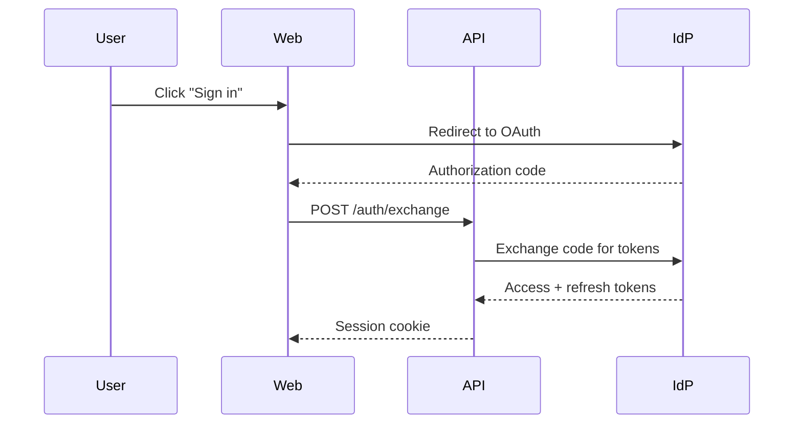

# specforge Conventions

Detailed reference for PRD and ADR authors. This file is the normative spec for file names, headers, required sections, diagrams, and cross-references. If `CLAUDE.md` and this file disagree, this file wins on format questions; `CLAUDE.md` wins on workflow questions.

---

## 1. Document types

| Type | Purpose | Typical length | Status lifecycle |
|---|---|---|---|
| **PRD** | Specifies what to build and how for a single feature or change. Includes API, data model, tests, migration. | 300–1500 lines | `Draft` → `Implemented` (or `Superseded by PRD-N`) |
| **ADR** | Documents a single architectural decision with alternatives and trade-offs. | 80–300 lines | `Proposed` → `Accepted` (or `Superseded by ADR-N`) |
| **SYSTEM_ARTIFACT.md** | Living description of current system state, organized by domain. | Unbounded; grows with the system | No status; updated on every ship |

PRDs and ADRs are **historical snapshots**. Once they reach their terminal status (`Implemented` / `Accepted`) they should not be edited except to correct factual errors or to mark them `Superseded`.

The length ranges above describe what most PRDs and ADRs look like in practice, not a hard floor. A well-scoped small PRD under 300 lines is fine when the feature is genuinely small; a PRD that would exceed 1500 lines should be decomposed into phase PRDs per § 12 rather than stretched further.

---

## 2. File naming

### PRDs

```
NNN-kebab-case-title.md
```

Examples:

```
001-oauth-login.md
014-refund-workflow.md
027-async-ingest-phase-1.md
028-async-ingest-phase-2.md
```

Rules:

- `NNN` is a zero-padded 3-digit sequence number. Check the highest existing number before assigning.
- Title is kebab-case (lowercase, hyphens), describing the feature succinctly.
- Phase decompositions use `-phase-N` suffixes. Each phase gets its own number.
- Numbers are never reused, even if a PRD is deleted or superseded.

### ADRs

```
ADR-NNN-kebab-case-title.md
```

Examples:

```
ADR-001-monorepo-vs-polyrepo.md
ADR-007-event-bus-choice.md
```

ADRs have their own independent numbering sequence.

---

## 3. PRD header metadata

Every PRD begins with an H1 title followed by a metadata block. Draft PRDs and Implemented PRDs carry different fields.

### Draft PRD header

```markdown
# PRD-NNN: Short Descriptive Title

**Status**: Draft
**Date**: YYYY-MM-DD
**Author**: AI-assisted (reviewed by <name or role>)
**Priority**: P0 | P1 | P2
**Depends on**: PRD-NNN, PRD-MMM   <!-- optional -->
**Supersedes**: PRD-NNN             <!-- optional; use only if replacing -->

## Impacted Projects

| Project | Impact |
|---|---|
| **api-service** | New endpoints under `/v1/auth/*`, new table `oauth_sessions`, new worker `refresh_loop`. |
| web-client | New login callback route, updated auth context. |
```

The `Project` column contains the name of a sibling — no path, no repo slug. Every name here must match an active row in [`SIBLINGS.md`](SIBLINGS.md). Everything else about the project (where it lives, what stack it runs) lives in the registry, not duplicated in every PRD.

### Implemented PRD header

When the PRD is promoted to `Implemented`, the header adds one field (`Implemented at`). The three gate fields do **not** live in the header — they live in a dedicated **gate block** at the bottom of the PRD (see next subsection).

```markdown
# PRD-NNN: Short Descriptive Title

**Status**: Implemented
**Date**: YYYY-MM-DD              <!-- original draft date, unchanged -->
**Implemented at**: YYYY-MM-DD    <!-- date the gate was satisfied -->
**Author**: AI-assisted (reviewed by <name or role>)
**Priority**: P0 | P1 | P2
**Depends on**: PRD-NNN           <!-- optional -->
**Supersedes**: PRD-NNN           <!-- optional -->
```

### Gate block

> **Behavioral rules** for the gate block (what triggers the `Draft` → `Implemented` promotion, list-shape invariants, `[TBD]` semantics) live in [`.claude/rules/gate-block.md`](.claude/rules/gate-block.md), which loads automatically every session. This section documents the **canonical YAML shape and field meanings** for reference.

Every PRD — `Draft` or `Implemented` — carries a gate block at the very bottom, under a heading `## Gate: Promotion to Implemented`. The block is a YAML fence with exactly three fields:

```yaml
commit_hash: a1b2c3d4
tests:
  - ../api-service/tests/auth/oauth_flow_test   # relative to the specforge dir; any language
  - ../api-service/tests/auth/refresh_test
system_artifact_diff:
  - ../api-service/docs/SYSTEM_ARTIFACT.md#auth-oauth (commit a1b2c3d4)
```

Rules:

- In a `Draft` PRD, the block is present but every field is `[TBD]` or an empty YAML list. Never omit the block.
- A PRD cannot carry `Status: Implemented` unless all three fields are present and non-empty. If any is `[TBD]`, empty, or missing, the PRD stays `Draft`. No exceptions.
- **Both `tests` and `system_artifact_diff` are always YAML lists**, even when the list has only one entry. Never a bare scalar. This rule is absolute — single-shape fields are what lets tooling and grep treat the gate block as machine-readable.
- `tests` paths are **relative to the specforge directory** and typically point into one of the sibling projects declared in [`SIBLINGS.md`](SIBLINGS.md). Any language: `.py`, `.ts`, `.go`, `_test.go`, Rust modules — whatever the sibling uses.
- `commit_hash` is the commit (or merge commit) where the feature landed on the main branch of the impacted sibling project. If a single PRD ships across multiple siblings in separate commits, use the last merge commit that completes the feature.
- Each entry in `system_artifact_diff` is a relative path into one sibling's `SYSTEM_ARTIFACT.md` (with a section anchor) plus the commit that updated it. **The list length equals the number of impacted siblings that maintain a `SYSTEM_ARTIFACT.md`** — siblings without one (e.g. UI-only) contribute zero entries. A PRD that impacts two siblings where only one has a `SYSTEM_ARTIFACT.md` has a 1-element list, not a 2-element list with a blank.
- The gate block is the **only** location for these fields. Do not duplicate them in the header or anywhere else.

### Impacted Projects table

Mandatory in every PRD, even when only one project is affected. Two columns only: `Project` and `Impact`. No path, no repo slug, no stack column — all of that lives in [`SIBLINGS.md`](SIBLINGS.md). Rules:

- **The `Project` cell must match, character-for-character, a row's `Project` name in `SIBLINGS.md`** (bold marker on the primary project is fine; the match is against the name inside the bold). Draft PRDs may only cite active rows; historical PRDs may cite retired rows.
- If a PRD needs to touch a project not yet in the registry, add the registry row in the same commit as the PRD — never after the fact (see [`.claude/rules/hard-rules.md`](.claude/rules/hard-rules.md) rule 11).
- The primary project is listed first and bolded.
- The `Impact` column must be concrete: name the new endpoints, tables, modules, env vars. No vague phrases like "minor changes".
- If a project is touched for tests only, say so explicitly.

---

## 4. ADR header metadata

```markdown
# ADR-NNN: Short Descriptive Title

**Status**: Proposed | Accepted | Superseded by ADR-NNN
**Date**: YYYY-MM-DD
**Decision makers**: <roles or names>
**Context PRDs**: PRD-NNN, PRD-MMM   <!-- optional -->
**Supersedes**: ADR-NNN              <!-- optional -->
```

ADRs do not carry the three-field implementation gate because they document decisions, not features. The decision is "implemented" the moment the ADR reaches `Accepted`.

---

## 5. Status enum

### PRD status values

| Status | Meaning | Editable? |
|---|---|---|
| `Draft` | Design agreed, not yet shipped. | Yes — freely editable until promoted. |
| `Implemented` | Design shipped at `commit_hash`. Historical snapshot tied to a specific commit and test set. | No — frozen except for factual corrections. |
| `Superseded by PRD-N` | A newer PRD replaces this design. | No — frozen. Add a `> **Superseded**` banner at the top. |

No other status values are permitted. `WIP`, `In Progress`, `Partial`, `Draft-2`, `Complete` are all invalid.

### ADR status values

| Status | Meaning |
|---|---|
| `Proposed` | Under discussion. |
| `Accepted` | Decision ratified. |
| `Superseded by ADR-N` | A newer ADR replaces this decision. |

### The meaning of `Implemented`

`Implemented` is a **historical claim**: "on this date, at this commit, this design shipped with these tests, and `SYSTEM_ARTIFACT.md` was updated to reflect it". It is **not** a claim that the system still behaves this way today. Subsequent PRDs may have modified, extended, or replaced parts of the feature. Readers who want current state consult `SYSTEM_ARTIFACT.md` or the code.

This is a deliberate design choice. Trying to keep PRDs in sync with live code is the failure mode this framework is built to avoid.

---

## 6. Required sections

### PRD required sections

Every PRD must contain these sections, in roughly this order. Omitting any of them fails review.

| # | Section | Purpose |
|---|---|---|
| 1 | **Problem Statement** | What user or system problem this solves. |
| 2 | **Goals** | Concrete, measurable outcomes. Imperative verbs. |
| 3 | **Non-Goals** | Things deliberately out of scope. |
| 4 | **User Flows** *(if user-visible)* | Step-by-step scenarios. |
| 5 | **API** | Endpoints, schemas, status codes, error responses. |
| 6 | **Data Model** | Tables, columns, constraints, indexes, migrations. |
| 7 | **Architecture** | How components interact. Include Mermaid diagrams when flows are non-trivial. |
| 8 | **Security** | Threats, mitigations, auth, secrets, PII handling. Never skip. |
| 9 | **Test Plan** | Table of tests: `#` \| `Test` \| `Type` \| `Description`. Cover happy path, edges, errors, regressions. Never skip. |
| 10 | **Migration Plan** | How to roll out safely. Backward compatibility, data migrations, rollback. Never skip. |
| 11 | **Open Questions** | Checkbox list of unresolved decisions. Must be empty or explicitly deferred before `Implemented`. |

Optional sections (include when relevant): `Design Decisions` (table of choices and trade-offs), `Performance`, `Observability`, `Accessibility`, `Frontend Spec`, `Rollout Plan`, `Cost Estimate`.

### ADR required sections

| # | Section | Purpose |
|---|---|---|
| 1 | **Context** | What situation forces this decision. |
| 2 | **Decision** | The choice, stated in one paragraph. |
| 3 | **Alternatives Considered** | Options rejected, with reasons. |
| 4 | **Consequences** | What becomes easier, what becomes harder. |
| 5 | **Trade-offs Accepted** | What pain you are signing up for. |
| 6 | **Signals to Reconsider** | Concrete thresholds or events that should trigger a new ADR. |

Optional ADR sections (include when relevant): `Cost to Reverse` (rough effort to undo the decision if the signals fire — include when the cost is high or non-obvious), `Related Documents` (cross-references to PRDs or ADRs that depend on this decision).

---

## 7. Cross-references

Use markdown links with explicit titles.

```markdown
[PRD-006: Session Storage Strategy](006-session-storage-strategy.md)
[ADR-001: Monorepo vs Polyrepo](ADR-001-monorepo-vs-polyrepo.md)
```

For section-level references:

```markdown
See [PRD-006 § 5.1](006-session-storage-strategy.md#51-data-model)
```

Header fields `Depends on`, `Supersedes`, and `Context PRDs` use bare identifiers:

```markdown
**Depends on**: PRD-003, PRD-006
```

---

## 8. Diagrams

**Mermaid is the only permitted diagram format.** ASCII art diagrams, images, and screenshots are forbidden.

Markdown tables and nested bullet lists are **not** diagrams. They remain valid for expressing structured information.

### When to use which Mermaid diagram

| Use case | Diagram type |
|---|---|
| Request/response flow between services. | `sequenceDiagram` |
| Finite set of states a resource passes through. | `stateDiagram-v2` |
| Decision flow or branching logic. | `flowchart` |
| Database schema and foreign keys. | `erDiagram` |
| Class hierarchy or type relationships. | `classDiagram` |
| High-level component topology. | `flowchart` or `C4Context` |

### Example



Keep diagrams focused. If a diagram is getting complex enough to need a scrollbar, split it into two.

---

## 9. Language rules

- The specforge framework itself (this file, `CLAUDE.md`, `README.md`, templates, examples, agent briefings) is written in **English**.
- Teams adopting specforge may write their PRDs and ADRs in whatever human language they choose. Be consistent within a team.
- **Code, JSON, SQL, config keys, env variable names, endpoint paths, and file paths are always in English**, regardless of the documentation language. This is non-negotiable because these artifacts cross the doc/code boundary.
- Header field names (`Status`, `Date`, `Implemented at`, `Priority`, `Depends on`, `Supersedes`) and gate block keys (`commit_hash`, `tests`, `system_artifact_diff`) are always in English so that tooling can parse them.

---

## 10. Forbidden

The following will fail review:

| Forbidden | Why |
|---|---|
| ASCII-art diagrams for flows, sequences, states, or architecture. | Mermaid only. Legible and machine-parseable. |
| `> **Updated by PRD-N**` back-reference banners. | Dead convention. Use the newer PRD's `Depends on` / `Supersedes` header instead. |
| Inventing endpoints, tables, columns, functions, or env vars not verified against real code. | Every reference must be either grounded or explicitly marked as new. |
| Skipping `Security`, `Test Plan`, or `Migration Plan` sections in a PRD. | They are required regardless of feature size. |
| Editing a PRD marked `Implemented` (except factual corrections). | PRDs are frozen snapshots. Design evolution happens in a new PRD. |
| Marking a PRD `Implemented` without `commit_hash`, `tests`, and `system_artifact_diff`. | The gate is mandatory. |
| Non-standard status values (`WIP`, `Partial`, `Complete`, `Done`). | Only the enum values in § 5 are permitted. |
| Marketing language. | See rule 9 in [`.claude/rules/hard-rules.md`](.claude/rules/hard-rules.md) for the canonical forbidden list and reasoning. Use measurable claims. |
| Batching multiple questions inside a single `AskUserQuestion` tool call. | One question per call, always. |
| Images, screenshots, binary attachments. | PRDs are plain text by design. |

---

## 11. Finding newer PRDs that modify an older one

The old-style `> **Updated by PRD-N**` back-reference banner is forbidden because it requires editing a frozen document and was historically never maintained. Instead, the authoritative information lives in the *newer* PRD's header: if PRD-042 supersedes or depends on PRD-017, then PRD-042's `Depends on` or `Supersedes` field says so.

To find every newer PRD that touches PRD-017, use one of these equivalent approaches:

```bash
# Grep the PRD number across files with a higher number.
grep -l "PRD-017" $(ls [0-9]*.md | awk '$1 > "017"')

# Or simply search for references to PRD-017 in all files.
grep -l "PRD-017" *.md | grep -v "^017-"
```

Any AI agent investigating the history of a feature should run this grep as part of step 2 of the workflow (grounding). The discipline is: newer PRDs carry pointers to older PRDs, never the other way around.

If a team needs the "what touches this?" lookup to be cheaper than grep, they can maintain an auto-generated index file — but it must be *generated* from the headers, never hand-edited into the frozen PRDs.

---

## 12. Phase decomposition

A feature that cannot ship in a single commit should be split into phase PRDs:

```
027-async-ingest-phase-1.md    # Status: Implemented
028-async-ingest-phase-2.md    # Status: Implemented, Depends on: PRD-027
029-async-ingest-phase-3.md    # Status: Draft,       Depends on: PRD-028
```

Rules:

- Each phase is **independently shippable**. It must leave the system in a consistent, deployable state even if no further phase ever lands.
- Each phase declares `Depends on` its predecessors.
- Each phase goes through the full `Implemented` gate on its own.
- Phases are not numbered with decimal suffixes (`027.1`, `027.2`). They get their own sequence numbers.

---

## 13. Quick checklist before requesting review

Before sending a PRD to reviewers, the author (human or AI) confirms:

- [ ] File name matches `NNN-kebab-case-title.md`.
- [ ] Sequence number is the next available, not a reuse.
- [ ] Header has Status, Date, Author, Priority, and (if applicable) Depends on / Supersedes.
- [ ] `Impacted Projects` table is present, primary project bolded, impact column concrete.
- [ ] All required sections (Problem, Goals, Non-Goals, API, Data Model, Security, Test Plan, Migration Plan, Open Questions) are present.
- [ ] Every endpoint, table, function, and env var is either grounded in real code or marked `new`.
- [ ] All diagrams are Mermaid. No ASCII art.
- [ ] No marketing language.
- [ ] No `> **Updated by PRD-N**` back-reference banners.
- [ ] Open Questions are checkbox list, not prose.
- [ ] `Status: Draft` — no gate fields populated yet.
