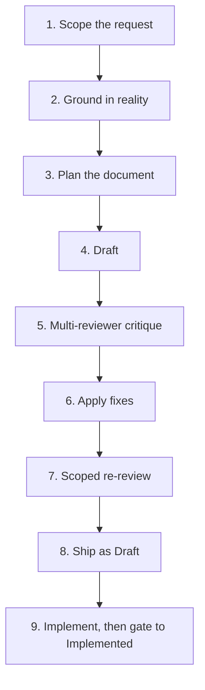

# specforge

Un framework para escribir especificaciones rigurosas (PRDs y ADRs) con IA como autora principal. Agnóstico al stack, agnóstico al dominio, con humano en el bucle.

**Also available in:** [English](README.md)

## Qué es

specforge es un workflow opinionado y un conjunto de templates para equipos que usan IA para redactar documentos de diseño y quieren que el output sea tan cuidadoso como si lo hubiera escrito un ingeniero senior. Trata a la IA como autora de borradores, no como compañera de vibe-coding, y paga ese trato con estructura: anclaje contra código real antes de escribir, crítica multi-revisor anclada al código, una compuerta dura entre `Draft` e `Implemented`, y una única fuente de verdad para el estado actual del sistema.

Distingue tres tipos de documentos y se niega a dejar que se confundan:

| Documento | Propósito | Ciclo de vida |
|---|---|---|
| **PRD** | Un ADR largo con detalle de implementación. Qué construir y cómo, para una feature o cambio. | Snapshot histórico. Congelado al llegar a `Implemented`. |
| **ADR** | Una decisión arquitectónica enfocada con alternativas y trade-offs. | Snapshot histórico. Congelado al llegar a `Accepted`. |
| **`SYSTEM_ARTIFACT.md`** | Estado actual del sistema, organizado por dominio. | Documento vivo, actualizado en cada ship. |

La distinción central: **los PRDs no son docs vivas**. Un PRD marcado `Implemented` es un registro congelado de lo que el equipo decidió y shippeó en un commit específico. Para saber qué hace el sistema *hoy*, leer `SYSTEM_ARTIFACT.md` o el código. Para saber *por qué* algo se construyó como se construyó, leer el PRD que lo introdujo.

## De qué es opinionado specforge

Seis principios, cada uno reforzado por reglas en `CLAUDE.md` y `CONVENTIONS.md`:

1. **Anclar antes de redactar.** Nunca inventar endpoints, tablas, funciones o config keys. Verificar cada referencia contra código real, o marcarla explícitamente como nueva.
2. **Los PRDs son snapshots históricos, no docs vivas.** Los PRDs promovidos quedan congelados. La evolución del diseño vive en un nuevo PRD que declara `Supersedes:` contra el anterior.
3. **Crítica multi-revisor anclada al código.** Cuatro revisores en paralelo (backend, frontend, security, quality — adaptable a tu dominio), cada uno briefeado con links al código real, reportando con severidad explícita 🔴🟡🟢. Revisores sin anclaje a ground truth son solo opiniones correlacionadas.
4. **Compuerta dura entre `Draft` e `Implemented`.** Un PRD no puede promoverse sin un bloque YAML de compuerta con `commit_hash`, `tests`, y `system_artifact_diff`. Sin excepciones.
5. **Mermaid para todos los diagramas.** Nada de ASCII art. Las tablas markdown y las listas anidadas no son diagramas y siguen siendo válidas.
6. **`SYSTEM_ARTIFACT.md` es la única fuente de verdad del estado actual.** La compuerta del principio #4 es lo que lo mantiene honesto — no podés shippear una feature sin actualizar el documento vivo.

## Para quién es specforge

Adoptalo si:

- Usás IA como autora principal de docs de diseño, no solo como asistente de código.
- Tus specs deben ser coherentes entre varias personas, servicios o fases.
- Te han quemado docs generados por IA que eran internamente plausibles pero contradecían el código real.
- Querés un solo archivo (`SYSTEM_ARTIFACT.md`) que un ingeniero nuevo pueda leer para entender qué hace el sistema hoy.

No lo adoptes si:

- Tus specs son de un solo autor, una sola sesión, y nunca salen de tu cabeza.
- Preferís iterar en código y tratar los docs como opcionales.
- Lo que necesitás es un generador de README ligero o un template simple de PRD sin proceso alrededor.

specforge cambia velocidad por coherencia. Si no necesitás coherencia, la ceremonia te va a frenar más de lo que te ayuda.

## Layout de archivos

specforge está diseñado para vivir **como un directorio hermano de los repos de código que describe**, no como un subdirectorio de ninguno. Un layout de equipo típico:

```
<tu-org>/                           ← raíz del repo (monorepo o parent de repos hermanos)
├── specforge/                      ← este framework
│   ├── README.md                   ← versión en inglés
│   ├── README.es.md                ← este archivo
│   ├── CLAUDE.md                   ← reglas del framework cargadas automáticamente por tools de IA
│   ├── CONVENTIONS.md              ← referencia detallada: naming, headers, secciones, diagramas
│   ├── SIBLINGS.md                 ← registry mutable por el equipo de sibling projects (llenalo el día 1)
│   ├── LICENSE                     ← MIT
│   ├── templates/
│   │   ├── prd.md
│   │   ├── adr.md
│   │   └── system-artifact.md      ← template en blanco; va DENTRO de un sibling, no acá
│   ├── examples/
│   │   ├── prd-001-login-example.md
│   │   └── system-artifact-example.md   ← SYSTEM_ARTIFACT de ejemplo para UN sibling
│   ├── agents/                     ← briefings para los cuatro revisores paralelos
│   │   ├── backend-reviewer.md
│   │   ├── frontend-reviewer.md
│   │   ├── security-reviewer.md
│   │   └── quality-reviewer.md
│   ├── NNN-tu-prd.md               ← tus PRDs viven en la raíz de specforge
│   └── ADR-NNN-tu-adr.md           ← tus ADRs también
├── api-service/                    ← proyecto hermano (ejemplo — un backend)
│   ├── CLAUDE.md                   ← reglas específicas del proyecto (stack, lint, test)
│   └── docs/
│       └── SYSTEM_ARTIFACT.md      ← estado vivo de api-service; referenciado por los gate blocks de los PRDs
└── web-client/                     ← proyecto hermano (ejemplo — un frontend)
    ├── CLAUDE.md                   ← reglas específicas del proyecto
    └── (sin SYSTEM_ARTIFACT — UI-only, se ancla directo contra el código)
```

El **registry de Sibling projects** en [`SIBLINGS.md`](SIBLINGS.md) es el directorio de todo lo que specforge conoce — cada tabla `Impacted Projects` de un PRD sólo puede referenciar proyectos listados ahí, por nombre. `SIBLINGS.md` es data del equipo; el resto son archivos del framework que se pueden actualizar pulleando una nueva versión de specforge sin tocar tu registry.

## Quickstart

1. **Copiá specforge a tu repo**, o mantenelo como un directorio hermano que tus tools de IA puedan leer. El único archivo consumido automáticamente por Claude Code (y similares) es `CLAUDE.md` — los demás se referencian desde ahí.

2. **Bootstrap del día 1 — en este orden, antes de tu primer PRD:**
   - **Decidí dónde vive specforge** en la topología de tu repo — como directorio top-level de un monorepo, o como repo propio cloneado bajo el mismo parent que tus code repos. Cualquiera funciona; ambos satisfacen la convención de paths relativos `../api-service/`.
   - **Llená [`SIBLINGS.md`](SIBLINGS.md).** Listá cada repo de código que tu equipo mantiene y que los PRDs van a referenciar: nombre, path relativo, dónde viven `CLAUDE.md` y `SYSTEM_ARTIFACT.md`, resumen del stack, y `Status: active`. Esto es prerequisito del paso de grounding del workflow.
   - **Bootstrapeá el `SYSTEM_ARTIFACT.md` de cada sibling service-heavy, adentro de ese sibling** (típicamente en `<sibling>/docs/SYSTEM_ARTIFACT.md`). Copiá `templates/system-artifact.md` al proyecto hermano y corré un paso único de Explore — un agente por dominio. **La adopción incremental está soportada**: un equipo con 10 servicios no bootstrapea 10 SYSTEM_ARTIFACTs el día 1. Añadí el sibling a `SIBLINGS.md` con `Read first: CLAUDE.md` solamente, y el primer PRD que lo impacte puede bootstrapear su SYSTEM_ARTIFACT en el mismo change. Los siblings UI-only pueden skippear esto permanentemente — se anclan directo contra el código. No intentes retrofittear PRDs para features ya shippeadas.

3. **Escribí tu primer PRD.** Copiá `templates/prd.md`, seguí el workflow de `CLAUDE.md`, y usá `examples/prd-001-login-example.md` como referencia para el nivel de detalle esperado.

4. **Corré el loop de review.** Lanzá cuatro agentes revisores en paralelo, cada uno briefeado con el prompt correspondiente de `agents/`. Consolidá los findings por severidad. Re-revisá *solo* los dominios con 🔴 bloqueantes — nunca corras un review nuevo desde cero después de los fixes.

5. **Shippeá como `Draft`, implementá, después promové a `Implemented`.** El bloque de compuerta al final del PRD se queda con placeholders `[TBD]` hasta que los tres campos (`commit_hash`, `tests`, `system_artifact_diff`) estén llenos. Actualizá `SYSTEM_ARTIFACT.md` como parte del mismo cambio — eso es lo que referencia el campo `system_artifact_diff`.

## El workflow en una mirada



> Nota: los labels del diagrama y los nombres de paso se mantienen en inglés a propósito, para que coincidan 1-a-1 con los headers del workflow en `CLAUDE.md`. El idioma del proceso es inglés; la narrativa alrededor puede estar en cualquier idioma.

Workflow completo de nueve pasos con las reglas de cada uno: `CLAUDE.md`.

## Idioma

- specforge mismo está escrito en inglés para que sea adoptable por cualquier equipo.
- Los equipos que adopten specforge pueden escribir sus PRDs y ADRs en el idioma humano que prefieran. Sean consistentes dentro del equipo.
- Código, JSON, SQL, config keys, endpoint paths y file paths siempre en inglés, independientemente del idioma de la documentación.
- Los nombres de los header fields y las keys del bloque de compuerta siempre en inglés para que tooling basado en grep pueda parsearlos.
- Los nombres de sección dentro de PRDs/ADRs (`Problem Statement`, `Goals`, `Non-Goals`, `Architecture`, etc.) pueden traducirse si el equipo escribe sus specs en otro idioma, pero conviene mantener el orden y la presencia obligatoria de cada sección.

## Origen

specforge fue destilado por [Angel Kürten](https://github.com/angelkurten) a partir de un workflow que desarrolló mientras construía un producto interno con specs escritas por IA. Una review crítica de esa práctica surfaceó seis mejoras concretas sobre las reglas originales: tratar los PRDs como snapshots históricos en vez de pretender que eran docs vivas, introducir una compuerta dura de tres campos entre `Draft` e `Implemented`, declarar `SYSTEM_ARTIFACT.md` como la única fuente de verdad del estado actual, revertir una prohibición contraproducente de diagramas Mermaid, retirar una convención de cross-reference que tenía cero adopción en la práctica, y suavizar una regla rígida de preguntas estructuradas a contextual en vez de obligatoria. El framework fue reconstruido desde cero con esas seis mejoras baked in desde línea 1. No es un refactor del original — es lo que habrías escrito si hubieras sabido todo esto el día 1.

## Licencia

MIT — ver [LICENSE](LICENSE).
