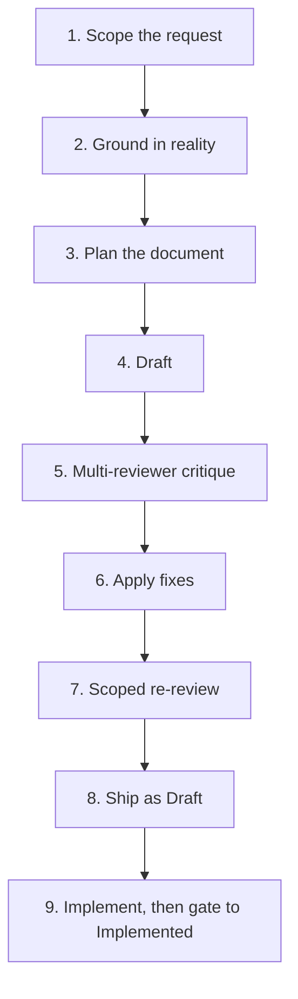

# specforge

A framework for writing rigorous specifications (PRDs and ADRs) with AI as the primary author. Stack-agnostic, domain-agnostic, human-in-the-loop.

**Also available in:** [Español](README.es.md)

## What it is

specforge is an opinionated workflow and a set of templates for teams that use AI to draft design documents and want the output to be as careful as if a senior engineer had written it. It treats the AI as a drafting author, not a vibe-coding sidekick, and it pays for that with structure: grounding before writing, multi-reviewer critique anchored to real code, a hard gate between `Draft` and `Implemented`, and a single source of truth for current system state.

It distinguishes three kinds of documents and refuses to let them drift into each other:

| Document | Purpose | Lifecycle |
|---|---|---|
| **PRD** | A long ADR with implementation detail. What to build and how, for one feature or change. | Historical snapshot. Frozen at `Implemented`. |
| **ADR** | A focused architectural decision with alternatives and trade-offs. | Historical snapshot. Frozen at `Accepted`. |
| **`SYSTEM_ARTIFACT.md`** | Current state of the system, organised by domain. | Living document, updated on every ship. |

The load-bearing distinction: **PRDs are not living docs**. A PRD marked `Implemented` is a frozen record of what the team decided and shipped at a specific commit. To learn what the system does *today*, read `SYSTEM_ARTIFACT.md` or the code. To learn *why* something was built the way it was, read the PRD that introduced it.

## What specforge is opinionated about

Six principles, each enforced by rules in `CLAUDE.md` and `CONVENTIONS.md`:

1. **Ground before drafting.** Never invent endpoints, tables, functions, or config keys. Verify each reference against real code, or mark it explicitly as new.
2. **PRDs are historical snapshots, not living docs.** Promoted PRDs are frozen. Design evolution happens in a new PRD that declares `Supersedes:` against the old one.
3. **Multi-reviewer critique anchored to code.** Four parallel reviewers (backend, frontend, security, quality — adapt to your domain), each briefed with links to real code, reporting with explicit severity 🔴🟡🟢. Reviewers with no ground-truth anchor are just correlated opinions.
4. **A hard gate between `Draft` and `Implemented`.** A PRD cannot be promoted without a YAML gate block carrying `commit_hash`, `tests`, and `system_artifact_diff`. No exceptions.
5. **Mermaid only for diagrams.** No ASCII art. Markdown tables and nested bullet lists are not diagrams and remain valid.
6. **`SYSTEM_ARTIFACT.md` is the single source of truth for current state.** The gate in #4 is what keeps it honest — you cannot ship a feature without updating the living state doc.

## Who should use specforge

Adopt it if:

- You use AI as the primary author of design docs, not just as a code assistant.
- Your specs have to be coherent across multiple people, services, or phases.
- You have been burned by AI-generated docs that were internally plausible but contradicted the actual code.
- You want one file (`SYSTEM_ARTIFACT.md`) that a new engineer can read to understand what the system does today.

Do not adopt it if:

- Your specs are single-author, single-session, and never leave your head.
- You prefer to iterate in code and treat docs as optional.
- You need a lightweight README generator or a simple PRD template with no process around it.

specforge trades speed for coherence. If you do not need coherence, the ceremony will slow you down.

## File layout

specforge is designed to live **as a sibling directory to the code repositories it describes**, not as a subdirectory of any one of them. A typical team layout:

```
<your-org>/                         ← repo root (monorepo or parent of sibling repos)
├── specforge/                      ← this framework
│   ├── README.md                   ← you are here (English)
│   ├── README.es.md                ← Spanish version of this README
│   ├── CLAUDE.md                   ← framework rules loaded automatically by AI tools
│   ├── CONVENTIONS.md              ← detailed reference: naming, headers, sections, diagrams
│   ├── SIBLINGS.md                 ← team-mutable registry of sibling projects (fill in on day 1)
│   ├── LICENSE                     ← MIT
│   ├── templates/
│   │   ├── prd.md
│   │   ├── adr.md
│   │   └── system-artifact.md      ← blank template; goes inside a sibling, not here
│   ├── examples/
│   │   ├── prd-001-login-example.md
│   │   └── system-artifact-example.md   ← example SYSTEM_ARTIFACT for one sibling
│   ├── agents/                     ← briefing templates for the four parallel reviewers
│   │   ├── backend-reviewer.md
│   │   ├── frontend-reviewer.md
│   │   ├── security-reviewer.md
│   │   └── quality-reviewer.md
│   ├── NNN-your-prd.md             ← your PRDs live at the specforge root
│   └── ADR-NNN-your-adr.md         ← your ADRs too
├── api-service/                    ← sibling project (example — a backend)
│   ├── CLAUDE.md                   ← project-specific rules (stack, lint, test conventions)
│   └── docs/
│       └── SYSTEM_ARTIFACT.md      ← living state for api-service; referenced by PRD gate blocks
└── web-client/                     ← sibling project (example — a frontend)
    ├── CLAUDE.md                   ← project-specific rules
    └── (no SYSTEM_ARTIFACT — UI-only, grounded from code directly)
```

The **Sibling projects registry** in [`SIBLINGS.md`](SIBLINGS.md) is the directory of everything specforge knows about — each PRD's `Impacted Projects` table must reference only projects listed there, by name. `SIBLINGS.md` is team data; the rest of the files are framework data that can be upgraded by pulling a new version of specforge without touching your registry.

## Quickstart

1. **Copy specforge into your repo**, or keep it as a sibling directory that your AI tools can read. The only file consumed automatically by Claude Code (and similar) is `CLAUDE.md` — everything else is referenced from it.

2. **Bootstrap on day 1 — in this order, before your first PRD:**
   - **Decide where specforge lives** in your repo topology — as a top-level directory in a monorepo, or as its own repo cloned under the same parent as your code repos. Either works; both satisfy the `../api-service/` relative-path convention.
   - **Fill in [`SIBLINGS.md`](SIBLINGS.md).** List every code repository your team maintains that PRDs will reference: project name, relative path, where its `CLAUDE.md` and `SYSTEM_ARTIFACT.md` live, stack summary, and `Status: active`. This is a prerequisite for the grounding step of the workflow.
   - **Bootstrap each service-heavy sibling's `SYSTEM_ARTIFACT.md` inside that sibling** (typically at `<sibling>/docs/SYSTEM_ARTIFACT.md`). Copy `templates/system-artifact.md` into the sibling and run a one-off Explore pass — one agent per domain. **Incremental adoption is supported**: a team with 10 services does not bootstrap 10 SYSTEM_ARTIFACT files on day 1. Add the sibling to `SIBLINGS.md` with `Read first: CLAUDE.md` only, and the first PRD that impacts it can bootstrap its SYSTEM_ARTIFACT in the same change. UI-only siblings can skip this permanently — they ground from code directly. Do not retrofit PRDs for already-shipped features.

3. **Write your first PRD.** Copy `templates/prd.md`, follow the workflow in `CLAUDE.md`, and use `examples/prd-001-login-example.md` as a reference for the level of detail expected.

4. **Run the review loop.** Launch four reviewer agents in parallel, each briefed with the relevant prompt from `agents/`. Consolidate findings by severity. Re-review *only* the domains with 🔴 blockers — never run a fresh review from scratch after fixes.

5. **Ship as `Draft`, implement, then gate to `Implemented`.** The gate block at the bottom of the PRD stays with `[TBD]` placeholders until all three fields (`commit_hash`, `tests`, `system_artifact_diff`) are satisfied. Update `SYSTEM_ARTIFACT.md` as part of the same change — that is what the `system_artifact_diff` field references.

## Workflow at a glance



Full nine-step workflow with rules for each step: `CLAUDE.md`.

## Language

- specforge itself is written in English so that it is adoptable by any team.
- Teams adopting specforge may write their PRDs and ADRs in whatever human language they choose. Be consistent within a team.
- Code, JSON, SQL, config keys, endpoint paths, and file paths are always in English, regardless of the documentation language.
- Header field names and gate block keys are always in English so that simple grep-based tooling can parse them.

## Origin

specforge was distilled by [Angel Kürten](https://github.com/angelkurten) from a workflow he developed while building an internal product with AI-authored specs. A critical review of that practice surfaced six concrete improvements over the original rules: treating PRDs as historical snapshots instead of pretending they were living docs, introducing a hard three-field gate between `Draft` and `Implemented`, declaring `SYSTEM_ARTIFACT.md` as the single source of truth for current state, reversing a counterproductive ban on Mermaid diagrams, retiring a cross-reference convention that had zero adoption in practice, and softening a rigid structured-question rule to be contextual instead of mandatory. The framework was then rebuilt from scratch with those six improvements baked in from line 1. It is not a refactor of the original — it is what you would write if you had known all of this on day 1.

## License

MIT — see [LICENSE](LICENSE).
