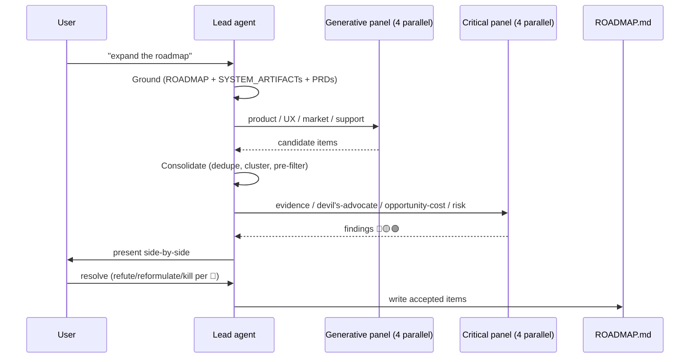

# Roadmap

`ROADMAP.md` is specforge's **single living document for product-level intent** — problems, users, evidence, status, and horizon. It carries **no technical detail**: no APIs, no schemas, no migrations. Those live in PRDs. The roadmap answers *what* and *for whom*; the PRDs answer *how*.

Introduced in v0.4.0 via [PRD-001](https://github.com/angelkurten/specforge-framework/blob/main/001-product-roadmap.md).

## Where it lives

A single `ROADMAP.md` at the root of specforge. Global, not per-sibling. It is **team data** (like `SIBLINGS.md`) — it survives framework upgrades untouched.

```
specforge/
├── ROADMAP.md                     ← product-level intent, living
├── SIBLINGS.md                    ← registry of code repos
├── .claude/rules/roadmap.md       ← the rule file that governs ROADMAP.md
└── ...
```

## Where it fits with the other documents

specforge now distinguishes **four** artifacts:

| Document | Purpose | Lifecycle |
|---|---|---|
| **PRD** | What to build and how, for one feature. | Frozen at `Implemented`. |
| **ADR** | One architectural decision with alternatives. | Frozen at `Accepted`. |
| **`SYSTEM_ARTIFACT.md`** | Current state of one sibling project. | Living, per-sibling. |
| **`ROADMAP.md`** | Product-level intent: problems, users, evidence. | Living, global. |

The roadmap sits *upstream* of the PRDs: it feeds them with problem framing and evidence, and it tracks which PRDs have shipped. PRDs remain frozen snapshots; `ROADMAP.md` is where direction can evolve.

## What goes in an item

Every item has a strict schema (full detail in [`.claude/rules/roadmap.md`](https://github.com/angelkurten/specforge-framework/blob/main/.claude/rules/roadmap.md)):

| Field | Purpose |
|---|---|
| `id` | `ROADMAP-NNN`, monotonic, never reused |
| `title` | kebab-case phrase, unique in the file |
| `status` | `Candidate` \| `Committed` \| `Shipped` \| `Parked` |
| `horizon` | `Now` \| `Next` \| `Later` (required for Candidate/Committed) |
| `theme` | optional `ROADMAP-T-NNN` reference |
| `last_reviewed` | UTC date, re-stamped on any edit |
| `prd` | populated when a PRD links back |
| `problem` | 1-3 sentences, product-level |
| `user` | role or persona |
| `siblings` | names from `SIBLINGS.md` |
| `evidence` | ≥1 entry from the 6 categories (see below) |
| `caveats` | optional, from surviving 🟢 findings |

Optional two-level `themes` group related items. Themes do not nest.

## Evidence is enforced, not suggested

Every item cites **at least one** entry from six evidence categories. Items without valid evidence are auto-rejected at consolidation and 🔴 from the evidence critic.

| # | Category | Shape |
|---|---|---|
| 1 | Quantitative signal | metric + dashboard link + time window |
| 2 | Tickets/issues | IDs from your tracker |
| 3 | User research | date + method + N participants |
| 4 | Direct feedback | quote + source + date (anonymised per PII rule) |
| 5 | Competitor | URL + capture date (publicly-reachable) |
| 6 | Hypothesis | explicit `hypothesis:` flag + **falsifiable** validation plan |

!!! warning "Hypothesis-only items are gated"
    An item whose only evidence is a category-6 hypothesis auto-starts at `Candidate` / `Later` and **cannot be promoted to `Committed`** until a non-hypothesis entry is added. This closes the "would be nice to have" loophole.

### PII carve-out (identity-based)

Syntactic patterns in the rule file — emails, phone numbers, `@handles`, pasted content blobs, image markdown, credential-bearing URLs — produce blocking findings. The carve-out is **identity-based, not severity-based**: a PII-derived finding cannot be `refute`d regardless of 🔴 or 🟡. Only `reformulate` (anonymise, add `consent:`) or `kill` are legal resolutions.

The `Visibility: public | private` header on `ROADMAP.md` modulates severity (public treats email/phone as 🔴, private downgrades those two to 🟡) — but **never opens a `refute` escape**. A contributor cannot flip `Visibility: public` → `private` to bypass the carve-out.

## Two flows

### Generative flow — on-demand user trigger



No calendar ritual. The trigger is always a real signal — stakeholder ask, support pain, post-ship insight, stale-item nudge. Calendar-only triggers produce rote output.

### Auto-update flow — codified in workflow step 9

On PRD gate promotion, the gate-filling agent either:

- **Flips** the linked `ROADMAP-NNN` to `Shipped` — adds `PRD: PRD-NNN` backlink, stamps `last_reviewed`, in the same commit as the gate block; **or**
- **Creates a retroactive item** if the PRD has no `Roadmap item:` header — `status: Shipped` directly, `evidence: [PRD-NNN]` (the category-7 meta-reference).

This guarantees the roadmap is a **complete index** of shipped work. Hotfixes, compliance-driven changes, and follow-ups do not bypass it — they appear retroactively so the roadmap reflects reality, not just the subset that passed the generative ritual.

## Severity and resolution

Identical semantics to the PRD reviewer panel:

- 🔴 **blocker** — must be resolved before write.
- 🟡 **should-fix** — adjust scope, weaken horizon, add evidence.
- 🟢 **nit / advisory** — annotate as `caveats:` on the item if retained.

Resolution is user-owned, **one pass per generative cycle**. No scoped re-review at the roadmap layer — items are not code, iterating N times on a proposal is over-engineering.

## Decay

Items not reviewed in `Stale threshold` (default 6 months) appear in the `## Stale items` section at the top of `ROADMAP.md` as a nudge. No hard enforcement — a stale item can still live, but the visibility surfaces it for a decay review. Teams can override the threshold with a file-level header.

Dates are **UTC** to prevent silent cross-team drift.

## When to trigger

Good triggers:

- A ship revealed something new (product direction needs updating).
- Support tickets concentrate on the same theme for weeks.
- Stakeholder asked "what's next?" and you want evidence-backed answers.
- Backlog feels stale or desynced.
- Stale-item nudge surfaces an item that needs a review.

Not triggers:

- Monday morning ritual.
- Because it's been a month.
- Quarterly planning cadence.

## Related

- [`.claude/rules/roadmap.md`](https://github.com/angelkurten/specforge-framework/blob/main/.claude/rules/roadmap.md) — the canonical rule file (detection surface, cycle spec, severity scheme, fence template).
- [PRD-001](https://github.com/angelkurten/specforge-framework/blob/main/001-product-roadmap.md) — the frozen contract that introduces the cycle.
- [Mental model](mental-model.md) — how ROADMAP fits with PRD / ADR / SYSTEM_ARTIFACT.
- [Workflow](../workflow/overview.md) — the 9-step PRD process, now with roadmap integration in steps 1 and 9.
