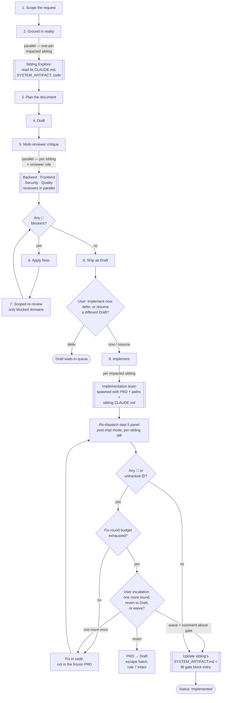

# Workflow

specforge is a 9-step process from blank page to frozen, implemented PRD. It is opinionated: never skip grounding, never draft before verifying against real code, never promote `Implemented` without clearing the post-implementation re-review.

## The diagram



Steps 2, 5, and 9 **fan out across the impacted siblings** — each sibling gets its own Explore agent during grounding, its own reviewer instance per role during critique, and its own `SYSTEM_ARTIFACT.md` update during implementation. The review phase (steps 5 → 6 → 7) is **cyclic**: scoped re-review loops back through fixes until no 🔴 blockers remain. After step 8 the workflow pauses at an explicit user-gate. Step 9 closes with a **second cyclic re-review** that runs the same reviewer panel against the *shipped* code before the gate block can be filled.

---

## The 9 steps

### 1. Scope the request

For bounded decisions (2-4 mutually exclusive options you can confidently enumerate), use `AskUserQuestion` — one question per call. For exploration, clarifications, or unbounded spaces, ask in prose. If the user asks to answer in prose or explain first, comply immediately.

### 2. Ground in reality

**Precondition**: verify every registry path in `SIBLINGS.md` resolves on the current machine for the siblings this change will impact. If any path does not resolve, halt and ask the user. Never proceed with partial grounding — silent degradation produces PRDs that cite code that does not exist.

Launch parallel Explore agents, **one per impacted sibling**. Each agent reads, in order:

1. That sibling's `CLAUDE.md` (project-specific rules on top of specforge's).
2. That sibling's `SYSTEM_ARTIFACT.md`, if the registry declares one.
3. Related existing PRDs and ADRs in specforge (search by keyword, read `Depends on` chains).
4. The actual code inside that sibling for every component the change touches.

Do not proceed to drafting until the findings from every sibling agent point to concrete files, functions, tables, or endpoints that already exist in that sibling. **Never invent** — if something is new, mark it explicitly as new.

### 3. Plan the document

Before writing, decide:

- PRD, ADR, or just a `SYSTEM_ARTIFACT.md` update? See the decision table in [`prd-authoring.md`](https://github.com/angelkurten/specforge-framework/blob/main/.claude/rules/prd-authoring.md).
- Which sibling projects are impacted? This becomes the mandatory `Impacted Projects` table.
- Single shippable unit, or decompose into phase PRDs (`NNN-phase-1-…`, `NNN-phase-2-…`) each declaring `Depends on` their predecessor? Split if the feature cannot ship in one commit or exceeds ~1500 lines of spec.

### 4. Draft

Write the PRD/ADR using `templates/prd.md` or `templates/adr.md`. Every required section must be present (see [`prd-authoring.md`](https://github.com/angelkurten/specforge-framework/blob/main/.claude/rules/prd-authoring.md)). Mermaid only for diagrams — ASCII art is forbidden.

### 5. Multi-reviewer critique

Launch reviewers **in parallel** — a typical panel of 4 (backend, frontend, security, quality), adapted to the domain. Each reviewer is briefed with:

- The PRD under review
- Links to real code paths to verify against
- **The path to the relevant sibling's `CLAUDE.md`** for stack-specific conventions
- Their domain scope
- **`{{REVIEW_MODE}}: draft`** — at step 5 the reviewer critiques the PRD itself. The alternative mode is `post-implementation`, set only in step 9. Always pass the mode explicitly.

Every finding carries severity: 🔴 blocker, 🟡 should-fix, 🟢 nit. Findings without `file:line` ground-truth anchors are rejected.

### 6. Apply fixes

Consolidate findings. For ambiguous trade-offs, ask the user (prose or `AskUserQuestion` per step 1). Apply edits to the PRD.

### 7. Scoped re-review

Re-run **only** the reviewers whose domain had 🔴 blockers. Never a fresh review from scratch — re-review validates that the specific fixes landed correctly.

### 8. Ship as `Draft`

Merge the PRD at `Status: Draft`. It is now a design contract but not yet implemented. The gate block stays with `[TBD]` placeholders.

After the merge, ask the user via `AskUserQuestion` with three bounded options:

| Option | What happens |
|---|---|
| **(a) Spawn the implementation team now for this PRD** | Proceed directly to step 9 with the PRD just merged. |
| **(b) Defer and end the session here** | The Draft waits in the queue. |
| **(c) Resume a different Draft** | Follow-up prose question to pick which Draft (grep `Status: Draft` across PRDs), then **re-ground with reuse**: for siblings already grounded in the current session, reuse that grounding; only launch Explore for siblings not yet grounded. |

The purpose of (c) is to amortize an already-paid grounding cost, not to require a full re-run.

### 9. Implement, then gate to `Implemented`

Spawn an implementation team from the main session. You stay in specforge cwd throughout — you do not `cd` to code repos. Each sub-agent receives an explicit brief containing the PRD, absolute paths to the sibling's code that must change, and instructions to Read the sibling's `CLAUDE.md` before touching any code.

After code lands, **before** filling the gate block, re-dispatch the step 5 reviewer panel with:

- `{{CODE_REFERENCES}}` = `git diff --name-only <commit_hash>`, scoped **per sibling** (multi-sibling PRDs with separate commits get one reviewer instance per sibling-commit pair)
- `{{SIBLING_CLAUDE_MD_PATH}}` = same as before
- `{{REVIEW_MODE}}: post-implementation` (explicit, not a default)

In post-implementation mode the PRD is frozen, the question flips from "is the PRD sound?" to "does the shipped code honor the PRD?", and reviewers must read both the new/modified source files **and** the new/modified test files from the diff, verifying §9 Test Plan row-for-row against the tests that actually landed.

#### 🔴 handling

A 🔴 finding blocks gate promotion. The fix goes back to the implementation team, never into the frozen PRD. Re-dispatch the re-review after each fix round.

Count rounds explicitly: `initial re-review + fix-round-1 + fix-round-2 = escalation`. If the same 🔴 persists after fix-round-2, or if rounds produce contradictory 🔴s, halt and escalate to the user via `AskUserQuestion` with three options:

- **(i) One more fix round** — buys exactly one additional round; if that round still fails, escalation returns with option (i) removed. The counter does not reset.
- **(ii) Move the PRD back to `Draft`** — the single escape hatch for hard rule 7. Strip gate fields, explain why at the top. The PRD is no longer `Implemented` and is free to be edited on its way to a later ship.
- **(iii) Waive the finding** — with a written reason recorded as a comment above the gate block.

#### 🟡 handling

Every 🟡 finding must be routed to exactly one of three **tracked** destinations before the gate block is filled:

1. **Fix in code** — the code is wrong, apply the fix, treat as closed.
2. **Follow-up PRD** — the PRD was wrong and the code diverged deliberately; create a new PRD file with `Supersedes: PRD-N` in its header and reference it by number in a comment above the gate block.
3. **`SYSTEM_ARTIFACT.md` note** — the divergence is acceptable and worth remembering; add a line to the impacted sibling's `SYSTEM_ARTIFACT.md` describing the drift with a back-reference to this re-review round.

Untracked 🟡s block promotion the same way a 🔴 does. 🟢 is advisory.

#### Filling the gate block

Only once the re-review clears (no open 🔴, every 🟡 tracked) do you fill the gate block per [`gate-block.md`](https://github.com/angelkurten/specforge-framework/blob/main/.claude/rules/gate-block.md):

```yaml
commit_hash: a1b2c3d4
tests:
  - ../api-service/tests/auth/oauth_flow_test.py
  - ../api-service/tests/auth/refresh_test.py
system_artifact_diff:
  - ../api-service/docs/SYSTEM_ARTIFACT.md#auth-oauth (commit a1b2c3d4)
```

Update each impacted sibling's `SYSTEM_ARTIFACT.md` in the same commit, and move `Status` to `Implemented`.

## Related

- [Quickstart](../quickstart.md) — the day-by-day first-time bootstrap.
- [Mental model](../concepts/mental-model.md) — why PRDs get frozen and SYSTEM_ARTIFACT is the only living doc.
- [Sibling projects](../concepts/siblings.md) — the dispatch model that makes steps 2, 5, and 9 fan out without blowing up context.
