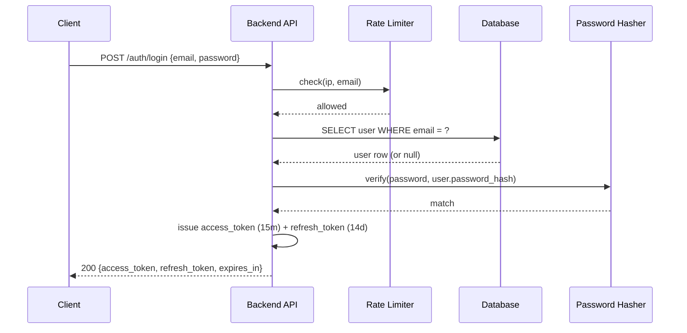
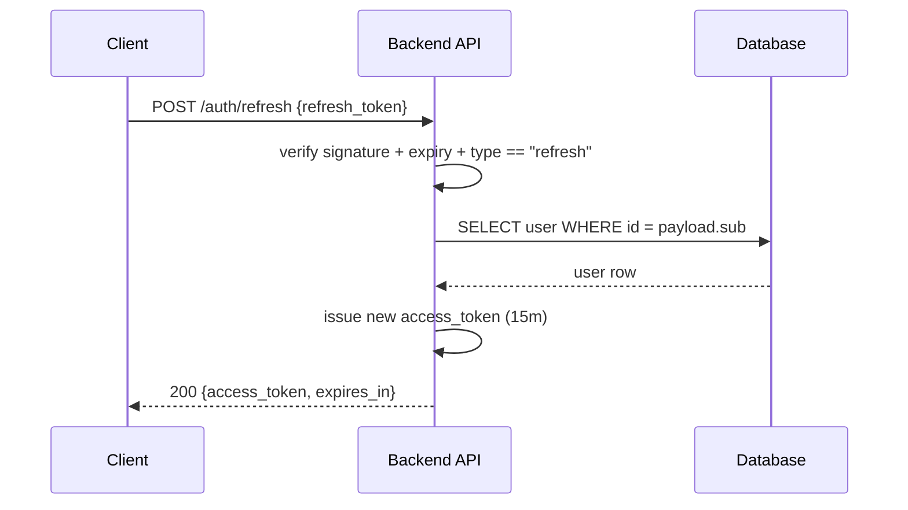
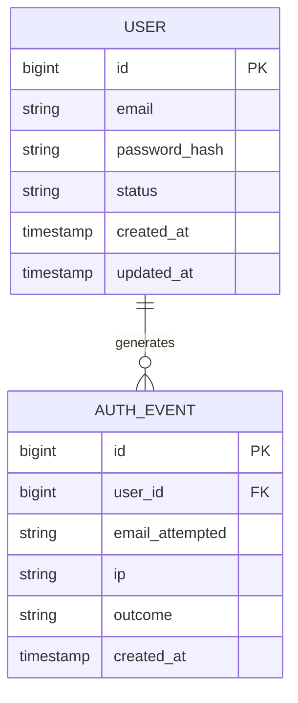
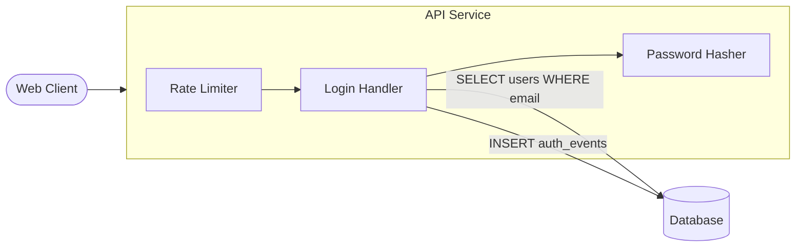

# PRD-001: Email/Password Login

**Status**: Draft
**Date**: 2026-04-09
**Author**: AI-assisted
**Priority**: P0
**Depends on**: None
**Supersedes**: None

> **Note**: This is an **example PRD** shipped with specforge to show what a
> filled-in PRD looks like. It is not a real product requirement. Specific
> values below (hashing parameters, token TTLs, rate limits, retention
> windows) are illustrative choices made by a fictional team, not
> requirements of specforge. The two `system-artifact-example.md` links
> below stay inside `examples/` because both files ship together as
> documentation; in a real PRD the equivalent links would point into the
> impacted sibling's `docs/SYSTEM_ARTIFACT.md` — see
> [`../SIBLINGS.md`](../SIBLINGS.md). See
> [../templates/prd.md](../templates/prd.md) for the blank template and
> [../CONVENTIONS.md](../CONVENTIONS.md) for the authoring rules.

## Impacted Projects

| Project | Impact |
|---------|--------|
| **api-service** | New `users` table, new `POST /auth/login` and `POST /auth/refresh` endpoints, new `AuthService`, new password hasher adapter, new rate-limit middleware on `/auth/*` |
| web-client | New `/login` page, new `useSession` hook, new auth interceptor that attaches the access token to outgoing requests |

*(Both `api-service` and `web-client` are declared as active rows in [`../SIBLINGS.md`](../SIBLINGS.md). The `Project` column carries names only — path, stack, and read-first metadata live in the registry.)*

---

## 1. Problem Statement

The platform currently has no authentication. Every endpoint is public, and
the web app has no notion of a logged-in user. We need users to be able to
prove their identity with an email and password so that we can attach data
to individual accounts and eventually enforce authorisation on per-user
resources.

We are starting with email/password specifically because it is the
universal baseline: any user has an email, no third-party identity provider
setup is required, and it unblocks the rest of the product roadmap without
introducing an external dependency on the critical path.

## 2. Goals

- Allow a user with an account to exchange their email and password for a
  short-lived access token and a longer-lived refresh token.
- Allow a client to exchange a valid refresh token for a new access token
  without re-prompting the user for their password.
- Hash passwords in a way that is safe against offline cracking if the
  database is exfiltrated.
- Rate-limit login attempts per IP and per account to slow online
  brute-force attacks.
- Log every authentication attempt (success or failure) with enough context
  to investigate incidents later.

## 3. Non-Goals

- **Account creation / registration.** This PRD assumes accounts exist.
  Registration is a separate PRD.
- **Password reset / forgotten password.** Separate PRD.
- **OAuth / social login / SSO.** Separate PRD.
- **Two-factor authentication.** Separate PRD.
- **Session revocation / logout.** Access tokens expire naturally; explicit
  revocation is a separate PRD.
- **Account lockout after N failed attempts.** Rate limiting is in scope;
  stateful lockout is not.
- **"Remember me" / extended session duration.** Out of scope.

## 4. User Flows / Design

### 4.1 Happy path



1. Client submits email and password to `POST /auth/login`.
2. Rate limiter checks both IP and email buckets. If either is exhausted,
   return `429` immediately without touching the database.
3. API looks up the user by email. If not found, it still calls the
   password hasher with a dummy hash to keep response times constant, then
   returns `401`.
4. API verifies the submitted password against `user.password_hash`.
5. On success, API issues two tokens: a 15-minute access token and a
   14-day refresh token.
6. API writes an `auth_event` row with `outcome = "success"`.
7. Client stores the tokens and uses the access token as `Authorization:
   Bearer <token>` on subsequent requests.

### 4.2 Refresh flow



Refresh tokens are **not rotated** in this PRD. A client can use the same
refresh token until it expires. Rotation and server-side refresh-token
storage are out of scope; see Open Questions.

### 4.3 Error branches

| Branch | Status | Body |
|--------|--------|------|
| Email not found | 401 | `{"error": "invalid_credentials"}` |
| Password mismatch | 401 | `{"error": "invalid_credentials"}` |
| Account disabled (`status != "active"`) | 401 | `{"error": "invalid_credentials"}` |
| Rate limit exceeded | 429 | `{"error": "too_many_attempts", "retry_after": <seconds>}` |
| Malformed body | 400 | `{"error": "invalid_request"}` |
| Refresh token expired | 401 | `{"error": "token_expired"}` |
| Refresh token signature invalid | 401 | `{"error": "invalid_token"}` |

Note: "email not found" and "password mismatch" return the same body. We do
not distinguish them to the client to avoid account enumeration.

## 5. API

### 5.1 `POST /auth/login`

**Auth**: none

**Request**:

```json
{
  "email": "alice@example.com",
  "password": "correct horse battery staple"
}
```

**Response 200**:

```json
{
  "token_type": "Bearer",
  "access_token": "eyJhbGciOiJIUzI1NiIsInR5cCI6IkpXVCJ9...",
  "refresh_token": "eyJhbGciOiJIUzI1NiIsInR5cCI6IkpXVCJ9...",
  "expires_in": 900
}
```

**Errors**:

| Status | Reason |
|--------|--------|
| 400 | Request body missing `email` or `password`, or email is not a valid RFC 5322 address |
| 401 | Credentials invalid, or account not `active` |
| 429 | Rate limit exceeded on IP or account |

**Rate limits**:

- 10 requests per minute per IP address
- 5 requests per minute per `email` value (normalised lowercase)

### 5.2 `POST /auth/refresh`

**Auth**: none (the refresh token is the credential)

**Request**:

```json
{
  "refresh_token": "eyJhbGciOiJIUzI1NiIsInR5cCI6IkpXVCJ9..."
}
```

**Response 200**:

```json
{
  "token_type": "Bearer",
  "access_token": "eyJhbGciOiJIUzI1NiIsInR5cCI6IkpXVCJ9...",
  "expires_in": 900
}
```

**Errors**:

| Status | Reason |
|--------|--------|
| 400 | Request body missing `refresh_token` |
| 401 | Token signature invalid, expired, or `type != "refresh"` |
| 401 | Referenced user no longer exists or is not `active` |
| 429 | Rate limit exceeded on IP |

**Rate limits**:

- 30 requests per minute per IP address

### 5.3 Access token payload

```json
{
  "sub": "42",
  "email": "alice@example.com",
  "type": "access",
  "iat": 1776000000,
  "exp": 1776000900
}
```

### 5.4 Refresh token payload

```json
{
  "sub": "42",
  "type": "refresh",
  "iat": 1776000000,
  "exp": 1777209600
}
```

Both tokens are signed with HS256 using `AUTH_JWT_SECRET`.

## 6. Data Model



### 6.1 `users` (new table)

| Column | Type | Nullable | Default | Description |
|--------|------|----------|---------|-------------|
| id | bigint | no | auto | primary key |
| email | varchar(320) | no | — | login identifier, unique in lowercase form |
| password_hash | varchar(255) | no | — | argon2id hash, see Security |
| status | varchar(20) | no | `'active'` | `active`, `disabled`, `deleted` |
| created_at | timestamptz | no | `now()` | |
| updated_at | timestamptz | no | `now()` | updated via trigger |

**Indexes**:

- `users_pkey` on `(id)`
- `users_email_lower_key` unique on `LOWER(email)` — enforces
  case-insensitive uniqueness and supports login lookup

### 6.2 `auth_events` (new table)

| Column | Type | Nullable | Default | Description |
|--------|------|----------|---------|-------------|
| id | bigint | no | auto | primary key |
| user_id | bigint | yes | — | FK to `users.id`; null when email did not match |
| email_attempted | varchar(320) | no | — | exact email as submitted |
| ip | inet | no | — | source IP |
| outcome | varchar(32) | no | — | `success`, `invalid_credentials`, `rate_limited`, `token_expired`, `invalid_token` |
| created_at | timestamptz | no | `now()` | |

**Indexes**:

- `auth_events_pkey` on `(id)`
- `auth_events_user_id_created_at_idx` on `(user_id, created_at desc)` for
  per-user audit queries
- `auth_events_email_created_at_idx` on `(email_attempted, created_at desc)`
  for the rate limiter and incident investigation

## 7. Architecture

The login flow crosses four internal components: the web client, the
API service, the rate limiter, and the database. The password hasher is
a synchronous in-process adapter inside the API service, not a separate
component.



The rate limiter is an in-memory token-bucket adapter keyed on IP and on
the normalised lowercase email. There is no external dependency (Redis,
Memcached) in this PRD — see § 11 Open Questions for the
distributed-limiter discussion.

The password hasher is an adapter that wraps Argon2id. It is injected
into the login handler so that tests can swap it for a deterministic
fake, keeping unit tests fast without losing the timing side-channel
coverage in integration tests.

## 8. Security

**Password hashing**. Passwords are hashed with Argon2id using the OWASP
2025 baseline: `m = 19 MiB`, `t = 2`, `p = 1`, 16-byte salt. The hashing
cost is tuned so that a single verify takes ~50ms on production hardware.
Bcrypt is explicitly rejected: we want a memory-hard function.

**Constant-time comparison**. `verify(password, hash)` is the only code
path that checks passwords, and it is constant-time. We never compare
password strings directly.

**Timing side-channels**. If `SELECT user` returns null, the handler still
calls `verify(password, dummy_hash)` so that the response time for an
unknown email matches the response time for a known email with a wrong
password. This blocks account enumeration via timing.

**Account enumeration**. Login error bodies do not distinguish "user not
found" from "wrong password". Both return
`{"error": "invalid_credentials"}` with status 401.

**Rate limiting**. Two buckets for `POST /auth/login`:

- Per IP: 10/minute, sliding window, keyed on `request.remote_addr`.
- Per email: 5/minute, sliding window, keyed on `lower(email)`.

The limiter runs **before** the database lookup so that a flood of requests
for a non-existent email cannot drive database load.

**JWT secret management**. `AUTH_JWT_SECRET` is a 256-bit random value
loaded from the secrets store at boot. It is never logged and never
returned in any API response. Rotation is out of scope for this PRD — see
Open Questions.

**Token expiry**. Access tokens expire in 15 minutes. Refresh tokens expire
in 14 days. These are the only places where token lifetime is configured
(`AUTH_ACCESS_TTL_SECONDS`, `AUTH_REFRESH_TTL_SECONDS`).

**PII classification**. `email` and `ip` are treated as PII. `auth_events`
retention is 90 days; a scheduled job deletes older rows. Retention policy
is documented in [SYSTEM_ARTIFACT.md (example)](system-artifact-example.md)
under the `auth` domain.

**Logging**. Passwords and hashes are never logged. Refresh tokens are
never logged in full — only the first 8 characters of the signature
fragment, for debugging.

## 9. Test Plan

| # | Test | Type | Description | Path |
|---|------|------|-------------|------|
| 1 | login with valid credentials returns 200 and both tokens | integration | | `../api-service/tests/auth/login_test.py` |
| 2 | login with unknown email returns 401 and generic body | integration | | `../api-service/tests/auth/login_test.py` |
| 3 | login with wrong password returns 401 and generic body | integration | | `../api-service/tests/auth/login_test.py` |
| 4 | login with disabled account returns 401 | integration | | `../api-service/tests/auth/login_test.py` |
| 5 | unknown email and wrong password take within 10% of the same wall-clock time | integration | timing side-channel check | `../api-service/tests/auth/timing_test.py` |
| 6 | 11 logins from the same IP in 60s → 11th returns 429 | integration | | `../api-service/tests/auth/rate_limit_test.py` |
| 7 | 6 logins for the same email in 60s → 6th returns 429 | integration | | `../api-service/tests/auth/rate_limit_test.py` |
| 8 | rate limiter runs before DB lookup (assert no SELECT when rate-limited) | integration | | `../api-service/tests/auth/rate_limit_test.py` |
| 9 | refresh with valid refresh token returns new access token | integration | | `../api-service/tests/auth/refresh_test.py` |
| 10 | refresh with expired refresh token returns 401 `token_expired` | integration | | `../api-service/tests/auth/refresh_test.py` |
| 11 | refresh with access token (type != refresh) returns 401 | integration | | `../api-service/tests/auth/refresh_test.py` |
| 12 | refresh with tampered signature returns 401 | integration | | `../api-service/tests/auth/refresh_test.py` |
| 13 | Argon2id verify rejects a password hashed with a different salt | unit | | `../api-service/tests/unit/auth/hasher_test.py` |
| 14 | `users_email_lower_key` prevents inserting `ALICE@example.com` when `alice@example.com` exists | integration | | `../api-service/tests/auth/users_schema_test.py` |
| 15 | `auth_events` row is written for every login attempt, success or failure | integration | | `../api-service/tests/auth/audit_test.py` |
| 16 | passwords and tokens never appear in application logs during any flow | unit | log scrubber test | `../api-service/tests/unit/auth/log_scrub_test.py` |
| 17 | E2E: user logs in via web UI, reloads page, stays logged in | e2e | | `../web-client/tests/e2e/auth/login.spec.ts` |
| 18 | E2E: user's access token expires, interceptor refreshes transparently | e2e | | `../web-client/tests/e2e/auth/refresh.spec.ts` |

## 10. Migration Plan

This is a greenfield change — no existing auth to migrate from.

**Order of operations**:

1. Ship schema migration: create `users`, `auth_events`, and their indexes.
   The migration is forward-only but reversible by dropping the two tables.
2. Deploy backend with `/auth/login` and `/auth/refresh` behind a feature
   flag `auth.login_enabled = false`. Endpoints return `503` while the
   flag is off.
3. Seed test accounts via an admin script (out of scope for this PRD, but
   required for acceptance testing).
4. Flip `auth.login_enabled = true` in staging, run the integration suite,
   then flip in production during a low-traffic window.
5. Deploy the web client with the `/login` page and the auth interceptor.
6. Monitor `auth_events.outcome` counts and the `/auth/login` error rate
   for 48 hours before closing the rollout.

**Rollback**:

- Flip `auth.login_enabled = false`. The web client degrades to the
  pre-auth experience. No schema rollback needed.
- If a data issue forces schema rollback, drop `auth_events` first, then
  `users`. There are no foreign keys into `users` from other tables yet,
  so the drop is safe.

**Backfill**: none. No rows to migrate.

## 11. Open Questions

- [ ] Should refresh tokens be rotated on every use? (Deferred: requires
      server-side refresh-token storage.)
- [ ] Should we add a server-side revocation list for compromised refresh
      tokens? (Deferred: separate incident-response PRD.)
- [ ] What is the key rotation policy for `AUTH_JWT_SECRET`? (Deferred:
      ops PRD.)
- [ ] Do we need `login_hint` / IP geolocation on the email notification
      for successful logins? (Deferred: separate notifications PRD.)

---

## Gate: Promotion to `Implemented`

```yaml
commit_hash: [TBD]                       # filled when this PRD ships
tests:                                   # YAML list, relative to the specforge dir
  - [TBD]                                #   e.g. ../api-service/tests/auth/login_test
  - [TBD]
system_artifact_diff:                    # YAML list — one entry per impacted sibling
  - [TBD]                                #   that maintains a SYSTEM_ARTIFACT.md.
                                         #   web-client has no SYSTEM_ARTIFACT (UI-only),
                                         #   so this list has exactly one entry pointing
                                         #   at ../api-service/docs/SYSTEM_ARTIFACT.md#auth
```

Once all three fields are filled and the linked tests pass on
`commit_hash`, update `Status` to `Implemented` and stop editing this
document. Current state of the auth domain lives in
[SYSTEM_ARTIFACT.md (example)](system-artifact-example.md), not here.
