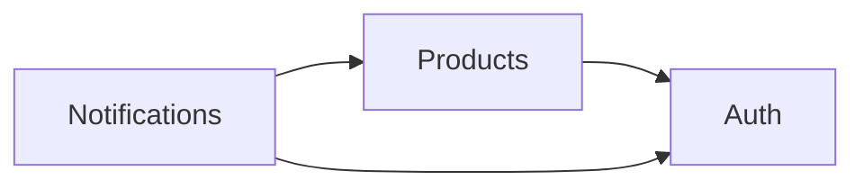

# SYSTEM_ARTIFACT

**Project**: api-service
**Last updated**: 2026-04-09
**Version**: 0.3.0
**Maintainers**: Platform team

> **Note**: This is an **example SYSTEM_ARTIFACT** shipped with specforge
> to show what the living state document looks like for **one sibling
> project** after a PRD has been promoted to `Implemented`. It is not a
> real system, and a team with multiple sibling projects keeps one such
> file per project (never merged). In a real layout this file would live
> at `../api-service/docs/SYSTEM_ARTIFACT.md` (relative to the specforge
> directory), not inside specforge itself. See
> [../templates/system-artifact.md](../templates/system-artifact.md) for
> the blank template and
> [prd-001-login-example.md](prd-001-login-example.md) for the PRD whose
> implementation is reflected here.

---

## How to maintain this document

1. **One change per commit.** Each update should be tied to a PRD reaching
   `Implemented` or a direct fix for observed drift.
2. **Update in the same commit as the code.** The diff against this file is
   one of the three required gate fields on the PRD.
3. **Describe what is, not what will be.** No "coming soon" sections.
4. **Group by domain.** Auth, products, notifications — not chronology.
5. **Link back to the PRD** that introduced each capability.
6. **Diagrams are Mermaid only.**

See [CONVENTIONS.md](../CONVENTIONS.md) for the full rules.

---

## Domain Map

---

## Domain: `auth`

**Source PRDs**: [PRD-001: Email/Password Login](prd-001-login-example.md)
**Primary owners**: Platform team

### Overview

The `auth` domain owns identity and authentication. It answers two
questions: "who is this request from?" and "is the caller allowed to prove
they are that person?". It does not answer authorisation questions
("is this user allowed to do X?"); that lives in the domain that owns the
resource.

Today the domain supports one credential type: email and password. JWT
access tokens are issued after a successful login and verified on every
protected request via shared middleware. Refresh tokens extend the
session without re-prompting for the password.

### Key Entities

#### `users`

| Column | Type | Notes |
|--------|------|-------|
| id | bigint | primary key |
| email | varchar(320) | unique in lowercase form (`users_email_lower_key`) |
| password_hash | varchar(255) | Argon2id, OWASP 2025 baseline |
| status | varchar(20) | `active`, `disabled`, `deleted` |
| created_at | timestamptz | |
| updated_at | timestamptz | |

Only `active` users can authenticate. `disabled` and `deleted` are treated
identically during login: the response is the same generic
`invalid_credentials` error.

#### `auth_events`

| Column | Type | Notes |
|--------|------|-------|
| id | bigint | primary key |
| user_id | bigint | nullable — null when email did not match |
| email_attempted | varchar(320) | exact value as submitted |
| ip | inet | source IP |
| outcome | varchar(32) | `success`, `invalid_credentials`, `rate_limited`, `token_expired`, `invalid_token` |
| created_at | timestamptz | |

Retention is 90 days. A nightly job (`jobs/auth_events_retention.py`)
deletes older rows.

### Main Capabilities

| Capability | Surface | Introduced in |
|------------|---------|---------------|
| Exchange email/password for tokens | `POST /auth/login` | [PRD-001](prd-001-login-example.md) |
| Exchange refresh token for new access token | `POST /auth/refresh` | [PRD-001](prd-001-login-example.md) |
| Verify access token on protected requests | `AuthMiddleware` | [PRD-001](prd-001-login-example.md) |
| Hash and verify passwords | `Argon2idPasswordHasher` | [PRD-001](prd-001-login-example.md) |
| Rate-limit authentication attempts | `AuthRateLimitMiddleware` | [PRD-001](prd-001-login-example.md) |

### Key Invariants

- `LOWER(users.email)` is unique across all rows, regardless of `status`.
- `users.password_hash` is always an Argon2id hash. Bcrypt and plaintext
  are never accepted, even in tests.
- Every call to `POST /auth/login` writes exactly one row to
  `auth_events`, whether the attempt succeeded or failed.
- The rate limiter runs before any database query for `/auth/login`. A
  request that is rate-limited never touches `users`.
- Login error responses do not distinguish "user not found" from "wrong
  password". They are byte-for-byte identical.
- Access tokens have `type: "access"` and `exp <= iat + 900`.
  Refresh tokens have `type: "refresh"` and `exp <= iat + 1209600`.
- `AUTH_JWT_SECRET` is never logged, never returned in any response, and
  never appears in any test fixture committed to the repository.

### Policies

**Password hashing**: Argon2id, `m = 19 MiB`, `t = 2`, `p = 1`, 16-byte
salt. Tuned to ~50ms per verify on production hardware.

**Token lifetimes**:

| Token | TTL | Env var |
|-------|-----|---------|
| Access | 15 minutes | `AUTH_ACCESS_TTL_SECONDS` |
| Refresh | 14 days | `AUTH_REFRESH_TTL_SECONDS` |

**Rate limits**:

| Endpoint | Key | Limit |
|----------|-----|-------|
| `POST /auth/login` | IP | 10 / minute |
| `POST /auth/login` | `lower(email)` | 5 / minute |
| `POST /auth/refresh` | IP | 30 / minute |

### Open Debt

- No refresh-token rotation. A stolen refresh token is valid for its full
  14-day TTL. Planned: future PRD on refresh-token rotation and
  revocation.
- No account lockout after repeated failures. Rate limiting slows
  brute-force attacks but does not lock accounts. Accepted trade-off —
  revisit if brute-force volume grows.
- `AUTH_JWT_SECRET` rotation is manual and requires a full backend
  restart. Planned: future ops PRD.

---

## Domain: `products`

**Source PRDs**: _None yet — stub domain_
**Primary owners**: Catalog team

### Overview

Placeholder for the products domain. No capabilities shipped yet. This
section exists so that the domain map has a home for the `products` node
and so that reviewers looking for it do not assume it lives elsewhere.

### Key Entities

_None yet._

### Main Capabilities

_None yet._

### Key Invariants

_None yet._

### Open Debt

- Entire domain is unspecified. Needs a scoping PRD before any code is
  written.

---

## Domain: `notifications`

**Source PRDs**: _None yet — stub domain_
**Primary owners**: Platform team

### Overview

Placeholder for the notifications domain. No capabilities shipped yet.
Planned to handle transactional emails (welcome, password reset, login
from a new device) once the registration and password-reset PRDs land.

### Key Entities

_None yet._

### Main Capabilities

_None yet._

### Key Invariants

_None yet._

### Open Debt

- No email delivery provider chosen. Decision will be recorded in an ADR
  before the first notifications PRD is written.

---

## Cross-cutting concerns

### Observability

- Structured JSON logs from every request via `RequestLoggingMiddleware`.
  Each log line includes `request_id`, `ip`, and `user_id` (if the
  request was authenticated).
- Metrics: `auth.login.success`, `auth.login.failure`,
  `auth.login.rate_limited`, `auth.refresh.success`,
  `auth.refresh.failure`. Exposed at `/metrics` in Prometheus format.
- Passwords and tokens are scrubbed from logs by
  `SensitiveFieldScrubber`. Test coverage for the scrubber is in
  `tests/unit/test_sensitive_field_scrubber.py`.

### Background jobs

| Job | Cadence | Owner domain |
|-----|---------|--------------|
| `auth_events_retention` | nightly, 03:00 UTC | auth |

### Shared middleware

| Middleware | Applied to | Purpose |
|------------|------------|---------|
| `RequestLoggingMiddleware` | all | structured request logs |
| `AuthMiddleware` | protected routes | validates access token, populates `request.user` |
| `AuthRateLimitMiddleware` | `/auth/*` | per-IP and per-email rate limits |

---

## Change log

| Date | PRD | Summary |
|------|-----|---------|
| 2026-04-09 | [PRD-001](prd-001-login-example.md) | Introduced `auth` domain: `users`, `auth_events`, login, refresh, password hashing, rate limiting |
