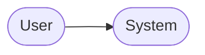
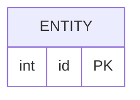
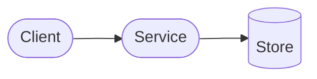

# PRD-NNN: <!-- Short descriptive title -->

**Status**: Draft
**Date**: YYYY-MM-DD
**Author**: AI-assisted
**Priority**: P1
**Depends on**: <!-- PRD-XXX, or "None" -->
**Supersedes**: <!-- PRD-XXX, or "None" -->

<!--
  Status lifecycle:
    Draft         — actively being written or reviewed, not yet built
    Implemented   — frozen snapshot tied to a specific commit (see gate below)
    Superseded    — replaced by another PRD; link it and keep history

  See [CONVENTIONS.md](../CONVENTIONS.md) for format reference (header shapes,
  naming, diagrams, cross-references) and [../.claude/rules/](../.claude/rules/)
  for behavioural rules: workflow, hard rules, gate block, required sections.
-->

## Impacted Projects

<!--
  Always include this table, even if only one project is impacted.
  Two columns: Project (must match a row in SIBLINGS.md by name) and
  Impact (concrete technical summary — endpoints, tables, services,
  screens, migrations).
  The primary project is bolded.
-->

| Project | Impact |
|---------|--------|
| **<project-name-from-SIBLINGS.md>** | <!-- new endpoints, tables, services --> |
| <project-name-from-SIBLINGS.md> | <!-- screens, components, state changes --> |

---

## 1. Problem Statement

<!--
  Describe the problem being solved, not the solution. Who is affected, what
  currently breaks or is missing, and why it matters now. One to three
  paragraphs is usually enough. Cite evidence (tickets, metrics, incidents)
  where possible — avoid speculation.
-->

## 2. Goals

<!-- Imperative bullets: "Enable X", "Provide Y", "Ensure Z". 3-7 items.
     Optional: for a goal describing a system reaction, prefer event/condition-
     first phrasing — "When <trigger>, the system shall <response>" or
     "If <condition>, then the system shall <response>" — so it maps directly
     to a § 9 Test Plan row. Style suggestion only; see prd-authoring.md § 2. -->


- <!-- Goal 1 -->
- <!-- Goal 2 -->
- <!-- Goal 3 -->

## 3. Non-Goals

<!--
  Explicitly list what is out of scope. This is where you defend the PRD
  against scope creep during review. Anything you say "no" to here does not
  need to be designed or tested.
-->

- <!-- Non-goal 1 -->
- <!-- Non-goal 2 -->

## 4. User Flows / Design

<!--
  Describe the happy-path flow and the important error branches. Use a
  Mermaid diagram for any flow with more than two actors or two steps.
  ASCII art is not allowed for diagrams — use Mermaid or a prose/table
  description. Tables and nested bullet lists are fine and are not
  considered diagrams.
-->



<!-- Replace the placeholder diagram above with the real flow. -->

### 4.1 Happy path

<!-- Step-by-step, numbered. Reference the diagram nodes where useful. -->

### 4.2 Error branches

<!-- What happens when inputs are invalid, the network fails, etc. -->

## 5. API

<!--
  For every new or changed endpoint include: method, path, auth requirement,
  request body (JSON), success response (JSON), error responses (table with
  status code + reason), and any rate limits.
-->

### 5.1 `METHOD /path`

**Auth**: <!-- none | bearer | session | ... -->

**Request**:

```json
{}
```

**Response 200**:

```json
{}
```

**Errors**:

| Status | Reason |
|--------|--------|
| 400 | <!-- validation failed --> |
| 401 | <!-- not authenticated --> |

## 6. Data Model

<!--
  Mermaid ERD for new or changed entities. Follow with a column-by-column
  table per entity. Include constraints, indexes, and defaults. If a table
  already exists and is only being extended, mark the new columns clearly.
-->



### 6.1 `<entity_name>`

| Column | Type | Nullable | Default | Description |
|--------|------|----------|---------|-------------|
| id     | int  | no       | auto    | primary key |

## 7. Architecture

<!--
  How the components involved in this change interact. Include a Mermaid
  diagram (flowchart, sequence, or component) when the flow spans more
  than two components. If this PRD touches only one component with no
  cross-service interaction, write one sentence explaining that and
  point to § 6 Data Model — do not omit the section entirely.
-->



## 8. Security

<!--
  Required section. Cover at minimum:
    - Authentication and authorization (who can call what)
    - Input validation and injection vectors
    - Secret/credential handling
    - Rate limiting and abuse prevention
    - PII / data classification
  Cite the threat and the mitigation. "We use HTTPS" is not a mitigation by
  itself.
-->

## 9. Test Plan

<!--
  Required section. Enumerate the test cases as a table. Cover happy path,
  edge cases, error responses, and regressions against behaviour documented
  in SYSTEM_ARTIFACT.md. Every row must name a concrete test file `Path`
  relative to the specforge directory (typically `../<sibling>/...`); the
  gate block's `tests` YAML list is the deduplicated set of these paths at
  promotion time. A greenfield test that does not yet exist still names the
  path it will be created at.
-->

| # | Test | Type | Description | Path |
|---|------|------|-------------|------|
| 1 |      | unit        |  | `../<sibling>/tests/unit/<file>_test.<ext>` |
| 2 |      | integration |  | `../<sibling>/tests/integration/<file>_test.<ext>` |
| 3 |      | e2e         |  | `../<sibling>/tests/e2e/<file>.spec.<ext>` |

## 10. Migration Plan

<!--
  Required section. Describe how the change reaches production without
  breaking existing users. Include: DB migration order, backfill strategy,
  feature flag plan (if any), rollback procedure, and the order in which
  services must be deployed.
-->

## 11. Open Questions

<!-- Checkbox list of unresolved decisions. Keep until they are answered. -->

- [ ] <!-- Question 1 -->
- [ ] <!-- Question 2 -->

---

## Gate: Promotion to `Implemented`

<!--
  A PRD cannot move from Draft to Implemented until every field below is
  filled with a real value. This is enforced during review. See
  [CONVENTIONS.md](../CONVENTIONS.md) for the full rule.
-->

```yaml
commit_hash:          # e.g. 3f8a91c — the commit that shipped this PRD
tests:                # YAML list of test paths, relative to the specforge dir,
  - ../<sibling>/path/to/test_file_1     # typically into an impacted sibling project
  - ../<sibling>/path/to/test_file_2
system_artifact_diff: # YAML list — one entry per impacted sibling that maintains
  - ../<sibling>/docs/SYSTEM_ARTIFACT.md#<section> (commit <hash>)   # a SYSTEM_ARTIFACT.md
```

Both `tests` and `system_artifact_diff` are **always YAML lists**, even if the
list has only one entry. Never a bare scalar. Siblings without a
`SYSTEM_ARTIFACT.md` (e.g. UI-only) do not contribute an entry to
`system_artifact_diff` — the list length equals the number of impacted siblings
that maintain one.

Once all three fields are filled and the linked tests pass on `commit_hash`,
update `Status` to `Implemented` and freeze this document. Future changes go
in a new PRD, not here. Current system state lives in the relevant sibling
project's `SYSTEM_ARTIFACT.md` (see [`SIBLINGS.md`](../SIBLINGS.md)), not in
this snapshot.
