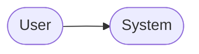
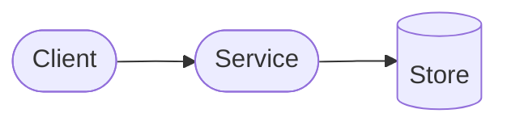

# PRD-NNN: <!-- Short descriptive title -->

**Status**: Draft
**Date**: YYYY-MM-DD
**Author**: AI-assisted
**Priority**: P1
**Depends on**: <!-- PRD-XXX, or "None" -->
**Supersedes**: <!-- PRD-XXX, or "None" -->

<!--
  Status lifecycle:
    Draft         — actively being written or reviewed, not yet built
    Implemented   — frozen snapshot tied to a specific commit (see gate below)
    Superseded    — replaced by another PRD; link it and keep history

  See [CONVENTIONS.md](../CONVENTIONS.md) for format reference (header shapes,
  naming, diagrams, cross-references) and [../.claude/rules/](../.claude/rules/)
  for behavioural rules: workflow, hard rules, gate block, required sections.
-->

## Impacted Projects

<!--
  Always include this table, even if only one project is impacted.
  Two columns: Project (must match a row in SIBLINGS.md by name) and
  Impact (concrete technical summary — endpoints, tables, services,
  screens, migrations).
  The primary project is bolded.
-->

| Project | Impact |
|---------|--------|
| **<project-name-from-SIBLINGS.md>** | <!-- new endpoints, tables, services --> |
| <project-name-from-SIBLINGS.md> | <!-- screens, components, state changes --> |

---

> **Before filling this in, read `examples/prd-001-login-example.md`** — a complete PRD of
> this shape, not a skeleton. The blocks below ask the questions; that file shows answers
> that passed a panel.

## 1. Problem Statement

> 1. Who is affected, what breaks or is missing for them today, and why now?
> 2. **Cite the evidence**: a metric with its window, a ticket id, an incident, a dated observation. Where you have none, write that you have none and say what would get it.
> 3. **What is established, and what is not.** Name the part you have measured and the part you are assuming.

## 2. Goals

> 3-7 imperative bullets. For a goal describing a reaction, prefer "When `<trigger>`, the system shall `<response>`" so it maps onto a §9 row.
>
> **Appetite**: state what this is worth. A budget bounds over-building and is the one number a reader can hold the finished design against.

-

## 3. Non-Goals

> **One sentence each.** The refuted alternative's full argument lives in §7, not here.
>
> - **Rabbit holes** — the expensive wrong turn you can see from here, and why it is one.
> - **No-gos** — what this deliberately will not do that a reader would assume it does.

-

## 4. User Flows / Design

> **Answer every line below inside this section.** Where you cannot, write
> `[NEEDS CLARIFICATION: <gap> — <2-4 candidates>]` at the site the answer belongs.
> Delete this block once every line is answered; a line still standing at step 5 is a
> question the panel will ask instead.
>
> 1. Who is the actor, what do they see first, and what do they do next?
> 2. What do they see while the system works, and for how long?
> 3. What does success look like to them, and how do they know?
> 4. What design does this implement — file, artboard or URL — or state in one line that none exists?


```mermaid
flowchart LR
    user([User]) --> system([System])
```

### 4.1 Happy path

> Numbered steps, referencing the diagram nodes.

### 4.2 Error branches

> **One row per branch.** Six that a first draft omits and a panel then authors:
>
> 1. Invalid or hostile input.
> 2. A second concurrent invocation by the same actor.
> 3. The reverse path — undo, downgrade, cancel, refund, delete.
> 4. A destructive or privileged option used wrongly.
> 5. Each dependency this flow calls, unavailable or slow.
> 6. The actor leaves mid-flow and comes back.

## 5. API

> Per new or changed endpoint: method and path; who may call it and **the `file:line` where
> that is enforced**; request shape; success shape; **every** error status with its cause;
> rate limit; and what the client holds between request and response.
>
> If this change adds no endpoint, write that claim in one sentence — it is checked against
> the diff at step 9, so it is a statement, not an exemption.

### 5.1 `METHOD /path`

**Auth**:

**Request**:

**Response 200**:

**Errors**:

| Status | Cause | Client sees |
|--------|-------|-------------|

## 6. Data Model

> 1. Which entities are new, which extended, which only read?
> 2. Per new or changed column: type, nullability, default, and what an existing row holds before the migration runs.
> 3. What is the uniqueness rule — and what happens when two writers race it?
> 4. How does a row leave: deleted, archived, expired? Driven by what, and when?

```mermaid
erDiagram
```

### 6.1 `<entity_name>`

| Column | Type | Nullable | Default | Description |
|--------|------|----------|---------|-------------|

## 7. Architecture

> 1. Name every component this change touches and the direction data moves. Mermaid when there are more than two.
> 2. Which component owns each new piece of state, and who else reads it?
> 3. What shape did you consider and reject, and what would make you reconsider it?
>
> Line 3 always has an answer. A change touching one component still rejected something, and
> the reader who re-proposes the rejected shape is the cost of not writing it down.


```mermaid
flowchart LR
    client([Client]) --> service([Service])
    service --> store[(Store)]
```

## 8. Security

> Per line: the threat, the mitigation, and **the `file:line` where the mitigation is
> enforced**. Naming a protocol is not naming a mitigation.
>
> 1. Who can call what, and where is that enforced?
> 2. Which input reaches storage, a query, a shell, or a template — and what validates it?
> 3. Which secrets does this need, where do they live, and what reads them?
> 4. What bounds abuse — rate limit, quota, cost cap? State the number, and say whether it
>    is a bound (refuses before spending) or a tally (counts after).
> 5. What PII does this touch, and who can see it?

## 9. Test Plan

> **Before writing each row:**
>
> 1. Does it assert a **presence** (a status code, an error, a value, a grep hit) or an
>    **absence** (nothing logged, a method not called, no row written)?
> 2. Write the minimal diff a well-intentioned developer would make. **Name the row that
>    goes red against it.** A row that names none is not testing what it claims.
> 3. Check the row is not incidental, not fed by the mechanism's own output, and does not
>    enumerate itself.
>
> **Coverage is not your job here.** `scripts/prd-check.py` joins §4.2's branches, §5's
> error statuses and §6's constraints against this table and reports what has no row. Run
> it; do not restate its answer in prose.
>
> `Type` is one of: `unit`, `integration`, `e2e`, `conformance` (asserts a property of the
> repository or its documents rather than of running code), `wiring` (asserts a component is
> connected as specified). Every row names a concrete `Path`, existing or to-be-created.

| # | Test | Type | Description | Path |
|---|------|------|-------------|------|

## 10. Migration Plan

> 1. Order the steps. **Read step N and ask what must already exist for it to run.** A step
>    depending on something a later step creates is the defect this question catches, and
>    reading the plan does not catch it — walking it does.
> 2. What is the rollback for each step, and which step is the last one that can be rolled back at all?
> 3. What happens to rows that exist before the migration runs?
> 4. Does anything need a flag, and who turns it off?

## Observability

> **Required.** A control nobody can see is a promise, not a control.
>
> 1. What line is logged when this succeeds, and what when it refuses? Name the event and its fields.
> 2. Which number would tell an operator this is going wrong, and at what value?
> 3. Who reads it, and through what — a query, a dashboard, an alarm? "Watch it for a week" names no reader.

## 11. Open Questions

> Every `[NEEDS CLARIFICATION]` marker still standing, plus every `unanswered` row from
> the `CONVENTIONS.md` § 13 table. Each carries the cost of leaving it open and who can close it.

- [ ] <!-- Question 1 -->
- [ ] <!-- Question 2 -->

---

## Gate: Promotion to `Implemented`

<!--
  A PRD cannot move from Draft to Implemented until every field below is
  filled with a real value. This is enforced during review. See
  [CONVENTIONS.md](../CONVENTIONS.md) for the full rule.
-->

```yaml
commit_hash:          # e.g. 3f8a91c — the commit that shipped this PRD
tests:                # YAML list of test paths, relative to the specforge dir,
  - ../<sibling>/path/to/test_file_1     # typically into an impacted sibling project
  - ../<sibling>/path/to/test_file_2
system_artifact_diff: # YAML list — one entry per impacted sibling that maintains
  - ../<sibling>/docs/SYSTEM_ARTIFACT.md#<section> (commit <hash>)   # a SYSTEM_ARTIFACT.md
```

Both `tests` and `system_artifact_diff` are **always YAML lists**, even if the
list has only one entry. Never a bare scalar. Siblings without a
`SYSTEM_ARTIFACT.md` (e.g. UI-only) do not contribute an entry to
`system_artifact_diff` — the list length equals the number of impacted siblings
that maintain one.

Once all three fields are filled and the linked tests pass on `commit_hash`,
update `Status` to `Implemented` and freeze this document. Future changes go
in a new PRD, not here. Current system state lives in the relevant sibling
project's `SYSTEM_ARTIFACT.md` (see [`SIBLINGS.md`](../SIBLINGS.md)), not in
this snapshot.
