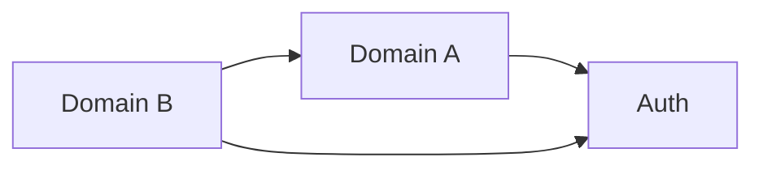

# SYSTEM_ARTIFACT

**Last updated**: YYYY-MM-DD
**Version**: 0.1.0
**Maintainers**: <!-- roles or teams, not names -->

<!--
  SYSTEM_ARTIFACT.md is the single source of truth for the current state of
  the system. PRDs are historical snapshots ("this is what we decided to
  build, frozen at commit X"); this document is a living reference ("this is
  what exists today"). If the two disagree, this document wins.

  See [CONVENTIONS.md](../CONVENTIONS.md) for the full rules around
  historical snapshots vs living state.
-->

---

## How to maintain this document

Read this section before editing.

1. **One change per commit.** Each update to this document should be tied to
   a PRD reaching `Implemented` status, or a direct fix for observed drift.
2. **Update in the same commit as the code.** When a PRD is promoted to
   `Implemented`, the diff against this file is one of the three required
   gate fields (`system_artifact_diff`). Do not let them drift.
3. **Describe what is, not what will be.** This document has no "future",
   "proposed", or "coming soon" sections. Future work lives in PRDs.
4. **Group by domain, not by chronology.** Someone reading this should
   learn the system by domain boundaries (auth, billing, notifications),
   not by the order features were built.
5. **Link back to the PRD that introduced each capability** so that
   readers can find the original rationale. Do not duplicate the rationale
   here — keep this document tight.
6. **Diagrams are Mermaid only.** No ASCII art. Tables and nested lists are
   fine and are not considered diagrams.

---

## Domain Map

<!--
  High-level view of the domains in the system and how they depend on each
  other. Update this diagram whenever a new top-level domain is added.
-->

---

## Domain: `<domain_name>`

**Source PRDs**: <!-- [PRD-001](prds/001-title.md), ... -->
**Primary owners**: <!-- team or role -->

### Overview

<!-- Two or three sentences explaining what this domain is responsible for. -->

### Key Entities

<!--
  One subsection per table/model/aggregate. Keep the schema summary short —
  the authoritative schema lives in the code/migrations, not here. List only
  the columns that matter to someone trying to understand the domain.
-->

#### `<entity_name>`

| Column | Type | Notes |
|--------|------|-------|
| id     | int  | primary key |

### Main Capabilities

<!--
  Endpoints, functions, workers, scheduled jobs — whatever the external
  surface of this domain is. One line each.
-->

| Capability | Surface | Introduced in |
|------------|---------|---------------|
| <!-- what it does --> | <!-- `METHOD /path` or `ClassName.method` --> | PRD-NNN |

### Key Invariants

<!--
  Rules that must always hold in this domain. These are the things that
  break if someone makes a thoughtless change. Examples: "email is unique
  across non-deleted users", "a completed order cannot be edited".
-->

- <!-- invariant 1 -->
- <!-- invariant 2 -->

### Open Debt

<!--
  Known shortcuts, hacks, or missing features that everyone should know
  about. Link the PRD or issue that plans to fix each one.
-->

- <!-- debt item — link to planned PRD or ticket -->

---

## Domain: `<another_domain_name>`

**Source PRDs**: <!-- ... -->
**Primary owners**: <!-- ... -->

### Overview

### Key Entities

### Main Capabilities

### Key Invariants

### Open Debt

---

## Cross-cutting concerns

<!--
  Things that span multiple domains: observability, feature flags,
  background jobs, shared middleware, global rate limits. Keep this
  section thin — most things belong to a domain.
-->

### Observability

<!-- What is logged, what metrics exist, where dashboards live. -->

### Background jobs

<!-- Scheduled tasks and workers, with cadence and owner domain. -->

### Shared middleware

<!-- Auth middleware, request IDs, tracing, etc. -->

---

## Change log

<!--
  Append-only list of PRDs that have updated this document. Do not rewrite
  history here — supersession is tracked in the PRDs themselves.
-->

| Date | PRD | Summary |
|------|-----|---------|
| YYYY-MM-DD | PRD-NNN | <!-- one-line summary --> |
